华夏收入混合型证券投资基金
2024 年年度报告
2024 年 12 月 31 日
| 基金管理人：华夏基金管理有限公司 |
| --- |
| 基金托管人：中国建设银行股份有限公司 |
| 送出日期：二〇二五年三月三十一日 |

华夏收入混合型证券投资基金2024年年度报告
§1 重要提示及目录
| 1.1 重要提示 |
| --- |
| 基金管理人的董事会、董事保证本报告所载资料不存在虚假记载、误导性陈述或重大遗漏，并 |
| 对其内容的真实性、准确性和完整性承担个别及连带的法律责任。本年度报告已经三分之二以上独 |
| 立董事签字同意，并由董事长签发。 |
| 基金托管人中国建设银行股份有限公司根据本基金合同规定，于2025年3月 27日复核了本报 |
| 告中的财务指标、净值表现、利润分配情况、财务会计报告、投资组合报告等内容，保证复核内容 |
| 不存在虚假记载、误导性陈述或者重大遗漏。 |
| 基金管理人承诺以诚实信用、勤勉尽责的原则管理和运用基金资产，但不保证基金一定盈利。 |
| 基金的过往业绩并不代表其未来表现。投资有风险，投资者在作出投资决策前应仔细阅读本基 |
| 金的招募说明书及其更新。 |
| 本报告中的财务资料经审计，安永华明会计师事务所（特殊普通合伙）为本基金出具了无保留 |
| 意见的审计报告，请投资者注意阅读。 |

。
本报告期自2024年1月1日起至12月31日止。
1

|  |  |  |  | 华夏收入混合型证券投资基金2024年年度报告 |
| --- | --- | --- | --- | --- |
| 1.2 |  | 目录 |  |  |
| §1 | 重 | 要 | 提示及目录 ................................................................... | ................................................................... 1 |
| §2 | 基 | 金 | 简介 ............................................................................... | ................................................................... 3 |
| §3 | 主 | 要 | 财务指标、基金净值表现及利润分配情况 ................ | ................................................................... 4 |
|  | 3. | 1 | 主要会计数据和财务指标 ............................................. | ................................................................... 4 |
|  | 3. | 2 | 基金净值表现 ................................................................. | ................................................................... 5 |
|  | 3. | 3 | 过去三年基金的利润分配情况 ..................................... | ................................................................... 6 |
| §4 | 管 | 理 | 人报告 ........................................................................... | ................................................................... 6 |
| §5 | 托 | 管 | 人报告 ........................................................................... | ................................................................. 14 |
| §6 | 审 | 计 | 报告 ............................................................................... | ................................................................. 14 |
| §7 | 年 | 度 | 财务报表 ....................................................................... | ................................................................. 16 |
|  | 7. | 1 | 资产负债表 ..................................................................... | ................................................................. 17 |
|  | 7. | 2 | 利润表 ............................................................................. | ................................................................. 18 |
|  | 7. | 3 | 净资产变动表 ................................................................. | ................................................................. 19 |
|  | 7. | 4 | 报表附注 ......................................................................... | ................................................................. 20 |
| §8 | 投 | 资 | 组合报告 ....................................................................... | ................................................................. 43 |
|  | 8. | 1 | 期末基金资产组合情况 ................................................. | ................................................................. 43 |
|  | 8. | 2 | 报告期末按行业分类的股票投资组合 ......................... | ................................................................. 44 |
|  | 8. | 3 | 期末按公允价值占基金资产净值比例大小排序的所 | 有股票投资明细 ...................................... 44 |
|  | 8. | 4 | 报告期内股票投资组合的重大变动 ............................. | ................................................................. 47 |
|  | 8. | 5 | 期末按债券品种分类的债券投资组合 ......................... | ................................................................. 48 |
|  | 8. | 6 | 期末按公允价值占基金资产净值比例大小排序的前 | 五名债券投资明细 .................................. 48 |
|  | 8. | 7 | 期末按公允价值占基金资产净值比例大小排序的所 | 有资产支持证券投资明细 ...................... 49 |
|  | 8. | 8 | 报告期末按公允价值占基金资产净值比例大小排序 | 的前五名贵金属投资明细 ...................... 49 |
|  | 8. | 9 | 期末按公允价值占基金资产净值比例大小排序的前 | 五名权证投资明细 .................................. 49 |
|  | 8. | 10 | 本基金投资股指期货的投资政策 ............................... | ................................................................. 49 |
|  | 8. | 11 | 报告期末本基金投资的国债期货交易情况说明 ....... | ................................................................. 49 |
|  | 8. | 12 | 投资组合报告附注 ....................................................... | ................................................................. 49 |
| §9 | 基 | 金 | 份额持有人信息 ........................................................... | ................................................................. 50 |
|  | 9. | 1 | 期末基金份额持有人户数及持有人结构 ..................... | ................................................................. 50 |
|  | 9. | 2 | 期末基金管理人的从业人员持有本基金的情况 ......... | ................................................................. 50 |
|  | 9. | 3 | 期末基金管理人的从业人员持有本开放式基金份额 | 总量区间的情况 ...................................... 50 |
| §10 |  | 开放 | 式基金份额变动 ......................................................... | ................................................................. 50 |
| §11 |  | 重大 | 事件揭示 ..................................................................... | ................................................................. 51 |
| §12 |  | 影响 | 投资者决策的其他重要信息 ..................................... | ................................................................. 54 |
| §13 |  | 备查 | 文件目录 ..................................................................... | ................................................................. 54 |

2

华夏收入混合型证券投资基金2024年年度报告
§2 基金简介
2.1 基金基本情况
| 基金名称 | 华夏收入混合型证券投资基金 |
| --- | --- |
| 基金简称 | 华夏收入混合 |
| 基金主代码 | 288002 |
| 交易代码 | 288002 |
| 基金运作方式 | 契约型开放式 |
| 基金合同生效日 | 2005年11月17日 |
| 基金管理人 | 华夏基金管理有限公司 |
| 基金托管人 | 中国建设银行股份有限公司 |
| 报告期末基金份额总额 | 284,240,224.83份 |
| 基金合同存续期 | 不定期 |

2.2 基金产品说明
本基金在严格执行投资风险管理的前提下，主要投资于盈利增长稳定的红
投资目标
利股，追求稳定的股息收入和长期的资本增值。
主要投资策略包括资产配置策略、股票投资策略、债券投资策略、短期金融
工具投资策略、权证投资策略等。在股票投资策略上，本基金通过品质检验、
投资策略 红利股筛选和盈利增长预测三个立体选股流程，精选出兼具良好财务品质、
稳定分红能力、高股息和持续盈利增长的上市公司股票作为主要投资对象，
这类股票占全部股票市值的比例不低于80%。
本基金的业绩比较基准为 80％富时中国 A 股红利 150 指数+20％富时中国
业绩比较基准
国债指数。
本基金风险与收益高于债券基金与货币市场基金。本基金遵循积极主动的
风险收益特征 投资理念，以盈利增长稳定的高股息和连续分红股票类资产为主要投资工
具，力争在严格控制风险的前提下实现基金资产的中长期稳定增值。
2.3 基金管理人和基金托管人
项目 基金管理人 基金托管人
名称 华夏基金管理有限公司 中国建设银行股份有限公司
姓名 李彬 王小飞
信息披露
联系电话 400-818-6666 021-6063 7103
负责人
电子邮箱 service@ChinaAMC.com wangxiaofei.zh@ccb.com
客户服务电话 400-818-6666 021-60637228
传真 010-63136700 021-60635778
北京市顺义区安庆大街甲3号
注册地址 北京市西城区金融大街25号
院
北京市朝阳区北辰西路6号院 北京市西城区闹市口大街1号院1号
办公地址
北辰中心C座5层 楼
邮政编码 100101 100033
法定代表人 张佑君 张金良
3

| 投资目标 | 本基金在严格执行投资风险管理的前提下，主要投资于盈利增长稳定的红
利股，追求稳定的股息收入和长期的资本增值。 |
| --- | --- |
| 投资策略 | 主要投资策略包括资产配置策略、股票投资策略、债券投资策略、短期金融
工具投资策略、权证投资策略等。在股票投资策略上，本基金通过品质检验、
红利股筛选和盈利增长预测三个立体选股流程，精选出兼具良好财务品质、
稳定分红能力、高股息和持续盈利增长的上市公司股票作为主要投资对象，
这类股票占全部股票市值的比例不低于80%。 |
| 业绩比较基准 | 本基金的业绩比较基准为 80％富时中国 A 股红利 150 指数+20％富时中国
国债指数。 |
| 风险收益特征 | 本基金风险与收益高于债券基金与货币市场基金。本基金遵循积极主动的
投资理念，以盈利增长稳定的高股息和连续分红股票类资产为主要投资工
具，力争在严格控制风险的前提下实现基金资产的中长期稳定增值。 |

| 项目 |  | 基金管理人 | 基金托管人 |
| --- | --- | --- | --- |
| 名称 |  | 华夏基金管理有限公司 | 中国建设银行股份有限公司 |
| 信息披露
负责人 | 姓名 | 李彬 | 王小飞 |
|  | 联系电话 | 400-818-6666 | 021-6063 7103 |
|  | 电子邮箱 | service@ChinaAMC.com | wangxiaofei.zh@ccb.com |
| 客户服务电话 |  | 400-818-6666 | 021-60637228 |
| 传真 |  | 010-63136700 | 021-60635778 |
| 注册地址 |  | 北京市顺义区安庆大街甲3号
院 | 北京市西城区金融大街25号 |
| 办公地址 |  | 北京市朝阳区北辰西路6号院
北辰中心C座5层 | 北京市西城区闹市口大街1号院1号
楼 |
| 邮政编码 |  | 100101 | 100033 |
| 法定代表人 |  | 张佑君 | 张金良 |

华夏收入混合型证券投资基金2024年年度报告
2.4 信息披露方式
本基金选定的信息披露报纸名称 《证券时报》
登载基金年度报告正文的管理人互联
www.ChinaAMC.com
网网址
基金年度报告备置地点 基金管理人和/或基金托管人的住所/办公地址
2.5 其他相关资料
项目 名称 办公地址
会计师事务所 安永华明会计师事务所（特殊普通合 北京市东城区东长安街 1 号东方广场安永
伙） 大楼17层
北京市朝阳区北辰西路 6 号院北辰中心 C
注册登记机构 华夏基金管理有限公司
座5层
§3 主要财务指标、基金净值表现及利润分配情况
3.1 主要会计数据和财务指标
金额单位：人民币元
3.1.1 期间数据和
2024年 2023年 2022年
指标
本期已实现收益 -271,578,166.40 -231,477,017.67 -93,373,498.35
本期利润 31,179,560.82 -280,792,722.57 -452,411,765.30
加权平均基金份额
0.1058 -0.8607 -1.4190
本期利润
本期加权平均净值
2.00% -13.73% -20.43%
利润率
本期基金份额净值
3.29% -13.35% -18.19%
增长率
3.1.2 期末数据和
2024年末 2023年末 2022年末
指标
期末可供分配利润 1,358,634,940.79 1,420,184,384.69 1,813,186,548.72
期末可供分配基金
4.7799 4.5957 5.4582
份额利润
期末基金资产净值 1,642,875,165.62 1,729,207,917.71 2,145,379,813.62
期末基金份额净值 5.780 5.596 6.458
3.1.3 累计期末指
2024年末 2023年末 2022年末
标
基金份额累计净值
1,203.80% 1,162.29% 1,356.73%
增长率
注：①所述基金业绩指标不包括持有人认购或交易基金的各项费用，计入费用后实际收益水平
要低于所列数字。
②本期已实现收益指基金本期利息收入、投资收益、其他收入（不含公允价值变动收益）扣除
4

| 本基金选定的信息披露报纸名称 | 《证券时报》 |
| --- | --- |
| 登载基金年度报告正文的管理人互联
网网址 | www.ChinaAMC.com |
| 基金年度报告备置地点 | 基金管理人和/或基金托管人的住所/办公地址 |

| 项目 | 名称 | 办公地址 |
| --- | --- | --- |
| 会计师事务所 | 安永华明会计师事务所（特殊普通合
伙） | 北京市东城区东长安街 1 号东方广场安永
大楼17层 |
| 注册登记机构 | 华夏基金管理有限公司 | 北京市朝阳区北辰西路 6 号院北辰中心 C
座5层 |

| 3.1.1 期间数据和
指标 | 2024年 | 2023年 | 2022年 |
| --- | --- | --- | --- |
| 本期已实现收益 | -271,578,166.40 | -231,477,017.67 | -93,373,498.35 |
| 本期利润 | 31,179,560.82 | -280,792,722.57 | -452,411,765.30 |
| 加权平均基金份额
本期利润 | 0.1058 | -0.8607 | -1.4190 |
| 本期加权平均净值
利润率 | 2.00% | -13.73% | -20.43% |
| 本期基金份额净值
增长率 | 3.29% | -13.35% | -18.19% |
| 3.1.2 期末数据和
指标 | 2024年末 | 2023年末 | 2022年末 |
| 期末可供分配利润 | 1,358,634,940.79 | 1,420,184,384.69 | 1,813,186,548.72 |
| 期末可供分配基金
份额利润 | 4.7799 | 4.5957 | 5.4582 |
| 期末基金资产净值 | 1,642,875,165.62 | 1,729,207,917.71 | 2,145,379,813.62 |
| 期末基金份额净值 | 5.780 | 5.596 | 6.458 |
| 3.1.3 累计期末指
标 | 2024年末 | 2023年末 | 2022年末 |
| 基金份额累计净值
增长率 | 1,203.80% | 1,162.29% | 1,356.73% |

华夏收入混合型证券投资基金2024年年度报告
相关费用和信用减值损失后的余额，本期利润为本期已实现收益加上本期公允价值变动收益。
③期末可供分配利润为期末资产负债表中未分配利润与未分配利润中已实现部分的孰低数。
3.2 基金净值表现
3.2.1 基金份额净值增长率及其与同期业绩比较基准收益率的比较
份额净值增 业绩比较基
份额净值增 业绩比较基
阶段 长率标准差 准收益率标 ①－③ ②－④
长率① 准收益率③
② 准差④
过去三个月 0.28% 2.09% -1.57% 1.19% 1.85% 0.90%
过去六个月 15.30% 2.02% 5.72% 1.14% 9.58% 0.88%
过去一年 3.29% 1.77% 13.10% 0.95% -9.81% 0.82%
过去三年 -26.78% 1.43% 8.60% 0.85% -35.38% 0.58%
过去五年 17.74% 1.44% 19.59% 0.88% -1.85% 0.56%
自基金合同
1,203.80% 1.47% 463.31% 1.31% 740.49% 0.16%
生效起至今
3.2.2 自基金合同生效以来基金份额累计净值增长率变动及其与同期业绩比较基准收益率变动的比
较
华夏收入混合型证券投资基金
份额累计净值增长率与业绩比较基准收益率历史走势对比图
(2005年11月17日至2024年12月31日)
3.2.3 过去五年基金每年净值增长率及其与同期业绩比较基准收益率的比较
华夏收入混合型证券投资基金
5

| 阶段 | 份额净值增
长率① | 份额净值增
长率标准差
② | 业绩比较基
准收益率③ | 业绩比较基
准收益率标
准差④ | ①－③ | ②－④ |
| --- | --- | --- | --- | --- | --- | --- |
| 过去三个月 | 0.28% | 2.09% | -1.57% | 1.19% | 1.85% | 0.90% |
| 过去六个月 | 15.30% | 2.02% | 5.72% | 1.14% | 9.58% | 0.88% |
| 过去一年 | 3.29% | 1.77% | 13.10% | 0.95% | -9.81% | 0.82% |
| 过去三年 | -26.78% | 1.43% | 8.60% | 0.85% | -35.38% | 0.58% |
| 过去五年 | 17.74% | 1.44% | 19.59% | 0.88% | -1.85% | 0.56% |
| 自基金合同
生效起至今 | 1,203.80% | 1.47% | 463.31% | 1.31% | 740.49% | 0.16% |

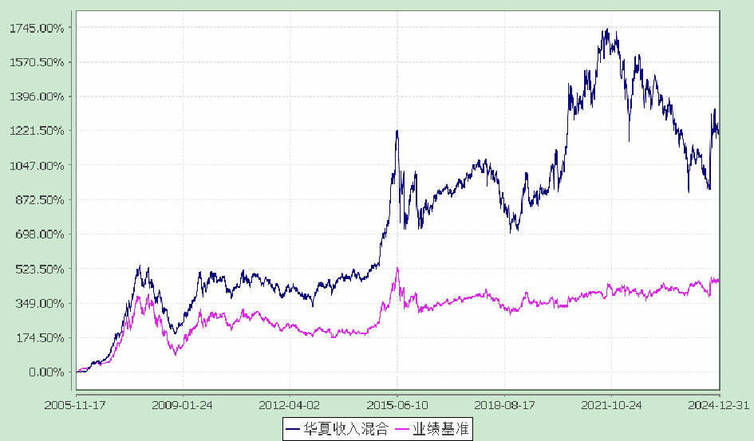

华夏收入混合型证券投资基金2024年年度报告
过去五年基金净值增长率与业绩比较基准收益率的对比图
| 3.3 过去三年基金的利润分配情况 |
| --- |
| 本基金过去三年无利润分配事项。 |
| §4 管理人报告 |
| 4.1 基金管理人及基金经理情况 |
| 4.1.1 基金管理人及其管理基金的经验 |
| 华夏基金管理有限公司成立于1998年4月9日，是经中国证监会批准成立的首批全国性基金管 |
| 理公司之一。公司总部设在北京，在北京、上海、深圳、成都、南京、杭州、广州、青岛、武汉及沈 |
| 阳设有分公司，在香港、深圳、上海、北京设有子公司。公司是首批全国社保基金管理人、首批企业 |
| 年金基金管理人、境内首批QDII基金管理人、境内首只ETF基金管理人、境内首只沪港通ETF基 |
| 金管理人、首批内地与香港基金互认基金管理人、首批基本养老保险基金投资管理人资格、首家加 |
| 入联合国责任投资原则组织的公募基金公司、首批公募FOF基金管理人、首批公募养老目标基金管 |
| 理人、首批个人养老金基金管理人、境内首批中日互通ETF基金管理人、首批商品期货ETF基金管 |
| 理人、首批公募MOM基金管理人、首批纳入互联互通ETF基金管理人、首批北交所主题基金管理 |
| 人以及特定客户资产管理人、保险资金投资管理人、公募 REITs 管理人，境内首家承诺“碳中和”具 |
| 体目标和路径的公募基金公司，香港子公司是首批RQFII基金管理人。华夏基金是业务领域最广泛 |
| 的基金管理公司之一。 |

。
6

| 华夏收入混合型证券投资基金2024年年度报告 |
| --- |
| 华夏基金是境内权益ETF管理规模最大的基金管理公司之一，在指数基金管理方面积累了丰富 |
| 的经验，形成了覆盖宽基、港股、行业主题、策略、跨境、商品等较为完整的指数产品线。 |
| 华夏基金以深入的投资研究为基础，尽力捕捉市场机会，为投资人谋求良好的回报。根据银河 |
| 证券基金研究中心《中国基金业绩评价报告》，截至2024年12月31日，华夏基金旗下多只产品近 |
| 1年同类排名领先（基金排名不作为产品未来表现的保证），其中： |
| 主动权益产品：在消费行业偏股型基金(A类)中华夏消费臻选混合发起式(A类)排名第1/81；在 |
| 新能源主题行业偏股型基金(A类)中华夏清洁能源龙头混合发起式(A类)排名第1/27；在北交所主题 |
| 偏股型基金(A 类)中华夏北交所创新中小企业精选两年定开混合发起式排名第 1/11；在标准股票型 |
| 基金(A类)中华夏优势精选股票排名第2/336、华夏潜龙精选股票排名第15/336、华夏创新前沿股票 |
| 排名第64/336；在汽车主题行业偏股型基金(A类)中华夏新能源车龙头混合发起式(A类)排名第3/16； |
| 在港股通标准股票型基金(A 类)中华夏港股通精选股票（LOF）(A 类)排名第 3/14；在 QDII 混合基 |
| 金(A类)中华夏全球科技先锋混合（QDII）排名第5/51；在偏股型基金(股票上限80%)(A类)中华夏 |
| 经典混合排名第5/148、华夏常阳三年定开混合排名第19/148、华夏策略混合排名第29/148；在TMT |
| 与信息技术行业偏股型基金(A 类)中华夏半导体龙头混合发起式(A 类)排名第 11/47；在医药医疗健 |
| 康行业偏股型基金(A类)中华夏乐享健康混合(A类)排名第13/78；在QDII股票型基金(A类)中华夏 |
| 全球股票（QDII）排名第14/72；在偏股型基金(股票上下限60%-95%)(A类)中华夏见龙精选混合排 |
| 名第13/1719、华夏阿尔法精选混合(A类)排名第40/1719、华夏融盛可持续一年持有混合(A类)排名 |
| 第101/1719、华夏远见成长一年持有混合(A类)排名第169/1719、华夏ESG可持续投资一年持有混 |
| 合(A类)排名第177/1719、华夏先进制造龙头混合(A类)排名第184/1719、华夏行业景气混合排名第 |
| 214/1719、华夏景气成长一年持有混合发起式(A类)排名第257/1719、华夏科技前沿6个月定开混合 |
| (A类)排名第278/1719；在灵活配置型基金(基准股票比例30%-60%)(A类)中华夏磐晟混合（LOF） |
| 排名第28/425、华夏高端制造混合(A类)排名第64/425、华夏新机遇混合(A类)排名第76/425；在偏 |
| 股型基金(股票上限95%)(A类) 华夏新兴经济一年持有混合(A类)排名第34/221、华夏大盘精选混合 |
| (A类)排名第49/221。 |
| 固收与固收+产品：在信用债指数债券型基金(A 类)中华夏亚债中国指数(A 类)排名第 1/18；在 |
| 普通债券型基金(可投转债)(A类)中华夏双债债券(A类)排名第2/246；在定开纯债债券型基金(A类) |
| 中华夏鼎华一年定开债券排名第9/647、华夏鼎誉三个月定开债券(A类)排名第51/647；在定开普通 |
| 债券型基金(二级)(A类)中华夏卓信一年定开债券发起式排名第11/24；在可转换债券型基金(A类)中 |
| 华夏可转债增强债券(A类)排名第12/38；在普通偏债型基金(股票上限不高于30%)(A类)中华夏磐泰 |
| 混合（LOF）(A 类)排名第 14/333；在中短期纯债债券型基金(A 类)中华夏中短债债券(A 类)排名第 |

7

华夏收入混合型证券投资基金2024年年度报告
15/165；在定开普通债券型基金(可投转债)(A 类)中华夏鼎禄三个月定开债券(A 类)排名第 22/157、
华夏鼎福三个月定开债券(A 类)排名第 31/157；在长期纯债债券型基金(A 类)中华夏鼎茂债券(A 类)
排名第20/851、华夏鼎通债券(A 类)排名第37/851；在普通债券型基金(二级)(A 类)中华夏稳享增利
6个月债券(A类)排名第79/443。
指数产品：在标准策略指数股票型基金(A类)中华夏上证50AH优选指数（LOF）(A类)排名第
6/25；在策略指数股票ETF基金中华夏中证智选300价值稳健策略ETF排名第8/48；在规模指数股
票 ETF 基金中华夏 MSCI 中国 A50 互联互通 ETF 排名第 14/161、华夏中证沪港深 500ETF 排名第
20/161、华夏上证50ETF排名第29/161；在行业指数股票ETF基金中华夏中证银行ETF排名第5/72、
华夏中证全指证券公司ETF排名第15/72；在增强规模指数股票型基金(A类)中华夏沪深300指数增
强(A类)排名第5/191、华夏上证科创板50成份指数增强发起式(A类)排名第17/191；在主题指数股
票ETF基金中华夏金融ETF发起式排名第2/357、华夏国证半导体芯片ETF排名第19/357、华夏中
证金融科技主题ETF排名第21/357、华夏中证5G通信主题ETF排名第60/357、华夏中证人工智能
主题ETF排名第72/357、华夏中证云计算与大数据主题ETF排名第83/357。
在客户服务方面，2024年，华夏基金继续以客户需求为导向，努力提高客户使用的便利性和服
务体验：（1）华夏基金直销渠道继续优化页面显示，升级搜索及查询功能，给客户更方便、直观的
使用感受；（2）华夏基金管家客户端从客户需求出发持续优化操作页面，进一步提升操作体验；（3）
与常熟农商银行、长春农商银行、贵文基金等代销机构合作，拓展更加丰富的客户理财渠道；（4）
开展 “送你长期主义的花朵”、“换个角度，世界可能不一样”、“聊聊新赛道”等活动，为客户提供了
多样化的投资者教育和关怀服务。
4.1.2基金经理（或基金经理小组）及基金经理助理的简介
任本基金的基金经理（助
姓名 职务 理）期限 证券从业年限 说明
任职日期 离任日期
硕士。曾任华夏证券高
级分析师，大成基金高
级分析师、投资经理。
2004 年 8 月加入原中
信基金。历任股权投资
本基金的基
部总监、华夏基金股票
郑煜 金经理、投 2009-02-04 - 26年
投资部副总经理、公司
委会成员
总经理助理，华夏经典
配置混合型证券投资
基金基金经理（2006年
8 月 11 月至 2011 年 3
月17日期间）、华夏红
8

| 姓名 | 职务 | 任本基金的基金经理（助
理）期限 |  | 证券从业年限 | 说明 |
| --- | --- | --- | --- | --- | --- |
|  |  | 任职日期 | 离任日期 |  |  |
| 郑煜 | 本基金的基
金经理、投
委会成员 | 2009-02-04 | - | 26年 | 硕士。曾任华夏证券高
级分析师，大成基金高
级分析师、投资经理。
2004 年 8 月加入原中
信基金。历任股权投资
部总监、华夏基金股票
投资部副总经理、公司
总经理助理，华夏经典
配置混合型证券投资
基金基金经理（2006年
8 月 11 月至 2011 年 3
月17日期间）、华夏红 |

华夏收入混合型证券投资基金2024年年度报告
|  |  |  |  |  | 利混合型证券投资基
金基金经理（2010年1
月16日至2011年3月
17 日期间)、华夏策略
精选灵活配置混合型
证券投资基金基金经
理（2016年1月29日
至2017 年3月7日期
间)、华夏创新前沿股
票型证券投资基金基
金经理（2016年9月7
日至2018年1月17日
期间)、华夏网购精选
灵活配置混合型证券
投资基金基金经理
（2016年11月2日至
2018 年 1 月 17 日期
间)、华夏价值精选混
合型证券投资基金基
金经理（2020年12月
8日至2021年12月30
日期间)、华夏常阳三
年定期开放混合型证
券投资基金基金经理
（2021年11月2日至
2023 年 3 月 10 日期
间)、华夏鸿阳 6 个月
持有期混合型证券投
资基金基金经理（2021
年11月2日至2023年
3 月 10 日期间)、华夏
安阳 6 个月持有期混
合型证券投资基金基
金经理（2021年11月
2 日至 2023 年 4 月 6
日期间)、华夏睿阳一
年持有期混合型证券
投资基金基金经理
（2021年11月2日至
2023年4月6日期间)、
华夏经典配置混合型
证券投资基金基金经
理（2022 年 7 月 4 日
至 2023 年 11月 13 日
期间)等。 |
| --- | --- | --- | --- | --- | --- |

。
9

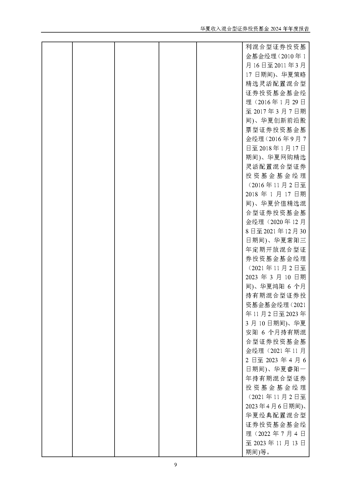

华夏收入混合型证券投资基金2024年年度报告
硕士。2010年7月加入
华夏基金管理有限公
本基金的基
周飞 2024-06-25 - 14年 司。历任交易管理部交
金经理助理
易员、现金管理部基金
经理助理。
注：①上述“任职日期”和“离任日期”为根据公司决定确定的聘任日期和解聘日期。首任基金经理
的，其“任职日期”为基金合同生效日。
②证券从业的含义遵从行业协会《证券基金经营机构董事、监事、高级管理人员及从业人员监
督管理办法》的相关规定。
4.1.3 期末兼任私募资产管理计划投资经理的基金经理同时管理的产品情况
姓名 产品类型 产品数量（只） 资产净值(元) 任职时间
公募基金 4 4,034,724,736.36 2009-02-04
私募资产管
1 10,989,018,835.55 2023-08-23
郑煜 理计划
其他组合 - - -
合计 5 15,023,743,571.91 -
注：报告期内，郑煜于2024年7月4日离任其原管理的1只公募基金。
4.1.4 基金经理薪酬机制
本基金管理人旗下基金经理兼任私募资产管理计划投资经理的，公司对其进行年度综合考核，
考核结果作为确定其薪酬激励的重要参考因素之一。因此，基金经理个人薪酬激励与其管理的私募
资产管理计划浮动管理费或产品业绩表现不直接挂钩。
4.2 管理人对报告期内本基金运作遵规守信情况的说明
报告期内，本基金管理人严格遵守《中华人民共和国证券投资基金法》、《公开募集证券投资基
金运作管理办法》、《证券投资基金管理公司公平交易制度指导意见》、《基金管理公司开展投资、研
究活动防控内幕交易指导意见》等法律法规和基金合同，本着诚实信用、勤勉尽责、安全高效的原
则管理和运用基金资产，在严格控制投资风险的基础上，为基金份额持有人谋求最大利益，没有损
害基金份额持有人利益的行为。
4.3 管理人对报告期内公平交易情况的专项说明
4.3.1 公平交易制度和控制方法
本基金管理人根据《证券投资基金管理公司公平交易制度指导意见》等法规制定了《华夏基金
管理有限公司公平交易制度》。公司通过科学、制衡的投资决策体系，加强交易分配环节的内部控制，
并通过工作制度、流程和技术手段保证公平交易原则的实现。同时，通过监察稽核、事后分析和信
息披露来保证公平交易过程和结果的监督。
4.3.2 公平交易制度的执行情况
10

| 周飞 | 本基金的基
金经理助理 | 2024-06-25 | - | 14年 | 硕士。2010年7月加入
华夏基金管理有限公
司。历任交易管理部交
易员、现金管理部基金
经理助理。 |
| --- | --- | --- | --- | --- | --- |

| 姓名 | 产品类型 | 产品数量（只） | 资产净值(元) | 任职时间 |
| --- | --- | --- | --- | --- |
| 郑煜 | 公募基金 | 4 | 4,034,724,736.36 | 2009-02-04 |
|  | 私募资产管
理计划 | 1 | 10,989,018,835.55 | 2023-08-23 |
|  | 其他组合 | - | - | - |
|  | 合计 | 5 | 15,023,743,571.91 | - |

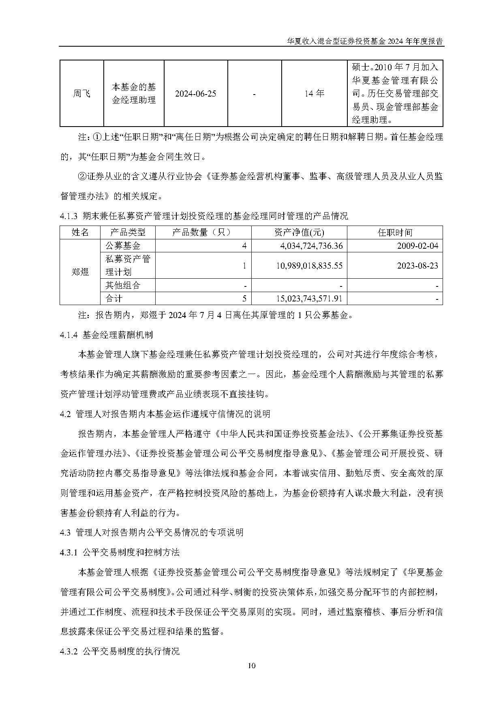

华夏收入混合型证券投资基金2024年年度报告
本基金管理人一贯公平对待旗下管理的所有基金和组合，制定并严格遵守相应的制度和流程，
| 通过系统和人工等方式在各环节严格控制交易公平执行。报告期内，本基金管理人严格执行了《证 |
| --- |
| 券投资基金管理公司公平交易制度指导意见》和《华夏基金管理有限公司公平交易制度》的规定。 |
| 4.3.2.1 增加执行的基金经理公平交易制度执行情况及公平交易管理情况 |
| 本基金管理人一贯严格执行公平交易原则，对兼任基金经理的交易情况进行持续监测。本年度 |
| 所有相关组合的交易行为均符合法规、制度和流程要求，未发现违反公平交易原则的情况。本年度 |
| 同一基金经理管理的不同组合在邻近交易日的同向和反向交易，交易时机和交易价差均可合理解释， |
| 未发现异常。 |
| 本基金管理人根据《基金经理兼任私募资产管理计划投资经理工作指引（试行）》要求，针对 |
| 同经理管理多个组合间的收益率差异进行归因分析，本年度各组合间收益率差异均属正常情况，主 |
| 要原因为业绩基准不同、投资策略不同，收益率差异可以合理解释。 |
| 4.3.3 异常交易行为的专项说明 |
| 报告期内未发现本基金存在异常交易行为。 |
| 报告期内，本基金管理人旗下所有投资组合参与的交易所公开竞价交易中，同日反向交易成交 |
| 较少的单边交易量超过该证券当日成交量的 5%的交易共有 197 次，其中 1 次为不同基金经理管理 |
| 的组合间因投资策略不同而发生的反向交易，有关基金经理已根据公司管理要求提供决策依据；其 |
| 余均为指数量化投资组合因投资策略需要和其他组合发生的反向交易。 |
| 4.4 管理人对报告期内基金的投资策略和业绩表现的说明 |
| 4.4.1 报告期内基金投资策略和运作分析 |
| 2024 年，全球经济格局面临复杂多变的外部形势。各国为推动自身经济增长和实现制造业回流， |
| 纷纷采取一系列对外政策举措。美国尽管国内消费需求呈现出放缓趋势，但私人投资支出展现出一 |
| 定韧性，经济增长总体保持平稳态势。因处于大选年，对华采取强硬政策成为获取选票的重要策略， |
| 美国在多个高科技领域对中国实施不合理的压制与限制措施。欧洲制造业出现萎缩，居民消费支出 |
| 和企业投资均表现疲软，欧洲计划对部分中国优势产业加税，这些无疑给中国未来的经济增长增添 |
| 了外部压力。 |
| 面对复杂的外部环境，中国政府积极出台多项政策以稳定经济。在汽车家电等领域推行以旧换 |
| 新政策，短期内取得了一定成效。但房地产市场与房价企稳以及居民收入预期紧密相关，政策见效 |
| 周期相对较长。新房开工率持续下行，拖累了固定资产投资增速。就业压力增大、居民收入提升困 |
| 难等问题，也对消费市场造成了明显的压力。 |

。
在宏观政策层面，政府在复杂的内外部环境下，继续维持适度宽松的货币政策，财政政策保持
11

华夏收入混合型证券投资基金2024年年度报告
| 相对稳健。通过落地财政超长期特别国债、加大对地方化债的支持力度、补充国有大行资本以及加 |
| --- |
| 大对重点群体的保障力度，增强了对未来产业发展的导向性。 |
| 从市场表现来看，经过两年的持续调整，年初投资者心态较为脆弱。在经济复苏尚未出现明显 |
| 迹象时，投资者纷纷抛售收益较高的计算机、电子板块股票以及超额收益较高的微盘股，采取避险 |
| 策略。高股息策略的相关股票，如煤炭、电力、银行、工程机械等，以及确定性较强的 AI 算力等 |
| 新质生产力相关股票表现较好。受基数等多种因素影响，下半年经济增长速度和上市公司业绩增长 |
| 面临较大压力，导致上证指数持续下行，三季度更是跌破 2700 点，此时优质公司的估值普遍偏低。 |
| 二十届三中全会着重强调创新驱动发展战略的重要性，对经济和民生领域改革作出全面部署，为未 |
| 来发展指明了长期方向。在总书记指示努力完成全年计划后，各部委出台了一系列强有力的政策， |
| 包括央行的降息降准、结构性货币政策等，这些政策提升了投资者信心，推动市场情绪好转，增量 |
| 资金入场。A 股市场日成交额连续多日突破万亿元，融资余额创下近几年新高。AI、机器人、半导 |
| 体等具有长期发展潜力的板块涨幅居前，而房地产产业链和煤炭等板块表现相对滞后。 |
| 尽管年度内经济面临的困难较多，外部的不确定性较大，但本基金仍坚持对新产业中的长期增 |
| 长和旧产业的价值发现，这类股票构成组合长期的核心持仓。今年初，在市场较为低迷的阶段，我 |
| 们增加了红利型资产的配置，同时通过加强对于国家产业方向的研究，继续保持对政策支持行业的 |
| 长期乐观态度，也保持了相对较高的仓位暴露。 |
| 4.4.2 报告期内基金的业绩表现 |
| 截至2024年12月31日，本基金份额净值为5.780元，本报告期份额净值增长率为3.29%，同 |
| 期业绩比较基准增长率为13.10%。 |
| 4.5 管理人对宏观经济、证券市场及行业走势的简要展望 |
| 2025年，中国是机遇和挑战并存的一年，经济有望在政策支持和内需恢复的推动下延续复苏态 |
| 势。可能的财政政策包括赤字率提升、较高的专项债规模，货币政策持续宽松，预计降准、结构性 |
| 降息工具继续发力，引导社会融资成本下行，缓解企业债务压力，“适度宽松的货币政策”和“更加积 |
| 极的财政政策”双轮驱动，将为经济增长提供有力支持，资本市场改革将持续推进，政策将聚焦支持 |
| 科技创新和产业升级，这些举措均有助于稳定市场预期。 |
| 流动性的宽松，对 2025 年 A 股市场整体环境较为有利，宏观经济的改善也将为市场提供基本 |
| 面支撑，市场有望延续震荡上行态势，但结构性分化仍将明显。 |
| AI的技术进步和其他核心关键技术的突破，除直接带动相关产业的预期收入利润的迅速增长外， |
| 还有利于增强投资者信心，从而带来股票市场的估值提升。 |

。
利率持续下行，使得高股息资产的价值更加凸显，我们将继续做好日常组合管理工作，根据基
12

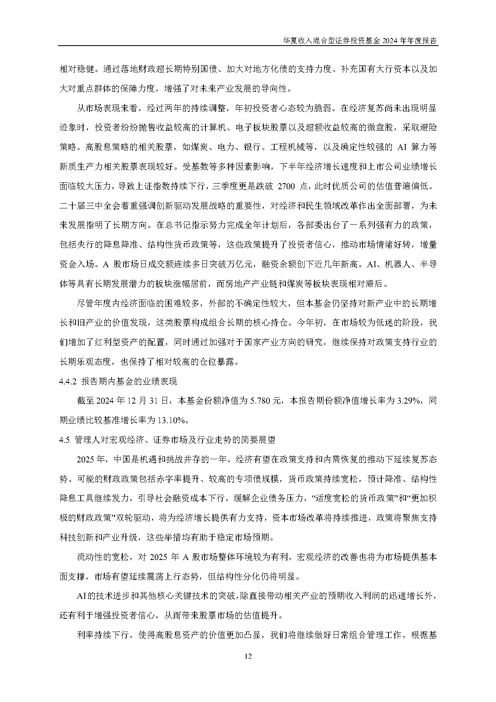

华夏收入混合型证券投资基金2024年年度报告
| 金产品特性，结合产业周期所处的阶段、产业景气度的变化和上市公司质量等多重指标，动态调整 |
| --- |
| 组合。选股上聚焦两部分，一部分为成熟行业中盈利相对稳定、股息率较高的股票集群，一部分仍 |
| 聚焦产业政策扶持的新兴方向、国内具有绝对竞争实力的制造业、基于大市场的持续升级的医疗消 |
| 费，以前者为核心，并视市场情况对两部分比例进行动态调整。这样既能够获取较好的股息收入， |
| 也能够在未来的成长方向中获得较好的收益。 |
| 珍惜基金份额持有人的每一分投资和每一份信任，本基金将继续奉行华夏基金管理有限公司“为 |
| 信任奉献回报”的经营理念，规范运作，审慎投资，勤勉尽责地为基金份额持有人谋求长期、稳定的 |
| 回报。 |
| 4.6 管理人内部有关本基金的监察稽核工作情况 |
| 报告期内，本基金管理人持续加强合规管理、风险控制和监察稽核工作。 |
| 在合规管理方面，公司通过合规审核、合规检查、合规咨询、合规宣传与合规培训等对合规风 |
| 险进行管理，确保公司合规体系高效运行，合规风险有效控制。报告期内，公司不断加强合规制度 |
| 建设，结合法律法规和业务实际，在廉洁从业风险防控、信息披露、洗钱风险管理等方面新增和修 |
| 订多项管理制度，制度化水平显著提高。持续开展合规培训，在全员覆盖的基础上，着重加强投资 |
| 研究和基金销售等重点业务领域的合规督导培训，强化员工主动合规意识和公募基金信息披露责任 |
| 意识。持续优化合规管理的机制化和系统化，完善合规管理综合服务平台，提高合规管理效能。持 |
| 续做好信息披露业务，通过流程优化、系统优化及强化培训持续保障信息披露的完整性、准确性、 |
| 及时性。持续规范基金销售业务，通过严格审查宣传推介材料，认真开展投资者适当性管理工作等， |
| 确保基金销售业务依法合规。公司高度重视洗钱风险管理，深入实践风险为本方法，认真贯彻落实 |
| 各项反洗钱监管要求，持续加强“风险评估+合规检查”双支柱管理框架，深入推进洗钱风险管理数智 |
| 化转型，持续提升洗钱风险管理水平。 |
| 在风险控制方面，公司秉承数字化管理理念，持续完善内部风险管理系统建设，稳步夯实投资 |
| 风险管理基础。紧密跟踪各项法律法规要求、加强风险研究，在严格管控基金日常投资运作风险的 |
| 同时，持续完善风险管理制度建设，提升基金流动性风险、市场风险、合规风险、操作风险等关键 |
| 风险的管控水平，努力保障各项风险管理措施落实到位。 |
| 在监察稽核方面，公司按照法规要求，做好日常合规监控，定期及不定期开展内部检查，排查 |
| 业务风险隐患，促进公司整体业务合规运作、稳健经营。 |
| 报告期内，本基金管理人所管理的基金整体运作合法合规。本基金管理人将继续以风险控制为 |
| 核心，坚持基金份额持有人利益优先的原则，提高监察稽核工作的科学性和有效性，切实保障基金 |
| 合规稳健运作。 |

。
13

华夏收入混合型证券投资基金2024年年度报告
| 4.7 管理人对报告期内基金估值程序等事项的说明 |
| --- |
| 根据中国证监会相关规定及基金合同约定，本基金管理人为准确、及时进行基金估值和份额净 |
| 值计价，制定了基金估值和份额净值计价的业务管理制度，建立了估值委员会，使用可靠的估值业 |
| 务系统，设有完善的风险监测、控制和报告机制。本基金托管人审阅本基金管理人采用的估值原则 |
| 及技术，并复核、审查基金资产净值和基金份额申购、赎回价格。会计师事务所在估值调整导致基 |
| 金资产净值的变化在0.25%以上时对所采用的相关估值技术、假设及输入值的适当性发表专业意见。 |
| 定价服务机构按照商业合同约定提供定价服务。 |
| 4.8 管理人对报告期内基金利润分配情况的说明 |
| 本基金本报告期未进行利润分配，符合相关法规及基金合同的规定。 |
| 4.9 报告期内管理人对本基金持有人数或基金资产净值预警情形的说明 |
| 报告期内，本基金未出现连续二十个工作日基金份额持有人数量不满二百人或者基金资产净值 |
| 低于五千万元的情形。 |
| §5 托管人报告 |
| 5.1 报告期内本基金托管人遵规守信情况声明 |
| 本报告期，中国建设银行股份有限公司在本基金的托管过程中，严格遵守了《证券投资基金法》、 |
| 基金合同、托管协议和其他有关规定，不存在损害基金份额持有人利益的行为，完全尽职尽责地履 |
| 行了基金托管人应尽的义务。 |
| 5.2 托管人对报告期内本基金投资运作遵规守信、净值计算、利润分配等情况的说明 |
| 本报告期，本基金托管人按照国家有关规定、基金合同、托管协议和其他有关规定，对本基金 |
| 的基金资产净值计算、基金费用开支等方面进行了认真的复核，对本基金的投资运作方面进行了监 |
| 督，未发现基金管理人有损害基金份额持有人利益的行为。 |
| 报告期内，本基金利润分配情况符合法律法规和基金合同的相关约定。 |
| 5.3 托管人对本年度报告中财务信息等内容的真实、准确和完整发表意见 |
| 本托管人复核审查了本报告中的财务指标、净值表现、利润分配情况、财务会计报告、投资组 |
| 合报告等内容，保证复核内容不存在虚假记载、误导性陈述或者重大遗漏。 |

。
§6 审计报告
安永华明（2025）审字第70035283_A07号
14

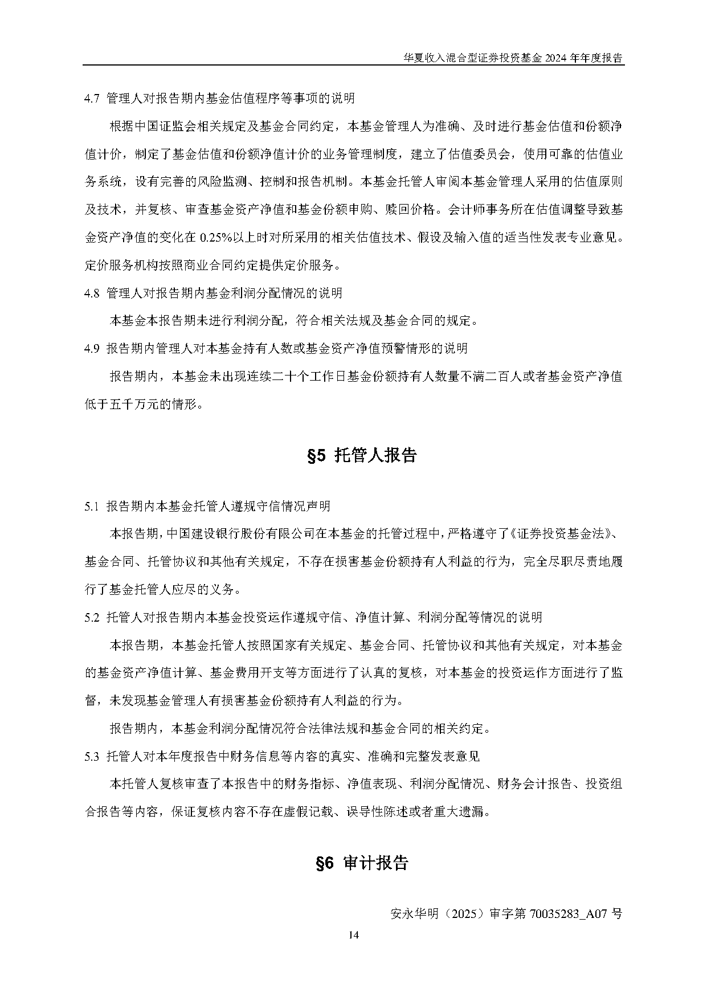

华夏收入混合型证券投资基金2024年年度报告
| 华夏收入混合型证券投资基金全体基金份额持有人： |
| --- |
| 6.1 审计意见 |
| 我们审计了华夏收入混合型证券投资基金的财务报表，包括2024年12月31日的资产负债表 |
| 2024年度的利润表、净资产变动表以及相关财务报表附注。 |
| 我们认为，后附的华夏收入混合型证券投资基金的财务报表在所有重大方面按照企业会计准则 |
| 的规定编制，公允反映了华夏收入混合型证券投资基金2024年12月31日的财务状况以及2024年 |
| 度的经营成果和净资产变动情况。 |
| 6.2 形成审计意见的基础 |
| 我们按照中国注册会计师审计准则的规定执行了审计工作。审计报告的“注册会计师对财务报 |
| 表审计的责任”部分进一步阐述了我们在这些准则下的责任。按照中国注册会计师职业道德守则， |
| 我们独立于华夏收入混合型证券投资基金，并履行了职业道德方面的其他责任。我们相信，我们获 |
| 取的审计证据是充分、适当的，为发表审计意见提供了基础。 |
| 6.3 其他信息 |
| 华夏收入混合型证券投资基金管理层对其他信息负责。其他信息包括年度报告中涵盖的信息， |
| 但不包括财务报表和我们的审计报告。 |
| 我们对财务报表发表的审计意见不涵盖其他信息，我们也不对其他信息发表任何形式的鉴证结 |
| 论。 |
| 结合我们对财务报表的审计，我们的责任是阅读其他信息，在此过程中，考虑其他信息是否与 |
| 财务报表或我们在审计过程中了解到的情况存在重大不一致或者似乎存在重大错报。 |
| 基于我们已执行的工作，如果我们确定其他信息存在重大错报，我们应当报告该事实。在这方 |
| 面，我们无任何事项需要报告。 |
| 6.4 管理层和治理层对财务报表的责任 |
| 管理层负责按照企业会计准则的规定编制财务报表，使其实现公允反映，并设计、执行和维护 |
| 必要的内部控制，以使财务报表不存在由于舞弊或错误导致的重大错报。 |
| 在编制财务报表时，管理层负责评估华夏收入混合型证券投资基金的持续经营能力，披露与持 |
| 续经营相关的事项（如适用），并运用持续经营假设，除非计划进行清算、终止运营或别无其他现实 |
| 的选择。 |
| 治理层负责监督华夏收入混合型证券投资基金的财务报告过程。 |
| 6.5 注册会计师对财务报表审计的责任 |

我们的目标是对财务报表整体是否不存在由于舞弊或错误导致的重大错报获取合理保证，并出
15

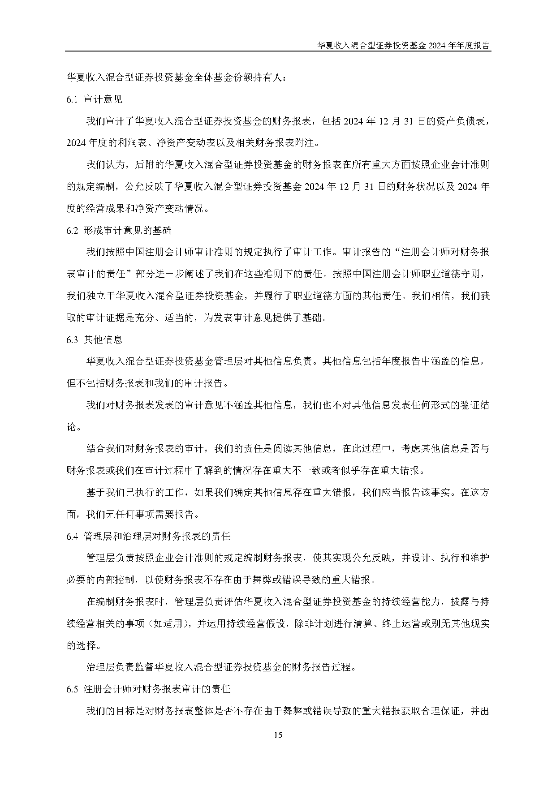

| 华夏收入混合型证券投资基金2024年年度报告 |
| --- |
| 具包含审计意见的审计报告。合理保证是高水平的保证，但并不能保证按照审计准则执行的审计在 |
| 某一重大错报存在时总能发现。错报可能由于舞弊或错误导致，如果合理预期错报单独或汇总起来 |
| 可能影响财务报表使用者依据财务报表作出的经济决策，则通常认为错报是重大的。 |
| 在按照审计准则执行审计工作的过程中，我们运用职业判断，并保持职业怀疑。同时，我们也 |
| 执行以下工作： |
| （1）识别和评估由于舞弊或错误导致的财务报表重大错报风险，设计和实施审计程序以应对这 |
| 些风险，并获取充分、适当的审计证据，作为发表审计意见的基础。由于舞弊可能涉及串通、伪造、 |
| 故意遗漏、虚假陈述或凌驾于内部控制之上，未能发现由于舞弊导致的重大错报的风险高于未能发 |
| 现由于错误导致的重大错报的风险。 |
| （2）了解与审计相关的内部控制，以设计恰当的审计程序，但目的并非对内部控制的有效性发 |
| 表意见。 |
| （3）评价管理层选用会计政策的恰当性和作出会计估计及相关披露的合理性。 |
| （4）对管理层使用持续经营假设的恰当性得出结论。同时，根据获取的审计证据，就可能导致 |
| 对华夏收入混合型证券投资基金持续经营能力产生重大疑虑的事项或情况是否存在重大不确定性得 |
| 出结论。如果我们得出结论认为存在重大不确定性，审计准则要求我们在审计报告中提请报表使用 |
| 者注意财务报表中的相关披露；如果披露不充分，我们应当发表非无保留意见。我们的结论基于截 |
| 至审计报告日可获得的信息。然而，未来的事项或情况可能导致华夏收入混合型证券投资基金不能 |
| 持续经营。 |
| （5）评价财务报表的总体列报（包括披露）、结构和内容，并评价财务报表是否公允反映相关 |
| 交易和事项。 |
| 我们与治理层就计划的审计范围、时间安排和重大审计发现等事项进行沟通，包括沟通我们在 |
| 审计中识别出的值得关注的内部控制缺陷。 |
| 安永华明会计师事务所（特殊普通合伙） 中国注册会计师 |
| 张小东 王海彦 |
| 北京市东城区东长安街1号东方广场安永大楼17层 |
| 2025年3月27日 |

§7 年度财务报表
16

华夏收入混合型证券投资基金2024年年度报告
7.1 资产负债表
会计主体：华夏收入混合型证券投资基金
报告截止日：2024年12月31日
单位：人民币元
本期末 上年度末
资产 附注号
2024年12月31日 2023年12月31日
资 产：
货币资金 7.4.7.1 146,009,467.36 174,369,711.72
结算备付金 1,708,609.31 1,672,967.81
存出保证金 245,326.48 253,727.88
交易性金融资产 7.4.7.2 1,500,711,903.48 1,558,454,794.25
其中：股票投资 1,419,423,335.17 1,558,454,794.25
基金投资 - -
债券投资 81,288,568.31 -
资产支持证券投资 - -
贵金属投资 - -
其他投资 - -
衍生金融资产 7.4.7.3 - -
买入返售金融资产 7.4.7.4 - -
应收清算款 - 160,342.29
应收股利 - -
应收申购款 158,724.59 1,855,255.45
递延所得税资产 - -
其他资产 7.4.7.5 - -
资产总计 1,648,834,031.22 1,736,766,799.40
本期末 上年度末
负债和净资产 附注号
2024年12月31日 2023年12月31日
负 债：
短期借款 - -
交易性金融负债 - -
衍生金融负债 7.4.7.3 - -
卖出回购金融资产款 - -
应付清算款 - -
应付赎回款 714,806.31 1,893,159.62
应付管理人报酬 1,704,080.72 1,755,835.65
应付托管费 284,013.42 292,639.27
应付销售服务费 - -
应付投资顾问费 - -
应交税费 3,294.00 3,294.00
应付利润 - -
递延所得税负债 - -
其他负债 7.4.7.6 3,252,671.15 3,613,953.15
17

| 资产 | 附注号 | 本期末
2024年12月31日 | 上年度末
2023年12月31日 |
| --- | --- | --- | --- |
| 资 产： |  |  |  |
| 货币资金 | 7.4.7.1 | 146,009,467.36 | 174,369,711.72 |
| 结算备付金 |  | 1,708,609.31 | 1,672,967.81 |
| 存出保证金 |  | 245,326.48 | 253,727.88 |
| 交易性金融资产 | 7.4.7.2 | 1,500,711,903.48 | 1,558,454,794.25 |
| 其中：股票投资 |  | 1,419,423,335.17 | 1,558,454,794.25 |
| 基金投资 |  | - | - |
| 债券投资 |  | 81,288,568.31 | - |
| 资产支持证券投资 |  | - | - |
| 贵金属投资 |  | - | - |
| 其他投资 |  | - | - |
| 衍生金融资产 | 7.4.7.3 | - | - |
| 买入返售金融资产 | 7.4.7.4 | - | - |
| 应收清算款 |  | - | 160,342.29 |
| 应收股利 |  | - | - |
| 应收申购款 |  | 158,724.59 | 1,855,255.45 |
| 递延所得税资产 |  | - | - |
| 其他资产 | 7.4.7.5 | - | - |
| 资产总计 |  | 1,648,834,031.22 | 1,736,766,799.40 |
| 负债和净资产 | 附注号 | 本期末
2024年12月31日 | 上年度末
2023年12月31日 |
| 负 债： |  |  |  |
| 短期借款 |  | - | - |
| 交易性金融负债 |  | - | - |
| 衍生金融负债 | 7.4.7.3 | - | - |
| 卖出回购金融资产款 |  | - | - |
| 应付清算款 |  | - | - |
| 应付赎回款 |  | 714,806.31 | 1,893,159.62 |
| 应付管理人报酬 |  | 1,704,080.72 | 1,755,835.65 |
| 应付托管费 |  | 284,013.42 | 292,639.27 |
| 应付销售服务费 |  | - | - |
| 应付投资顾问费 |  | - | - |
| 应交税费 |  | 3,294.00 | 3,294.00 |
| 应付利润 |  | - | - |
| 递延所得税负债 |  | - | - |
| 其他负债 | 7.4.7.6 | 3,252,671.15 | 3,613,953.15 |

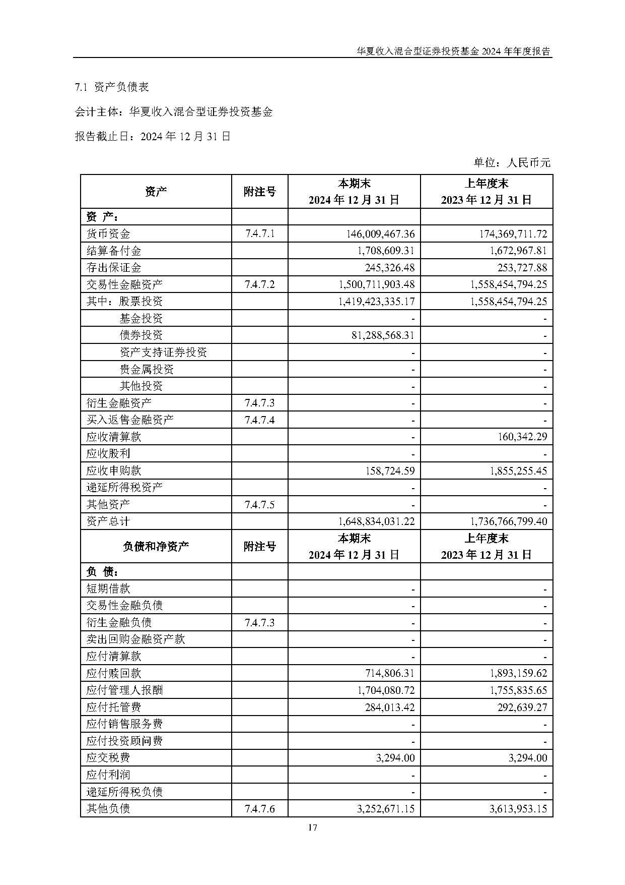

华夏收入混合型证券投资基金2024年年度报告
| 负债合计 |  | 5,958,865.60 | 7,558,881.69 |
| --- | --- | --- | --- |
| 净资产： |  |  |  |
| 实收基金 | 7.4.7.7 | 284,240,224.83 | 309,023,533.02 |
| 未分配利润 | 7.4.7.8 | 1,358,634,940.79 | 1,420,184,384.69 |
| 净资产合计 |  | 1,642,875,165.62 | 1,729,207,917.71 |
| 负债和净资产总计 |  | 1,648,834,031.22 | 1,736,766,799.40 |

注：报告截止日2024年12月31日，基金份额净值5.780元，基金份额总额284,240,224.83份。
7.2 利润表
会计主体：华夏收入混合型证券投资基金
本报告期：2024年1月1日至2024年12月31日
单位：人民币元
本期 上年度可比期间
项 目 附注号 2024年1月1日至 2023年1月1日至
2024年12月31日 2023年12月31日
一、营业总收入 53,172,035.29 -247,850,284.41
1.利息收入 476,342.99 779,041.67
其中：存款利息收入 7.4.7.9 476,342.99 779,041.67
债券利息收入 - -
资产支持证券利息收入 - -
买入返售金融资产收入 - -
其他利息收入 - -
2.投资收益（损失以“-”填列） -250,279,822.24 -199,575,678.68
其中：股票投资收益 7.4.7.10 -281,066,615.20 -220,081,177.35
基金投资收益 7.4.7.11 - -
债券投资收益 7.4.7.12 636,995.28 1,216,197.06
资产支持证券投资收益 7.4.7.13 - -
贵金属投资收益 7.4.7.14 - -
衍生工具收益 7.4.7.15 - -
股利收益 7.4.7.16 30,149,797.68 19,289,301.61
其他投资收益 - -
3.公允价值变动收益（损失以“-”号
7.4.7.17 302,757,727.22 -49,315,704.90
填列）
4.汇兑收益（损失以“-”号填列） - -
5.其他收入（损失以“-”号填列） 7.4.7.18 217,787.32 262,057.50
减：二、营业总支出 21,992,474.47 32,942,438.16
1.管理人报酬 18,668,025.99 28,031,621.58
2.托管费 3,111,337.70 4,671,936.81
3.销售服务费 - -
4.投资顾问费 - -
5.利息支出 - -
其中：卖出回购金融资产支出 - -
18

| 项 目 | 附注号 | 本期
2024年1月1日至
2024年12月31日 | 上年度可比期间
2023年1月1日至
2023年12月31日 |
| --- | --- | --- | --- |
| 一、营业总收入 |  | 53,172,035.29 | -247,850,284.41 |
| 1.利息收入 |  | 476,342.99 | 779,041.67 |
| 其中：存款利息收入 | 7.4.7.9 | 476,342.99 | 779,041.67 |
| 债券利息收入 |  | - | - |
| 资产支持证券利息收入 |  | - | - |
| 买入返售金融资产收入 |  | - | - |
| 其他利息收入 |  | - | - |
| 2.投资收益（损失以“-”填列） |  | -250,279,822.24 | -199,575,678.68 |
| 其中：股票投资收益 | 7.4.7.10 | -281,066,615.20 | -220,081,177.35 |
| 基金投资收益 | 7.4.7.11 | - | - |
| 债券投资收益 | 7.4.7.12 | 636,995.28 | 1,216,197.06 |
| 资产支持证券投资收益 | 7.4.7.13 | - | - |
| 贵金属投资收益 | 7.4.7.14 | - | - |
| 衍生工具收益 | 7.4.7.15 | - | - |
| 股利收益 | 7.4.7.16 | 30,149,797.68 | 19,289,301.61 |
| 其他投资收益 |  | - | - |
| 3.公允价值变动收益（损失以“-”号
填列） | 7.4.7.17 | 302,757,727.22 | -49,315,704.90 |
| 4.汇兑收益（损失以“-”号填列） |  | - | - |
| 5.其他收入（损失以“-”号填列） | 7.4.7.18 | 217,787.32 | 262,057.50 |
| 减：二、营业总支出 |  | 21,992,474.47 | 32,942,438.16 |
| 1.管理人报酬 |  | 18,668,025.99 | 28,031,621.58 |
| 2.托管费 |  | 3,111,337.70 | 4,671,936.81 |
| 3.销售服务费 |  | - | - |
| 4.投资顾问费 |  | - | - |
| 5.利息支出 |  | - | - |
| 其中：卖出回购金融资产支出 |  | - | - |

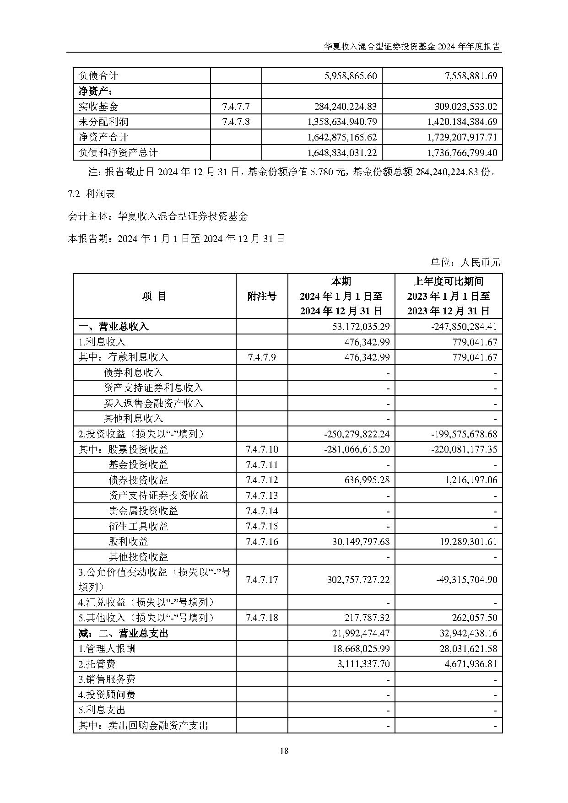

华夏收入混合型证券投资基金2024年年度报告
6.信用减值损失 7.4.7.20 - -
7.税金及附加 11.72 3.37
8.其他费用 7.4.7.21 213,099.06 238,876.40
三、利润总额（亏损总额以“-”号填
31,179,560.82 -280,792,722.57
列）
减：所得税费用 - -
四、净利润（净亏损以“-”号填列） 31,179,560.82 -280,792,722.57
五、其他综合收益的税后净额 - -
六、综合收益总额 31,179,560.82 -280,792,722.57
7.3 净资产变动表
会计主体：华夏收入混合型证券投资基金
本报告期：2024年1月1日至2024年12月31日
单位：人民币元
本期
项目 2024年1月1日至2024年12月31日
实收基金 未分配利润 净资产合计
一、上期期末净资产 309,023,533.02 1,420,184,384.69 1,729,207,917.71
二、本期期初净资产 309,023,533.02 1,420,184,384.69 1,729,207,917.71
三、本期增减变动额
-24,783,308.19 -61,549,443.90 -86,332,752.09
（减少以“-”号填列）
（一）、综合收益总额 - 31,179,560.82 31,179,560.82
（二）、本期基金份额
交易产生的净资产变
-24,783,308.19 -92,729,004.72 -117,512,312.91
动数（净资产减少以
“-”号填列）
其中：1.基金申购款 29,846,760.84 132,732,689.49 162,579,450.33
2.基金赎回款 -54,630,069.03 -225,461,694.21 -280,091,763.24
（三）、本期向基金份
额持有人分配利润产
生的净资产变动（净 - - -
资产减少以“-”号填
列）
四、本期期末净资产 284,240,224.83 1,358,634,940.79 1,642,875,165.62
上年度可比期间
项目 2023年1月1日至2023年12月31日
实收基金 未分配利润 净资产合计
一、上期期末净资产 332,193,264.90 1,813,186,548.72 2,145,379,813.62
二、本期期初净资产 332,193,264.90 1,813,186,548.72 2,145,379,813.62
三、本期增减变动额
-23,169,731.88 -393,002,164.03 -416,171,895.91
（减少以“-”号填列）
（一）、综合收益总额 - -280,792,722.57 -280,792,722.57
19

| 6.信用减值损失 | 7.4.7.20 | - | - |
| --- | --- | --- | --- |
| 7.税金及附加 |  | 11.72 | 3.37 |
| 8.其他费用 | 7.4.7.21 | 213,099.06 | 238,876.40 |
| 三、利润总额（亏损总额以“-”号填
列） |  | 31,179,560.82 | -280,792,722.57 |
| 减：所得税费用 |  | - | - |
| 四、净利润（净亏损以“-”号填列） |  | 31,179,560.82 | -280,792,722.57 |
| 五、其他综合收益的税后净额 |  | - | - |
| 六、综合收益总额 |  | 31,179,560.82 | -280,792,722.57 |

| 项目 | 本期
2024年1月1日至2024年12月31日 |  |  |
| --- | --- | --- | --- |
|  | 实收基金 | 未分配利润 | 净资产合计 |
| 一、上期期末净资产 | 309,023,533.02 | 1,420,184,384.69 | 1,729,207,917.71 |
| 二、本期期初净资产 | 309,023,533.02 | 1,420,184,384.69 | 1,729,207,917.71 |
| 三、本期增减变动额
（减少以“-”号填列） | -24,783,308.19 | -61,549,443.90 | -86,332,752.09 |
| （一）、综合收益总额 | - | 31,179,560.82 | 31,179,560.82 |
| （二）、本期基金份额
交易产生的净资产变
动数（净资产减少以
“-”号填列） | -24,783,308.19 | -92,729,004.72 | -117,512,312.91 |
| 其中：1.基金申购款 | 29,846,760.84 | 132,732,689.49 | 162,579,450.33 |
| 2.基金赎回款 | -54,630,069.03 | -225,461,694.21 | -280,091,763.24 |
| （三）、本期向基金份
额持有人分配利润产
生的净资产变动（净
资产减少以“-”号填
列） | - | - | - |
| 四、本期期末净资产 | 284,240,224.83 | 1,358,634,940.79 | 1,642,875,165.62 |
| 项目 | 上年度可比期间
2023年1月1日至2023年12月31日 |  |  |
|  | 实收基金 | 未分配利润 | 净资产合计 |
| 一、上期期末净资产 | 332,193,264.90 | 1,813,186,548.72 | 2,145,379,813.62 |
| 二、本期期初净资产 | 332,193,264.90 | 1,813,186,548.72 | 2,145,379,813.62 |
| 三、本期增减变动额
（减少以“-”号填列） | -23,169,731.88 | -393,002,164.03 | -416,171,895.91 |
| （一）、综合收益总额 | - | -280,792,722.57 | -280,792,722.57 |

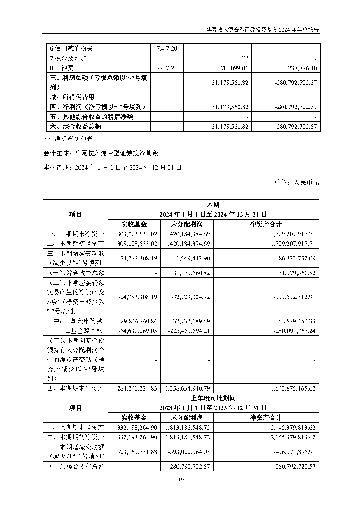

华夏收入混合型证券投资基金2024年年度报告
（二）、本期基金份额
交易产生的净资产变
-23,169,731.88 -112,209,441.46 -135,379,173.34
动数（净资产减少以
“-”号填列）
其中：1.基金申购款 29,755,887.94 164,146,789.30 193,902,677.24
2.基金赎回款 -52,925,619.82 -276,356,230.76 -329,281,850.58
（三）、本期向基金份
额持有人分配利润产
生的净资产变动（净 - - -
资产减少以“-”号填
列）
四、本期期末净资产 309,023,533.02 1,420,184,384.69 1,729,207,917.71
报表附注为财务报表的组成部分。
本报告7.1至7.4，财务报表由下列负责人签署：
基金管理人负责人：张佑君，主管会计工作负责人：朱威，会计机构负责人：朱威
7.4 报表附注
7.4.1 基金基本情况
原中信红利精选股票型证券投资基金经中国证券监督管理委员会（以下简称“中国证监会”）证
监基金字[2005]171号文《关于同意中信红利精选股票型证券投资基金设立的批复》核准，由原中信
基金管理有限责任公司依照《中华人民共和国证券投资基金法》、《证券投资基金销售管理办法》、《证
券投资基金运作管理办法》、《中信红利精选股票型证券投资基金基金合同》及其他法律法规公开募
集。首次设立募集不包括认购资金利息共募集 543,486,644.15 元，业经安永华明会计师事务所予以
验资。经向中国证监会备案，《中信红利精选股票型证券投资基金基金合同》于2005 年11月17日
正式生效，基金合同生效日的基金份额总额为543,579,037.46份基金份额。根据中国证监会2009年
1月4日《关于核准中信经典配置证券投资基金等四只基金基金份额持有人大会决议的批复》（证监
许可[2009]1 号），基金管理人由中信基金管理有限责任公司更换为华夏基金管理有限公司，基金名
称变更为华夏收入股票型证券投资基金。根据基金管理人2015年7月3日刊登的《华夏基金管理有
限公司关于旗下部分开放式基金更名的公告》，华夏收入股票型证券投资基金自2015年7月15日起
更名为华夏收入混合型证券投资基金（以下简称“本基金”）。本基金为契约型开放式，存续期限不定，
基金托管人为中国建设银行股份有限公司。
根据《中华人民共和国证券投资基金法》和本基金基金合同等有关规定，本基金投资于具有良
好流动性的金融工具，包括国内依法发行和上市交易的公司股票（含存托凭证）、债券、资产支持证
券、权证以及中国证监会批准的允许基金投资的其他金融工具。
7.4.2 会计报表的编制基础
20

| （二）、本期基金份额
交易产生的净资产变
动数（净资产减少以
“-”号填列） | -23,169,731.88 | -112,209,441.46 | -135,379,173.34 |
| --- | --- | --- | --- |
| 其中：1.基金申购款 | 29,755,887.94 | 164,146,789.30 | 193,902,677.24 |
| 2.基金赎回款 | -52,925,619.82 | -276,356,230.76 | -329,281,850.58 |
| （三）、本期向基金份
额持有人分配利润产
生的净资产变动（净
资产减少以“-”号填
列） | - | - | - |
| 四、本期期末净资产 | 309,023,533.02 | 1,420,184,384.69 | 1,729,207,917.71 |

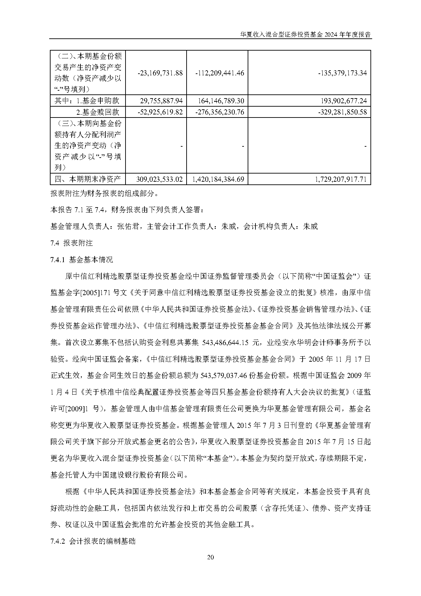

华夏收入混合型证券投资基金2024年年度报告
本基金的财务报表按照财政部颁布和修订的《企业会计准则－基本准则》、各项具体会计准则(以
| 下合称“企业会计准则”) 、中国证券投资基金业协会(以下简称“中国基金业协会”)颁布的《证券投资 |
| --- |
| 基金会计核算业务指引》、中国证监会发布的《证券投资基金信息披露XBRL模板第3号<年度报告 |
| 和中期报告>》和中国证监会、中国基金业协会允许的如财务报表附注 7.4.4 所列示的基金行业实务 |
| 操作的有关规定编制。 |
| 本财务报表以持续经营为基础编制。 |
| 7.4.3 遵循企业会计准则及其他有关规定的声明 |
| 本财务报表符合企业会计准则的要求，真实、完整地反映了本基金本报告期末的财务状况以及 |
| 本报告期间的经营成果和净资产变动情况等有关信息。 |
| 7.4.4 重要会计政策和会计估计 |
| 7.4.4.1 会计年度 |
| 本基金会计年度为公历1月1日起至12月31日止。 |
| 7.4.4.2 记账本位币 |
| 本基金的记账本位币为人民币。 |
| 7.4.4.3 金融资产和金融负债的分类 |
| 金融工具，是指形成一方的金融资产并形成其他方的金融负债或权益工具的合同。当本基金成 |
| 为金融工具合同的一方时，确认相关的金融资产或金融负债。 |
| 1、金融资产分类 |
| 本基金的金融资产于初始确认时分类为：以摊余成本计量的金融资产、以公允价值计量且其变 |
| 动计入其他综合收益的金融资产及以公允价值计量且其变动计入当期损益的金融资产。金融资产的 |
| 分类取决于本基金管理金融资产的业务模式和金融资产的合同现金流量特征。本基金现无金融资产 |
| 分类为以公允价值计量且其变动计入其他综合收益的金融资产。 |
| （1）债务工具 |
| 本基金持有的债务工具是指从发行方角度分析符合金融负债定义的工具，分别采用以下两种方 |
| 式进行计量： |
| 以摊余成本计量： |
| 本基金管理以摊余成本计量的金融资产的业务模式为以收取合同现金流量为目标，且以摊余成 |
| 本计量的金融资产的合同现金流量特征与基本借贷安排相一致，即在特定日期产生的现金流量，仅 |
| 为对本金和以未偿付本金金额为基础的利息的支付。基金持有的以摊余成本计量的金融资产主要为 |
| 银行存款、买入返售金融资产和其他各类应收款项等。 |

。
21

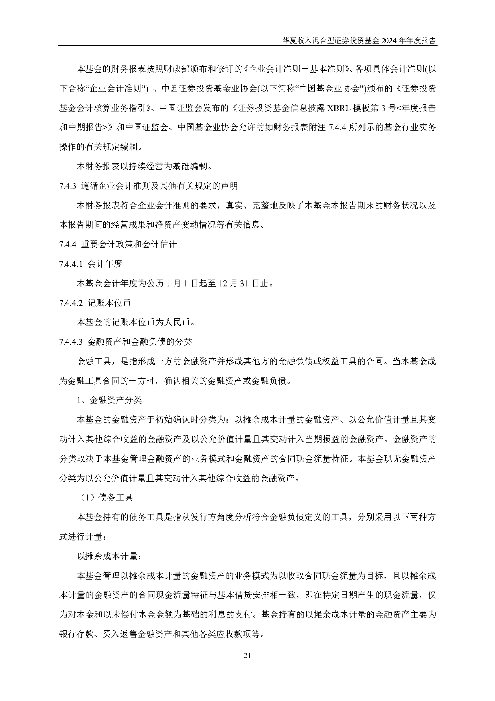

| 华夏收入混合型证券投资基金2024年年度报告 |
| --- |
| 以公允价值计量且其变动计入当期损益： |
| 本基金将持有的未划分为以摊余成本计量的债务工具划分为以公允价值计量且其变动计入当期 |
| 损益。基金持有的以公允价值计量且其变动计入当期损益的金融资产主要为债券投资、资产支持证 |
| 券投资和基金投资，在资产负债表中以交易性金融资产列示。 |
| （2）权益工具 |
| 权益工具是指从发行方角度分析符合权益定义的工具。本基金将对其没有控制、共同控制和重 |
| 大影响的权益工具(主要为股票投资)按照公允价值计量且其变动计入当期损益，在资产负债表中列 |
| 示为交易性金融资产。 |
| 2、金融负债的分类 |
| 本基金的金融负债于初始确认时分类为：以摊余成本计量的金融负债和以公允价值计量且其变 |
| 动计入当期损益的金融负债。本基金目前暂无金融负债分类为以公允价值计量且其变动计入当期损 |
| 益的金融负债。本基金持有的以摊余成本计量的金融负债包括卖出回购金融资产款和其他各类应付 |
| 款项等。 |
| 3、衍生金融工具 |
| 本基金将持有的衍生金融工具以公允价值计量且其变动计入当期损益，在资产负债表中列示为 |
| 衍生金融资产/负债。 |
| 7.4.4.4 金融资产和金融负债的初始确认、后续计量和终止确认 |
| 本基金于成为金融工具合同的一方时确认一项金融资产或金融负债。 |
| 划分为以公允价值计量且其变动计入当期损益的金融资产和金融负债，以及不作为有效套期工 |
| 具的衍生工具，按照取得时的公允价值作为初始确认金额，相关的交易费用在发生时计入当期损益； |
| 对于支付的价款中包含的债券或资产支持证券起息日或上次除息日至购买日止的利息，确认为应计 |
| 利息，包含在交易性金融资产的账面价值中。 |
| 划分为以摊余成本计量的金融资产和金融负债，按照取得时的公允价值作为初始确认金额，相 |
| 关交易费用计入其初始确认金额。 |
| 对于以公允价值计量且其变动计入当期损益的金融资产，采用公允价值进行后续计量，其公允 |
| 价值变动形成的利得或损失计入当期损益。 |
| 对于以摊余成本计量的金融资产，采用实际利率法确认利息收入，其终止确认、修改或减值产 |
| 生的利得或损失，均计入当期损益。 |
| 本基金对以摊余成本计量的金融资产，以预期信用损失为基础，进行减值处理并确认损失准备。 |
| 本基金考虑有关过去事项、当前状况以及对未来经济状况的预测等合理且有依据的信息，以发生违 |

22

华夏收入混合型证券投资基金2024年年度报告
| 约的风险为权重，计算合同应收的现金流量与预期能收到的现金流量之间差额的现值的概率加权金 |
| --- |
| 额，确认预期信用损失。 |
| 对于不含重大融资成分的应收款项，本基金运用简化计量方法，按照相当于整个存续期内的预 |
| 期信用损失金额计量损失准备。除上述采用简化计量方法以外的金融资产，本基金在每个估值日评 |
| 估其信用风险自初始确认后是否已经显著增加，如果信用风险自初始确认后未显著增加，处于第一 |
| 阶段，本基金按照相当于未来12个月内预期信用损失的金额计量损失准备，并按照账面余额和实际 |
| 利率计算利息收入；如果信用风险自初始确认后已显著增加但尚未发生信用减值的，处于第二阶段， |
| 本基金按照相当于整个存续期内预期信用损失的金额计量损失准备，并按照账面余额和实际利率计 |
| 算利息收入；如果初始确认后发生信用减值的，处于第三阶段，本基金按照相当于整个存续期内预 |
| 期信用损失的金额计量损失准备，并按照摊余成本和实际利率计算利息收入。 |
| 本基金在每个估值日评估相关金融工具的信用风险自初始确认后是否已显著增加。本基金以单 |
| 项金融工具或者具有相似信用风险特征的金融工具组合为基础，通过比较金融工具在估值日发生违 |
| 约的风险与在初始确认日发生违约的风险，以确定金融工具预计存续期内发生违约风险的变化情况。 |
| 当对金融资产预期未来现金流量具有不利影响的一项或多项事件发生时，该金融资产成为已发生信 |
| 用减值的金融资产。当本基金不再合理预期能够全部或部分收回金融资产合同现金流量时，本基金 |
| 直接减记该金融资产的账面余额。 |
| 金融资产满足下列条件之一的，予以终止确认：(1) 收取该金融资产现金流量的合同权利终止； |
| (2) 该金融资产已转移，且本基金将金融资产所有权上几乎所有的风险和报酬转移给转入方；或者(3) |
| 该金融资产已转移，虽然本基金既没有转移也没有保留金融资产所有权上几乎所有的风险和报酬， |
| 但是放弃了对该金融资产控制。 |
| 金融资产终止确认时，其账面价值与收到的对价的差额，计入当期损益。 |
| 当金融负债的现时义务全部或部分已经解除时，终止确认该金融负债或义务已解除的部分。终 |
| 止确认部分的账面价值与支付的对价之间的差额，计入当期损益。 |
| 7.4.4.5 金融资产和金融负债的估值原则 |
| 本基金持有的金融工具按如下原则确定公允价值并进行估值： |
| 1、存在活跃市场的金融工具按其估值日的市场交易价格确定公允价值；估值日无交易且最近交 |
| 易日后未发生影响公允价值计量的重大事件的，按最近交易日的市场交易价格确定公允价值。有充 |
| 足证据表明估值日或最近交易日的市场交易价格不能真实反映公允价值的，应对市场交易价格进行 |
| 调整，确定公允价值。与上述投资品种相同，但具有不同特征的，应以相同资产或负债的公允价值 |
| 为基础，并在估值技术中考虑不同特征因素的影响。特征是指对资产出售或使用的限制等，如果该 |

23

华夏收入混合型证券投资基金2024年年度报告
| 限制是针对资产持有者的，那么在估值技术中不应将该限制作为特征考虑。此外，基金管理人不应 |
| --- |
| 考虑因大量持有相关资产或负债所产生的溢价或折价。 |
| 2、当金融工具不存在活跃市场，采用在当前情况下适用并且有足够可利用数据和其他信息支持 |
| 的估值技术确定公允价值。采用估值技术时，优先使用可观察输入值，只有在无法取得相关资产或 |
| 负债可观察输入值或取得不切实可行的情况下，才可以使用不可观察输入值。 |
| 3、如经济环境发生重大变化或证券发行人发生影响金融工具价格的重大事件，应对估值进行调 |
| 整并确定公允价值。 |
| 7.4.4.6 金融资产和金融负债的抵销 |
| 本基金持有的资产和承担的负债基本为金融资产和金融负债。当本基金依法有权抵销债权债务 |
| 且交易双方准备按净额结算时，金融资产与金融负债按抵销后的净额在资产负债表中列示。 |
| 7.4.4.7 实收基金 |
| 实收基金为对外发行基金份额所募集的总金额在扣除损益平准金分摊部分后的余额。对于曾经 |
| 实施份额拆分或折算的基金，由于基金份额拆分或折算引起的实收基金份额变动于基金份额拆分日 |
| 或基金份额折算日根据拆分前或折算前的基金份额数及确定的拆分或折算比例计算认列。由于申购 |
| 和赎回引起的实收基金变动分别于基金申购确认日及基金赎回确认日认列。对于已开放转换业务的 |
| 基金，上述申购和赎回分别包括基金转换所引起的转入基金的实收基金增加和转出基金的实收基金 |
| 减少。 |
| 7.4.4.8 损益平准金 |
| 损益平准金包括已实现平准金和未实现平准金。已实现平准金指在申购或赎回基金份额时，申 |
| 购或赎回款项中包含的按累计未分配的已实现损益占净资产比例计算的金额。未实现平准金指在申 |
| 购或赎回基金份额时，申购或赎回款项中包含的按累计未实现损益占净资产比例计算的金额。损益 |
| 平准金于基金申购确认日或基金赎回确认日认列，并于期末全额转入未分配利润/（累计亏损）。 |
| 7.4.4.9 收入/(损失)的确认和计量 |
| 境内基金投资在持有期间应取得的现金红利于除息日确认为投资收益；境外基金投资在持有期 |
| 间应取得的基金分红收益扣除基金交易所在地适用的预缴所得税后的净额确认投资收益。境内股票 |
| 投资在持有期间应取得的现金股利扣除由上市公司代扣代缴的个人所得税后的净额确认为投资收益； |
| 境外股票投资在持有期间应取得的现金股利扣除股票交易所在地适用的预缴所得税后的净额确认为 |
| 投资收益。境内债券投资和资产支持证券投资在持有期间应取得的按票面利率(对于贴现债为按发行 |
| 价计算的利率)或合同利率计算的利息扣除在适用情况下由债券和资产支持证券发行企业代扣代缴 |
| 的个人所得税及由基金管理人缴纳的增值税后的净额确认为投资收益。境外债券投资在持有期间应 |

24

华夏收入混合型证券投资基金2024年年度报告
| 取得的按票面利率计算的利息扣除在交易所在地适用的预缴所得税及由基金管理人缴纳的增值税后 |
| --- |
| 的净额确认为投资收益。 |
| 以公允价值计量且其变动计入当期损益的金融资产在持有期间的公允价值变动确认为公允价值 |
| 变动损益；处置时其公允价值与初始确认金额之间的差额扣除相关交易费用及在适用情况下由基金 |
| 管理人缴纳的增值税后的净额确认为投资收益，其中包括从公允价值变动损益结转的公允价值累计 |
| 变动额。 |
| 应收款项在持有期间确认的利息收入按实际利率法计算，实际利率法与直线法差异较小的按直 |
| 线法近似计算。 |
| 7.4.4.10 费用的确认和计量 |
| 针对基金合同约定费率和计算方法的费用，本基金在费用涵盖期间按合同约定进行确认。 |
| 其他以摊余成本计量的金融负债在持有期间确认的利息支出按实际利率法计算，实际利率法与 |
| 直线法差异较小的按直线法近似计算。 |
| 7.4.4.11 基金的收益分配政策 |
| 每一基金份额享有同等分配权。本基金收益以现金形式分配，但基金份额持有人可选择现金红 |
| 利或将现金红利按分红权益再投资日的基金份额净值自动转为基金份额进行再投资。期末可供分配 |
| 利润指期末资产负债表中未分配利润与未分配利润中已实现收益的孰低数。 |
| 经宣告的拟分配基金收益于分红除权日从净资产转出。 |
| 7.4.4.12 其他重要的会计政策和会计估计 |
| 根据本基金的估值原则和中国证监会允许的基金行业估值实务操作，本基金确定以下类别股票 |
| 投资和债券投资的公允价值时采用的估值方法及其关键假设如下： |
| 1、对于证券交易所上市的股票，若出现重大事项停牌或交易不活跃(包括涨跌停时的交易不活 |
| 跃)等情况，本基金根据中国证监会公告[2017]13 号《中国证监会关于证券投资基金估值业务的指导 |
| 意见》，根据具体情况采用《关于发布中基协(AMAC)基金行业股票估值指数的通知》提供的指数收 |
| 益法、市盈率法、现金流量折现法等估值技术进行估值。 |
| 2、对于在锁定期内的非公开发行股票、首次公开发行股票时公司股东公开发售股份、通过大宗 |
| 交易取得的带限售期的股票等流通受限股票，根据中国基金业协会中基协发[2017]6 号《关于发布< |
| 证券投资基金投资流通受限股票估值指引(试行)>的通知》之附件《证券投资基金投资流通受限股票 |
| 估值指引(试行)》进行估值。 |
| 3、对于在证券交易所上市或挂牌转让的固定收益品种(可转换债券除外)及在银行间同业市场交 |
| 易的固定收益品种，根据中国证监会公告[2017]13 号《中国证监会关于证券投资基金估值业务的指 |

25

华夏收入混合型证券投资基金2024年年度报告
| 导意见》及中国基金业协会中基协字[2022]566号《关于发布<关于固定收益品种的估值处理标准>的 |
| --- |
| 通知》之附件《关于固定收益品种的估值处理标准》采用估值技术确定公允价值。本基金持有的证 |
| 券交易所上市或挂牌转让的固定收益品种(可转换债券除外)，按照中证指数有限公司所独立提供的 |
| 估值结果确定公允价值。本基金持有的银行间同业市场交易的固定收益品种，按照中债金融估值中 |
| 心有限公司所独立提供的估值结果确定公允价值。 |
| 7.4.5 会计政策和会计估计变更以及差错更正的说明 |
| 7.4.5.1 会计政策变更的说明 |
| 本基金本报告期无会计政策变更。 |
| 7.4.5.2 会计估计变更的说明 |
| 本基金本报告期无会计估计变更。 |
| 7.4.5.3 差错更正的说明 |
| 本基金本报告期无重大会计差错的内容和更正金额。 |
| 7.4.6 税项 |
| 根据财税[2004]78 号《关于证券投资基金税收政策的通知》、财税[2005]103 号《关于股权分置 |
| 试点改革有关税收政策问题的通知》、财税[2008]1号《关于企业所得税若干优惠政策的通知》、财税 |
| [2012]85号《关于实施上市公司股息红利差别化个人所得税政策有关问题的通知》、财税[2014]81号 |
| 《关于沪港股票市场交易互联互通机制试点有关税收政策的通知》、财税[2015]101 号《关于上市公 |
| 司股息红利差别化个人所得税政策有关问题的通知》、财税[2015]125 号《财政部、国家税务总局、 |
| 证监会关于内地与香港基金互认有关税收政策的通知》、财税[2016]36号《关于全面推开营业税改征 |
| 增值税试点的通知》、财税[2016]46号《财政部、国家税务总局关于进一步明确全面推开营改增试点 |
| 金融业有关政策的通知》、财税[2016]70号《财政部、国家税务总局关于金融机构同业往来等增值税 |
| 政策的补充通知》、财税[2016]127 号《财政部国家税务总局证监会关于深港股票市场交易互联互通 |
| 机制试点有关税收政策的通知》、财税[2016]140号《关于明确金融房地产开发 教育辅助服务等增值 |
| 税政策的通知》、财税[2017]2号《关于资管产品增值税政策有关问题的补充通知》、财税[2017]56号 |
| 《关于资管产品增值税有关问题的通知》、财税[2017]90号《关于租入固定资产进项税额抵扣等增值 |
| 税政策的通知》、财税[2023]39号《关于减半征收证券交易印花税的公告》及其他相关财税法规和实 |
| 务操作，主要税项列示如下： |
| （1）以发行基金方式募集资金不属于增值税征收范围，不征收增值税。 |
| （2）资管产品运营过程中发生的增值税应税行为，以资管产品管理人为增值税纳税人。资管产 |
| 品管理人运营资管产品过程中发生的增值税应税行为，暂适用简易计税方法，按照3%的征收率缴纳 |

26

华夏收入混合型证券投资基金2024年年度报告
增值税。
（3）基金买卖股票、债券的差价收入免征增值税，暂不征收企业所得税。
（4）存款利息收入不征收增值税。
（5）国债、地方政府债利息收入，金融同业往来利息收入免征增值税。
（6）对基金取得的债券的利息收入及其他收入，暂不征收企业所得税。
（7）基金作为流通股股东在股权分置改革过程中收到由非流通股股东支付的股份、现金等对价
暂免征收印花税、企业所得税和个人所得税。
（8）对基金在境内取得的股票的股息、红利收入，由上市公司在向基金派发股息、红利收入时
代扣代缴 20%的个人所得税，暂不征收企业所得税。基金在境内从上市公司分配取得的股息红利所
得，持股期限在 1 个月以内（含 1 个月）的，全额计入应纳税所得额，持股期限在 1 个月以上至 1
年（含1年）的，减按50%计入应纳税所得额，持股期限超过1年的，暂免征收个人所得税。对基
金通过沪港通/深港通投资香港联交所上市H股取得的股息红利，H股公司应向中国证券登记结算有
限责任公司(以下简称“中国结算”)提出申请，由中国结算向H股公司提供内地个人投资者名册，H股
公司按照20%的税率代扣个人所得税。基金通过沪港通/深港通投资香港联交所上市的非H股取得的
股息红利，由中国结算按照 20%的税率代扣个人所得税。对香港市场投资者取得的股息、红利收入
按照10%的税率代扣所得税。
（9）基金在境内卖出股票按 0.1%的税率缴纳股票交易印花税，买入股票不征收股票交易印花
税。基金通过沪港通/深港通买卖、继承、赠与联交所上市股票，按照香港特别行政区现行税法规定
缴纳印花税。自2023年8月28日起，证券交易印花税实施减半征收。
（10）基金在境外证券交易所进行交易或取得的源自境外证券市场的收益，其涉及的税收政策，
按照相关国家或地区税收法律和法规执行。
（11）本基金分别按实际缴纳的增值税额的7%、3%、2%缴纳城市维护建设税、教育费附加和
地方教育费附加。
7.4.7 重要财务报表项目的说明
7.4.7.1 货币资金
单位：人民币元
本期末 上年度末
项目
2024年12月31日 2023年12月31日
活期存款 146,009,467.36 174,369,711.72
等于：本金 145,997,393.24 174,350,358.24
加：应计利息 12,074.12 19,353.48
定期存款 - -
27

| 项目 | 本期末
2024年12月31日 | 上年度末
2023年12月31日 |
| --- | --- | --- |
| 活期存款 | 146,009,467.36 | 174,369,711.72 |
| 等于：本金 | 145,997,393.24 | 174,350,358.24 |
| 加：应计利息 | 12,074.12 | 19,353.48 |
| 定期存款 | - | - |

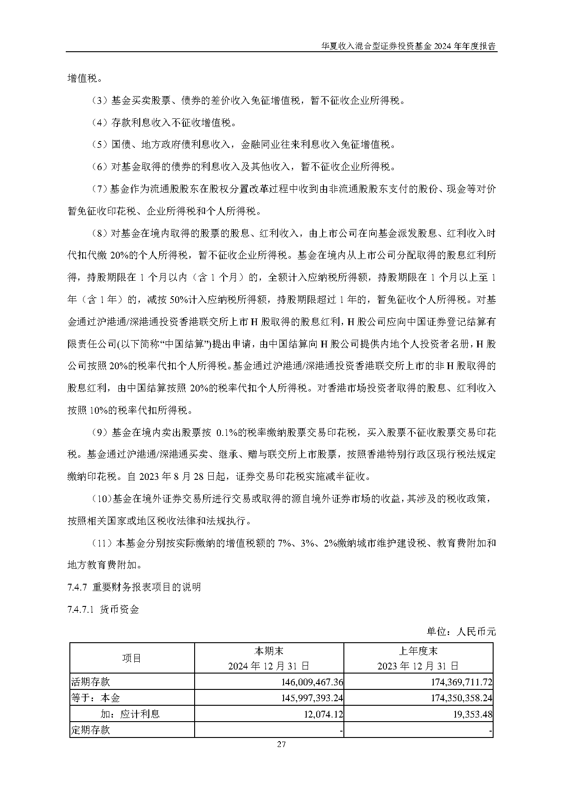

华夏收入混合型证券投资基金2024年年度报告
| 等于：本金 | - | - |
| --- | --- | --- |
| 加：应计利息 | - | - |
| 其中：存款期限1个月以内 | - | - |
| 存款期限1-3个月 | - | - |
| 存款期限3个月以上 | - | - |
| 其他存款 | - | - |
| 等于：本金 | - | - |
| 加：应计利息 | - | - |
| 合计 | 146,009,467.36 | 174,369,711.72 |

7.4.7.2 交易性金融资产
单位：人民币元
本期末
项目 2024年12月31日
成本 应计利息 公允价值 公允价值变动
股票 1,382,100,289.40 - 1,419,423,335.17 37,323,045.77
贵金属投资-
金交所黄金 - - - -
合约
交 易
所 市 - - - -
场
债
银 行
券
间 市 80,000,800.00 1,192,568.31 81,288,568.31 95,200.00
场
合计 80,000,800.00 1,192,568.31 81,288,568.31 95,200.00
资产支持证
- - - -
券
基金 - - - -
其他 - - - -
合计 1,462,101,089.40 1,192,568.31 1,500,711,903.48 37,418,245.77
上年度末
项目 2023年12月31日
成本 应计利息 公允价值 公允价值变动
股票 1,823,794,275.70 - 1,558,454,794.25 -265,339,481.45
贵金属投资-
金交所黄金 - - - -
合约
交 易
债 所 市 - - - -
券 场
银 行 - - - -
28

| 项目 |  | 本期末
2024年12月31日 |  |  |  |
| --- | --- | --- | --- | --- | --- |
|  |  | 成本 | 应计利息 | 公允价值 | 公允价值变动 |
| 股票 |  | 1,382,100,289.40 | - | 1,419,423,335.17 | 37,323,045.77 |
| 贵金属投资-
金交所黄金
合约 |  | - | - | - | - |
| 债
券 | 交 易
所 市
场 | - | - | - | - |
|  | 银 行
间 市
场 | 80,000,800.00 | 1,192,568.31 | 81,288,568.31 | 95,200.00 |
|  | 合计 | 80,000,800.00 | 1,192,568.31 | 81,288,568.31 | 95,200.00 |
| 资产支持证
券 |  | - | - | - | - |
| 基金 |  | - | - | - | - |
| 其他 |  | - | - | - | - |
| 合计 |  | 1,462,101,089.40 | 1,192,568.31 | 1,500,711,903.48 | 37,418,245.77 |
| 项目 |  | 上年度末
2023年12月31日 |  |  |  |
|  |  | 成本 | 应计利息 | 公允价值 | 公允价值变动 |
| 股票 |  | 1,823,794,275.70 | - | 1,558,454,794.25 | -265,339,481.45 |
| 贵金属投资-
金交所黄金
合约 |  | - | - | - | - |
| 债
券 | 交 易
所 市
场 | - | - | - | - |
|  | 银 行 | - | - | - | - |

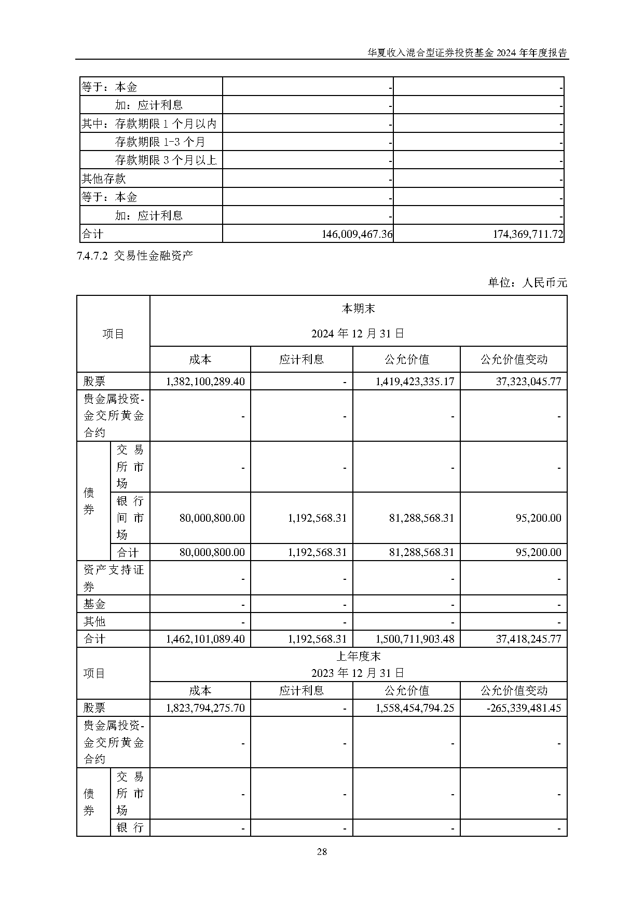

华夏收入混合型证券投资基金2024年年度报告
|  | 间 市
场 |  |  |  |  |
| --- | --- | --- | --- | --- | --- |
|  | 合计 | - | - | - | - |
| 资产支持证
券 |  | - | - | - | - |
| 基金 |  | - | - | - | - |
| 其他 |  | - | - | - | - |
| 合计 |  | 1,823,794,275.70 | - | 1,558,454,794.25 | -265,339,481.45 |

7.4.7.3 衍生金融资产/负债
7.4.7.3.1 衍生金融资产/负债期末余额
无。
7.4.7.4 买入返售金融资产
7.4.7.4.1 各项买入返售金融资产期末余额
无。
7.4.7.4.2 期末买断式逆回购交易中取得的债券
无。
7.4.7.5 其他资产
无。
7.4.7.6 其他负债
单位：人民币元
本期末 上年度末
项目
2024年12月31日 2023年12月31日
应付券商交易单元保证金 - -
应付赎回费 423.58 2,390.90
应付证券出借违约金 - -
应付交易费用 3,077,247.57 3,411,562.25
其中：交易所市场 3,077,247.57 3,411,562.25
银行间市场 - -
应付利息 - -
预提费用 175,000.00 200,000.00
合计 3,252,671.15 3,613,953.15
7.4.7.7 实收基金
金额单位：人民币元
本期
项目 2024年1月1日至2024年12月31日
基金份额（份） 账面金额
上年度末 309,023,533.02 309,023,533.02
本期申购 29,846,760.84 29,846,760.84
29

| 项目 | 本期末
2024年12月31日 | 上年度末
2023年12月31日 |
| --- | --- | --- |
| 应付券商交易单元保证金 | - | - |
| 应付赎回费 | 423.58 | 2,390.90 |
| 应付证券出借违约金 | - | - |
| 应付交易费用 | 3,077,247.57 | 3,411,562.25 |
| 其中：交易所市场 | 3,077,247.57 | 3,411,562.25 |
| 银行间市场 | - | - |
| 应付利息 | - | - |
| 预提费用 | 175,000.00 | 200,000.00 |
| 合计 | 3,252,671.15 | 3,613,953.15 |

| 项目 | 本期
2024年1月1日至2024年12月31日 |  |
| --- | --- | --- |
|  | 基金份额（份） | 账面金额 |
| 上年度末 | 309,023,533.02 | 309,023,533.02 |
| 本期申购 | 29,846,760.84 | 29,846,760.84 |

华夏收入混合型证券投资基金2024年年度报告
| 本期赎回（以“-”号填列） | -54,630,069.03 | -54,630,069.03 |
| --- | --- | --- |
| 本期末 | 284,240,224.83 | 284,240,224.83 |

7.4.7.8 未分配利润
单位：人民币元
项目 已实现部分 未实现部分 未分配利润合计
上年度末 1,890,967,458.60 -470,783,073.91 1,420,184,384.69
本期期初 1,890,967,458.60 -470,783,073.91 1,420,184,384.69
本期利润 -271,578,166.40 302,757,727.22 31,179,560.82
本期基金份额交易产
-136,871,106.93 44,142,102.21 -92,729,004.72
生的变动数
其中：基金申购款 165,008,062.88 -32,275,373.39 132,732,689.49
基金赎回款 -301,879,169.81 76,417,475.60 -225,461,694.21
本期已分配利润 - - -
本期末 1,482,518,185.27 -123,883,244.48 1,358,634,940.79
7.4.7.9 存款利息收入
单位：人民币元
本期 上年度可比期间
项目 2024年1月1日至2024年12 2023年1月1日至2023年12
月31日 月31日
活期存款利息收入 448,511.28 745,229.20
定期存款利息收入 - -
其他存款利息收入 - -
结算备付金利息收入 24,614.92 27,675.85
其他 3,216.79 6,136.62
合计 476,342.99 779,041.67
7.4.7.10 股票投资收益
7.4.7.10.1 股票投资收益项目构成
单位：人民币元
本期 上年度可比期间
项目 2024年1月1日至2024年12 2023年1月1日至2023年12
月31日 月31日
股票投资收益——买卖股票差
价收入 -281,066,615.20 -220,081,177.35
股票投资收益——赎回差价收
入 - -
股票投资收益——申购差价收
入 - -
股票投资收益——证券出借差
价收入 - -
合计 -281,066,615.20 -220,081,177.35
7.4.7.10.2 股票投资收益——买卖股票差价收入
30

| 项目 | 已实现部分 | 未实现部分 | 未分配利润合计 |
| --- | --- | --- | --- |
| 上年度末 | 1,890,967,458.60 | -470,783,073.91 | 1,420,184,384.69 |
| 本期期初 | 1,890,967,458.60 | -470,783,073.91 | 1,420,184,384.69 |
| 本期利润 | -271,578,166.40 | 302,757,727.22 | 31,179,560.82 |
| 本期基金份额交易产
生的变动数 | -136,871,106.93 | 44,142,102.21 | -92,729,004.72 |
| 其中：基金申购款 | 165,008,062.88 | -32,275,373.39 | 132,732,689.49 |
| 基金赎回款 | -301,879,169.81 | 76,417,475.60 | -225,461,694.21 |
| 本期已分配利润 | - | - | - |
| 本期末 | 1,482,518,185.27 | -123,883,244.48 | 1,358,634,940.79 |

| 项目 | 本期
2024年1月1日至2024年12
月31日 | 上年度可比期间
2023年1月1日至2023年12
月31日 |
| --- | --- | --- |
| 活期存款利息收入 | 448,511.28 | 745,229.20 |
| 定期存款利息收入 | - | - |
| 其他存款利息收入 | - | - |
| 结算备付金利息收入 | 24,614.92 | 27,675.85 |
| 其他 | 3,216.79 | 6,136.62 |
| 合计 | 476,342.99 | 779,041.67 |

| 项目 | 本期
2024年1月1日至2024年12
月31日 | 上年度可比期间
2023年1月1日至2023年12
月31日 |
| --- | --- | --- |
| 股票投资收益——买卖股票差
价收入 | -281,066,615.20 | -220,081,177.35 |
| 股票投资收益——赎回差价收
入 | - | - |
| 股票投资收益——申购差价收
入 | - | - |
| 股票投资收益——证券出借差
价收入 | - | - |
| 合计 | -281,066,615.20 | -220,081,177.35 |

华夏收入混合型证券投资基金2024年年度报告
单位：人民币元
本期 上年度可比期间
项目 2024年1月1日至2024年12 2023年1月1日至2023年12月
月31日 31日
卖出股票成交总额 2,962,717,472.37 2,548,465,409.23
减：卖出股票成本总额 3,238,612,896.56 2,762,031,109.18
减：交易费用 5,171,191.01 6,515,477.40
买卖股票差价收入 -281,066,615.20 -220,081,177.35
7.4.7.11 基金投资收益
无。
7.4.7.12 债券投资收益
7.4.7.12.1 债券投资收益项目构成
单位：人民币元
本期 上年度可比期间
项目 2024年1月1日至2024年12月31 2023年1月1日至2023年12月31
日 日
债券投资收益——利息收入 803,433.11 933.55
债券投资收益——买卖债券
（债转股及债券到期兑付）差 -166,437.83 1,215,263.51
价收入
债券投资收益——赎回差价收
- -
入
债券投资收益——申购差价收
- -
入
合计 636,995.28 1,216,197.06
7.4.7.12.2 债券投资收益——买卖债券差价收入
单位：人民币元
本期 上年度可比期间
项目 2024年1月1日至2024年12月31 2023年1月1日至2023年12月31
日 日
卖出债券（债转股及债券到期
17,277,366.85 5,738,483.22
兑付）成交总额
减：卖出债券（债转股及债券到
17,391,135.40 4,521,800.00
期兑付）成本总额
减：应计利息总额 50,933.63 1,190.67
减：交易费用 1,735.65 229.04
买卖债券差价收入 -166,437.83 1,215,263.51
7.4.7.13 资产支持证券投资收益
无。
7.4.7.14 贵金属投资收益
31

| 项目 | 本期
2024年1月1日至2024年12
月31日 | 上年度可比期间
2023年1月1日至2023年12月
31日 |
| --- | --- | --- |
| 卖出股票成交总额 | 2,962,717,472.37 | 2,548,465,409.23 |
| 减：卖出股票成本总额 | 3,238,612,896.56 | 2,762,031,109.18 |
| 减：交易费用 | 5,171,191.01 | 6,515,477.40 |
| 买卖股票差价收入 | -281,066,615.20 | -220,081,177.35 |

| 项目 | 本期
2024年1月1日至2024年12月31
日 | 上年度可比期间
2023年1月1日至2023年12月31
日 |
| --- | --- | --- |
| 债券投资收益——利息收入 | 803,433.11 | 933.55 |
| 债券投资收益——买卖债券
（债转股及债券到期兑付）差
价收入 | -166,437.83 | 1,215,263.51 |
| 债券投资收益——赎回差价收
入 | - | - |
| 债券投资收益——申购差价收
入 | - | - |
| 合计 | 636,995.28 | 1,216,197.06 |

| 项目 | 本期
2024年1月1日至2024年12月31
日 | 上年度可比期间
2023年1月1日至2023年12月31
日 |
| --- | --- | --- |
| 卖出债券（债转股及债券到期
兑付）成交总额 | 17,277,366.85 | 5,738,483.22 |
| 减：卖出债券（债转股及债券到
期兑付）成本总额 | 17,391,135.40 | 4,521,800.00 |
| 减：应计利息总额 | 50,933.63 | 1,190.67 |
| 减：交易费用 | 1,735.65 | 229.04 |
| 买卖债券差价收入 | -166,437.83 | 1,215,263.51 |

华夏收入混合型证券投资基金2024年年度报告
无。
7.4.7.15 衍生工具收益
无。
7.4.7.16 股利收益
单位：人民币元
本期 上年度可比期间
项目 2024年1月1日至2024年12月31 2023年1月1日至2023年12月31
日 日
股票投资产生的股利收益 30,149,797.68 19,289,301.61
其中：证券出借权益补偿收入 - -
基金投资产生的股利收益 - -
合计 30,149,797.68 19,289,301.61
7.4.7.17 公允价值变动收益
单位：人民币元
本期 上年度可比期间
项目名称 2024年1月1日至2024年12月31 2023年1月1日至2023年12月31
日 日
1.交易性金融资产 302,757,727.22 -49,315,704.90
——股票投资 302,662,527.22 -48,977,581.50
——债券投资 95,200.00 -338,123.40
——资产支持证券投资 - -
——基金投资 - -
——贵金属投资 - -
——其他 - -
2.衍生工具 - -
——权证投资 - -
3.其他 - -
减：应税金融商品公允价值变
动产生的预估增值税 - -
合计 302,757,727.22 -49,315,704.90
7.4.7.18 其他收入
单位：人民币元
本期 上年度可比期间
项目
2024年1月1日至2024年12月31日 2023年1月1日至2023年12月31日
基金赎回费收入 217,598.04 261,699.44
其他 189.28 358.06
合计 217,787.32 262,057.50
32

| 项目 | 本期
2024年1月1日至2024年12月31
日 | 上年度可比期间
2023年1月1日至2023年12月31
日 |
| --- | --- | --- |
| 股票投资产生的股利收益 | 30,149,797.68 | 19,289,301.61 |
| 其中：证券出借权益补偿收入 | - | - |
| 基金投资产生的股利收益 | - | - |
| 合计 | 30,149,797.68 | 19,289,301.61 |

| 项目名称 | 本期
2024年1月1日至2024年12月31
日 | 上年度可比期间
2023年1月1日至2023年12月31
日 |
| --- | --- | --- |
| 1.交易性金融资产 | 302,757,727.22 | -49,315,704.90 |
| ——股票投资 | 302,662,527.22 | -48,977,581.50 |
| ——债券投资 | 95,200.00 | -338,123.40 |
| ——资产支持证券投资 | - | - |
| ——基金投资 | - | - |
| ——贵金属投资 | - | - |
| ——其他 | - | - |
| 2.衍生工具 | - | - |
| ——权证投资 | - | - |
| 3.其他 | - | - |
| 减：应税金融商品公允价值变
动产生的预估增值税 | - | - |
| 合计 | 302,757,727.22 | -49,315,704.90 |

| 项目 | 本期
2024年1月1日至2024年12月31日 | 上年度可比期间
2023年1月1日至2023年12月31日 |
| --- | --- | --- |
| 基金赎回费收入 | 217,598.04 | 261,699.44 |
| 其他 | 189.28 | 358.06 |
| 合计 | 217,787.32 | 262,057.50 |

华夏收入混合型证券投资基金2024年年度报告
7.4.7.19 持有基金产生的费用
无。
7.4.7.20 信用减值损失
无。
7.4.7.21 其他费用
单位：人民币元
本期 上年度可比期间
项目 2024年1月1日至2024年12月31 2023年1月1日至2023年12月31
日 日
审计费用 55,000.00 80,000.00
信息披露费 120,000.00 120,000.00
证券出借违约金 - -
银行费用 899.06 1,676.40
银行间账户维护费 36,000.00 36,000.00
其他 1,200.00 1,200.00
合计 213,099.06 238,876.40
7.4.8 或有事项、资产负债表日后事项的说明
7.4.8.1 或有事项
截至资产负债表日，本基金无或有事项。
7.4.8.2 资产负债表日后事项
截至财务报表批准日，本基金无资产负债表日后事项。
7.4.9 关联方关系
关联方名称 与本基金的关系
华夏基金管理有限公司 基金管理人
中国建设银行股份有限公司（“中国建设银行”） 基金托管人
中信证券股份有限公司（“中信证券”） 基金管理人的股东
天津海鹏科技咨询有限公司 基金管理人的股东
MACKENZIE FINANCIAL CORPORATION 基金管理人的股东
上海华夏财富投资管理有限公司（“华夏财富”） 基金管理人的子公司
华夏股权投资基金管理（北京）有限公司 基金管理人的子公司
China Asset Management (Hong Kong) Limited（中文
基金管理人的子公司
名：华夏基金(香港)有限公司）
华夏资本管理有限公司（“华夏资本”） 基金管理人的子公司
注：下述关联交易均在正常业务范围内按一般商业条款订立。
7.4.10 本报告期及上年度可比期间的关联方交易
7.4.10.1 通过关联方交易单元进行的交易
7.4.10.1.1 股票交易
33

| 项目 | 本期
2024年1月1日至2024年12月31
日 | 上年度可比期间
2023年1月1日至2023年12月31
日 |
| --- | --- | --- |
| 审计费用 | 55,000.00 | 80,000.00 |
| 信息披露费 | 120,000.00 | 120,000.00 |
| 证券出借违约金 | - | - |
| 银行费用 | 899.06 | 1,676.40 |
| 银行间账户维护费 | 36,000.00 | 36,000.00 |
| 其他 | 1,200.00 | 1,200.00 |
| 合计 | 213,099.06 | 238,876.40 |

| 关联方名称 | 与本基金的关系 |
| --- | --- |
| 华夏基金管理有限公司 | 基金管理人 |
| 中国建设银行股份有限公司（“中国建设银行”） | 基金托管人 |
| 中信证券股份有限公司（“中信证券”） | 基金管理人的股东 |
| 天津海鹏科技咨询有限公司 | 基金管理人的股东 |
| MACKENZIE FINANCIAL CORPORATION | 基金管理人的股东 |
| 上海华夏财富投资管理有限公司（“华夏财富”） | 基金管理人的子公司 |
| 华夏股权投资基金管理（北京）有限公司 | 基金管理人的子公司 |
| China Asset Management (Hong Kong) Limited（中文
名：华夏基金(香港)有限公司） | 基金管理人的子公司 |
| 华夏资本管理有限公司（“华夏资本”） | 基金管理人的子公司 |

华夏收入混合型证券投资基金2024年年度报告
无。
7.4.10.1.2 权证交易
无。
7.4.10.1.3 债券交易
无。
7.4.10.1.4 债券回购交易
无。
7.4.10.1.5 基金交易
无。
7.4.10.1.6 应支付关联方的佣金
无。
7.4.10.2 关联方报酬
7.4.10.2.1 基金管理费
单位：人民币元
本期 上年度可比期间
项目 2024年1月1日至2024年12 2023年1月1日至2023年12
月31日 月31日
当期发生的基金应支付的管理费 18,668,025.99 28,031,621.58
其中：应支付销售机构的客户维护费 3,040,598.79 4,306,479.15
应支付基金管理人的净管理费 15,627,427.20 23,725,142.43
注：①支付基金管理人的基金管理人报酬按前一日基金资产净值 1.20%的年费率计提，逐日累
计至每月月底，按月支付。
②基金管理人报酬计算公式为：日基金管理人报酬＝前一日基金资产净值×年费率/当年天数。
③客户维护费是指基金管理人与基金销售机构约定的用以向基金销售机构支付客户服务及销售
活动中产生的相关费用，该费用按照代销机构所代销基金的份额保有量作为基数进行计算，从基金
管理人收取的基金管理费中列支，不属于从基金资产中列支的费用项目。
7.4.10.2.2 基金托管费
单位：人民币元
本期 上年度可比期间
项目 2024年1月1日至2024年12 2023年1月1日至2023年12
月31日 月31日
当期发生的基金应支付的托管费 3,111,337.70 4,671,936.81
注：①支付基金托管人的基金托管费按前一日基金资产净值 0.20%的年费率计提，逐日累计至
34

| 项目 | 本期
2024年1月1日至2024年12
月31日 | 上年度可比期间
2023年1月1日至2023年12
月31日 |
| --- | --- | --- |
| 当期发生的基金应支付的管理费 | 18,668,025.99 | 28,031,621.58 |
| 其中：应支付销售机构的客户维护费 | 3,040,598.79 | 4,306,479.15 |
| 应支付基金管理人的净管理费 | 15,627,427.20 | 23,725,142.43 |

| 项目 | 本期
2024年1月1日至2024年12
月31日 | 上年度可比期间
2023年1月1日至2023年12
月31日 |
| --- | --- | --- |
| 当期发生的基金应支付的托管费 | 3,111,337.70 | 4,671,936.81 |

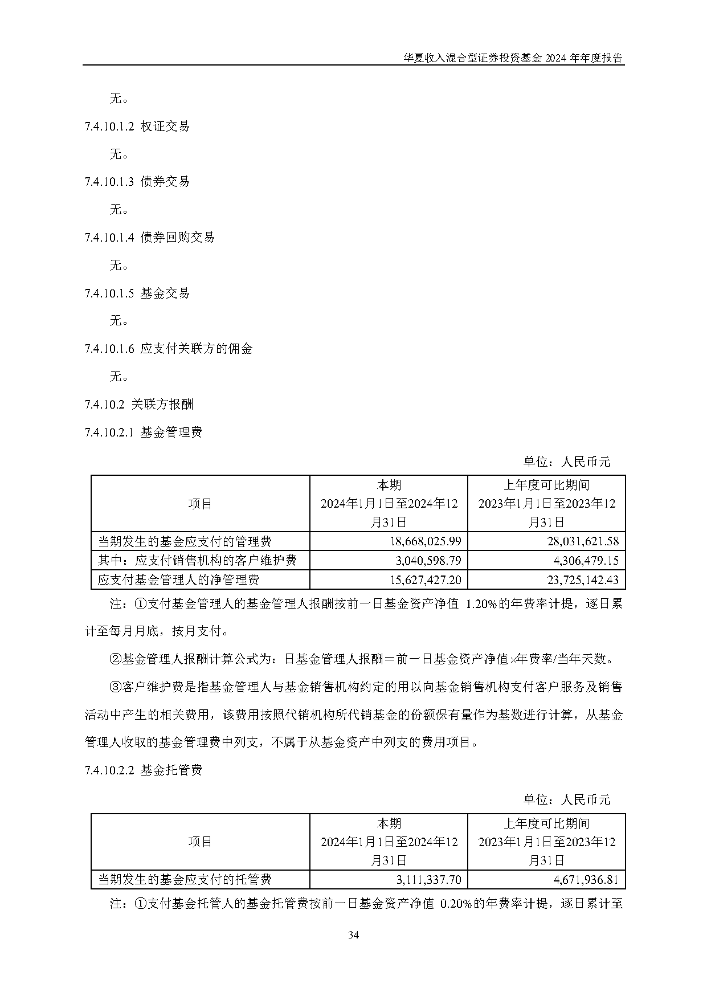

华夏收入混合型证券投资基金2024年年度报告
每月月底，按月支付。
②基金托管费计算公式为：日基金托管费＝前一日基金资产净值×年费率/当年天数。
7.4.10.2.3 销售服务费
无。
7.4.10.3 与关联方进行银行间同业市场的债券(含回购)交易
无。
7.4.10.4 报告期内转融通证券出借业务发生重大关联交易事项的说明
7.4.10.4.1 与关联方通过约定申报方式进行的适用固定期限费率的证券出借业务的情况
无。
7.4.10.4.2 与关联方通过约定申报方式进行的适用市场化期限费率的证券出借业务的情况
无。
7.4.10.5 各关联方投资本基金的情况
7.4.10.5.1 报告期内基金管理人运用固有资金投资本基金的情况
无。
7.4.10.5.2 报告期末除基金管理人之外的其他关联方投资本基金的情况
无。
7.4.10.6 由关联方保管的银行存款余额及当期产生的利息收入
单位：人民币元
本期 上年度可比期间
关联方名称 2024年1月1日至2024年12月31日 2023年1月1日至2023年12月31日
期末余额 当期利息收入 期末余额 当期利息收入
中国建设银行活期存
146,009,467.36 448,511.28 174,369,711.72 745,229.20
款
注：本基金的活期银行存款由基金托管人中国建设银行保管，按银行同业利率或约定利率计息。
7.4.10.7 本基金在承销期内参与关联方承销证券的情况
无。
7.4.10.8 其他关联交易事项的说明
7.4.10.8.1 其他关联交易事项的说明
无。
7.4.11 利润分配情况
本基金本报告期无利润分配事项。
7.4.12 期末（2024年12月31日）本基金持有的流通受限证券
35

| 关联方名称 | 本期
2024年1月1日至2024年12月31日 |  | 上年度可比期间
2023年1月1日至2023年12月31日 |  |
| --- | --- | --- | --- | --- |
|  | 期末余额 | 当期利息收入 | 期末余额 | 当期利息收入 |
| 中国建设银行活期存
款 | 146,009,467.36 | 448,511.28 | 174,369,711.72 | 745,229.20 |

华夏收入混合型证券投资基金2024年年度报告
7.4.12.1 因认购新发/增发证券而于期末持有的流通受限证券
金额单位：人民币元
7.4.12.1.1 受限证券类别：股票
成功 流通 数量
证券代 证券名 认购 期末估 期末成本 期末估值
认购 受限期 受限 (单位： 备注
码 称 价格 值单价 总额 总额
日 类型 股)
新发
苏州 2024-
301626 6个月 流通 21.23 65.78 957 20,317.11 62,951.46 -
天脉 10-17
受限
新发
合合 2024-
688615 6个月 流通 55.18 165.78 289 15,947.02 47,910.42 -
信息 09-19
受限
新发
拉普 2024-
688726 6个月 流通 17.58 33.06 979 17,210.82 32,365.74 -
拉斯 10-22
受限
新发
无线 2024-
301551 6个月 流通 9.40 43.23 652 6,128.80 28,185.96 -
传媒 09-19
受限
1个月 新发
天和 2024-
603072 内 流通 12.30 12.30 2,029 24,956.70 24,956.70 -
磁材 12-24
（含） 受限
新发
上大 2024-
301522 6个月 流通 6.88 24.84 816 5,614.08 20,269.44 -
股份 10-09
受限
新发
托普 2024-
301556 6个月 流通 14.50 59.05 267 3,871.50 15,766.35 -
云农 10-10
受限
新发
壹连 2024-
301631 6个月 流通 72.99 101.96 153 11,167.47 15,599.88 -
科技 11-12
受限
新发
绿联 2024-
301606 6个月 流通 21.21 36.49 396 8,399.16 14,450.04 -
科技 07-17
受限
新发
国科 2024-
301571 6个月 流通 11.14 40.83 350 3,899.00 14,290.50 -
天成 08-14
受限
新发
英思 2024-
301622 6个月 流通 22.36 44.92 306 6,842.16 13,745.52 -
特 11-26
受限
新发
博实 2024-
301608 6个月 流通 44.50 65.38 184 8,188.00 12,029.92 -
结 07-25
受限
佳力 2024- 新发
301586 6个月 18.09 53.14 215 3,889.35 11,425.10 -
奇 08-21 流通
36

| 7.4.12.1.1 受限证券类别：股票 |  |  |  |  |  |  |  |  |  |  |
| --- | --- | --- | --- | --- | --- | --- | --- | --- | --- | --- |
| 证券代
码 | 证券名
称 | 成功
认购
日 | 受限期 | 流通
受限
类型 | 认购
价格 | 期末估
值单价 | 数量
(单位：
股) | 期末成本
总额 | 期末估值
总额 | 备注 |
| 301626 | 苏州
天脉 | 2024-
10-17 | 6个月 | 新发
流通
受限 | 21.23 | 65.78 | 957 | 20,317.11 | 62,951.46 | - |
| 688615 | 合合
信息 | 2024-
09-19 | 6个月 | 新发
流通
受限 | 55.18 | 165.78 | 289 | 15,947.02 | 47,910.42 | - |
| 688726 | 拉普
拉斯 | 2024-
10-22 | 6个月 | 新发
流通
受限 | 17.58 | 33.06 | 979 | 17,210.82 | 32,365.74 | - |
| 301551 | 无线
传媒 | 2024-
09-19 | 6个月 | 新发
流通
受限 | 9.40 | 43.23 | 652 | 6,128.80 | 28,185.96 | - |
| 603072 | 天和
磁材 | 2024-
12-24 | 1个月
内
（含） | 新发
流通
受限 | 12.30 | 12.30 | 2,029 | 24,956.70 | 24,956.70 | - |
| 301522 | 上大
股份 | 2024-
10-09 | 6个月 | 新发
流通
受限 | 6.88 | 24.84 | 816 | 5,614.08 | 20,269.44 | - |
| 301556 | 托普
云农 | 2024-
10-10 | 6个月 | 新发
流通
受限 | 14.50 | 59.05 | 267 | 3,871.50 | 15,766.35 | - |
| 301631 | 壹连
科技 | 2024-
11-12 | 6个月 | 新发
流通
受限 | 72.99 | 101.96 | 153 | 11,167.47 | 15,599.88 | - |
| 301606 | 绿联
科技 | 2024-
07-17 | 6个月 | 新发
流通
受限 | 21.21 | 36.49 | 396 | 8,399.16 | 14,450.04 | - |
| 301571 | 国科
天成 | 2024-
08-14 | 6个月 | 新发
流通
受限 | 11.14 | 40.83 | 350 | 3,899.00 | 14,290.50 | - |
| 301622 | 英思
特 | 2024-
11-26 | 6个月 | 新发
流通
受限 | 22.36 | 44.92 | 306 | 6,842.16 | 13,745.52 | - |
| 301608 | 博实
结 | 2024-
07-25 | 6个月 | 新发
流通
受限 | 44.50 | 65.38 | 184 | 8,188.00 | 12,029.92 | - |
| 301586 | 佳力
奇 | 2024-
08-21 | 6个月 | 新发
流通 | 18.09 | 53.14 | 215 | 3,889.35 | 11,425.10 | - |

华夏收入混合型证券投资基金2024年年度报告
受限
新发
益诺 2024-
688710 6个月 流通 19.06 33.58 332 6,327.92 11,148.56 -
思 08-27
受限
新发
博苑 2024-
301617 6个月 流通 27.76 39.79 253 7,023.28 10,066.87 -
股份 12-03
受限
新发
乔锋 2024-
301603 6个月 流通 26.50 41.98 233 6,174.50 9,781.34 -
智能 07-03
受限
新发
富特 2024-
301607 6个月 流通 14.00 36.14 257 3,598.00 9,287.98 -
科技 08-28
受限
新发
中力 2024-
603194 6个月 流通 20.32 28.13 291 5,913.12 8,185.83 -
股份 12-17
受限
新发
科力 2024-
301552 6个月 流通 30.00 56.87 143 4,290.00 8,132.41 -
装备 07-15
受限
新发
强邦 2024-
001279 6个月 流通 9.68 27.91 265 2,565.20 7,396.15 -
新材 09-27
受限
新发
红四 2024-
603395 6个月 流通 7.98 35.77 154 1,228.92 5,508.58 -
方 11-19
受限
新发
小方 2024-
603207 6个月 流通 12.47 26.65 185 2,306.95 4,930.25 -
制药 08-19
受限
新发
巍华 2024-
603310 6个月 流通 17.39 17.95 254 4,417.06 4,559.30 -
新材 08-07
受限
新发
安乃 2024-
603350 6个月 流通 20.56 36.17 106 2,179.36 3,834.02 -
达 06-26
受限
新发
键邦 2024-
603285 6个月 流通 18.65 22.61 129 2,405.85 2,916.69 -
股份 06-28
受限
新发
天和 2024-
603072 6个月 流通 12.30 12.30 226 2,779.80 2,779.80 -
磁材 12-24
受限
注：①根据中国证监会《上市公司证券发行注册管理办法》，基金参与上市公司向特定对象发
行股票所获得的股票，自发行结束之日起6个月内不得转让。
②基金还可作为特定投资者，认购首次公开发行股票时公司股东公开发售股份，所认购的股份
37

|  |  |  |  | 受限 |  |  |  |  |  |  |
| --- | --- | --- | --- | --- | --- | --- | --- | --- | --- | --- |
| 688710 | 益诺
思 | 2024-
08-27 | 6个月 | 新发
流通
受限 | 19.06 | 33.58 | 332 | 6,327.92 | 11,148.56 | - |
| 301617 | 博苑
股份 | 2024-
12-03 | 6个月 | 新发
流通
受限 | 27.76 | 39.79 | 253 | 7,023.28 | 10,066.87 | - |
| 301603 | 乔锋
智能 | 2024-
07-03 | 6个月 | 新发
流通
受限 | 26.50 | 41.98 | 233 | 6,174.50 | 9,781.34 | - |
| 301607 | 富特
科技 | 2024-
08-28 | 6个月 | 新发
流通
受限 | 14.00 | 36.14 | 257 | 3,598.00 | 9,287.98 | - |
| 603194 | 中力
股份 | 2024-
12-17 | 6个月 | 新发
流通
受限 | 20.32 | 28.13 | 291 | 5,913.12 | 8,185.83 | - |
| 301552 | 科力
装备 | 2024-
07-15 | 6个月 | 新发
流通
受限 | 30.00 | 56.87 | 143 | 4,290.00 | 8,132.41 | - |
| 001279 | 强邦
新材 | 2024-
09-27 | 6个月 | 新发
流通
受限 | 9.68 | 27.91 | 265 | 2,565.20 | 7,396.15 | - |
| 603395 | 红四
方 | 2024-
11-19 | 6个月 | 新发
流通
受限 | 7.98 | 35.77 | 154 | 1,228.92 | 5,508.58 | - |
| 603207 | 小方
制药 | 2024-
08-19 | 6个月 | 新发
流通
受限 | 12.47 | 26.65 | 185 | 2,306.95 | 4,930.25 | - |
| 603310 | 巍华
新材 | 2024-
08-07 | 6个月 | 新发
流通
受限 | 17.39 | 17.95 | 254 | 4,417.06 | 4,559.30 | - |
| 603350 | 安乃
达 | 2024-
06-26 | 6个月 | 新发
流通
受限 | 20.56 | 36.17 | 106 | 2,179.36 | 3,834.02 | - |
| 603285 | 键邦
股份 | 2024-
06-28 | 6个月 | 新发
流通
受限 | 18.65 | 22.61 | 129 | 2,405.85 | 2,916.69 | - |
| 603072 | 天和
磁材 | 2024-
12-24 | 6个月 | 新发
流通
受限 | 12.30 | 12.30 | 226 | 2,779.80 | 2,779.80 | - |

华夏收入混合型证券投资基金2024年年度报告
| 自发行结束之日起12个月内不得转让。 |
| --- |
| ③根据《上海证券交易所科创板上市公司股东以向特定机构投资者询价转让和配售方式减持股 |
| 份实施细则》，基金通过询价转让受让的股份，在受让后6个月内不得转让。 |
| ④基金可使用以基金名义开设的股票账户，选择网上或者网下一种方式进行新股申购。其中基 |
| 金参与网下申购获得的设定限售期的新股或作为战略投资者参与配售获得的新股，在新股上市后的 |
| 约定期限内不能自由转让；基金参与网上申购获配的新股，从新股获配日至新股上市日之间不能自 |
| 由转让。 |
| 7.4.12.2 期末持有的暂时停牌等流通受限股票 |
| 无。 |
| 7.4.12.3 期末债券正回购交易中作为抵押的债券 |
| 7.4.12.3.1 银行间市场债券正回购 |
| 无。 |
| 7.4.12.3.2 交易所市场债券正回购 |
| 无。 |
| 7.4.12.4 期末参与转融通证券出借业务的证券 |
| 无。 |
| 7.4.13 金融工具风险及管理 |
| 7.4.13.1 风险管理政策和组织架构 |
| 本基金的风险管理政策是使基金投资风险可测、可控、可承担。本基金管理人建立了由风险管 |
| 理委员会、督察长、法律部、合规部、稽核部、风险管理部和相关业务部门构成的多层次风险管理 |
| 架构体系。风险管理团队在识别、衡量投资风险后，通过正式报告的方式，将分析结果及时传达给 |
| 基金经理、投资总监、投资决策委员会和风险管理委员会，协助制定风险控制决策，实现风险管理 |
| 目标。 |
| 本基金管理人主要通过定性分析和定量分析的方法，估测各种金融工具风险可能产生的损失。 |
| 本基金管理人从定性分析的角度出发，判断风险损失的严重性；从定量分析的角度出发，根据本基 |
| 金的投资目标，结合基金资产所运用的金融工具特征，通过特定的风险量化指标、模型和日常的量 |
| 化报告，参考压力测试结果，确定风险损失的限度和相应置信程度，及时对各种风险进行监督、检 |
| 查和评估，并制定相应决策，将风险控制在预期可承受的范围内。 |
| 7.4.13.2 信用风险 |

信用风险是指由于基金所投资债券的发行人出现违约、拒绝支付到期本息，债券发行人信用评
38

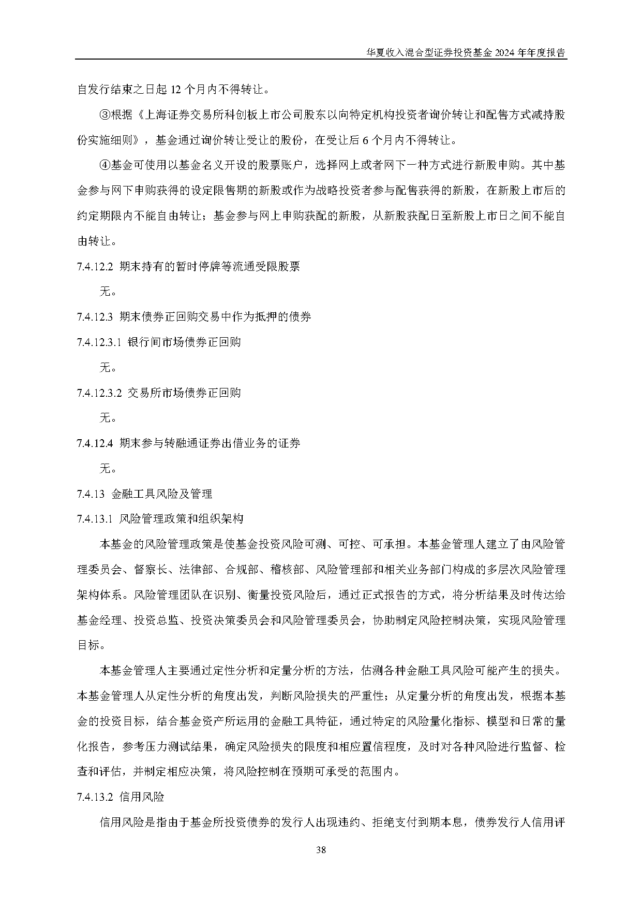

华夏收入混合型证券投资基金2024年年度报告
| 级降低导致债券价格下降，或基金在交易过程中发生交收违约，而造成基金资产损失的可能性。 |
| --- |
| 本基金管理人通过信用分析团队建立了内部评级体系和交易对手库，对发行人及债券投资进行 |
| 内部评级，对交易对手的资信状况进行充分评估、设定授信额度，以控制可能出现的信用风险。 |
| 7.4.13.3 流动性风险 |
| 流动性风险是在市场或持有资产流动性不足的情况下，基金管理人可能无法迅速、低成本地调 |
| 整基金投资组合，从而对基金收益造成不利影响。 |
| 本基金管理人通过限制投资集中度来管理投资品种变现的流动性风险。除在“7.4.12期末本基金 |
| 持有的流通受限证券”中列示的部分基金资产流通暂时受限制的情况外，本基金所投资的证券均能及 |
| 时变现。 |
| 7.4.13.3.1 报告期内本基金组合资产的流动性风险分析 |
| 在日常运作中，本基金的流动性安排能够与基金合同约定的申购赎回安排以及投资者的申购赎 |
| 回规律相匹配。 |
| 在资产端，本基金主要投资于基金合同约定的具有良好流动性的金融工具。基金管理人持续监 |
| 测本基金持有资产的市场交易量、交易集中度等涉及资产流动性水平的风险指标，并定期开展压力 |
| 测试，详细评估在不同的压力情景下资产变现情况的变化。 |
| 在负债端，基金管理人持续监测本基金开放期内投资者历史申赎、投资者类型和结构变化等数 |
| 据，审慎评估不同市场环境可能带来的投资者潜在赎回需求，当市场环境或投资者结构发生变化时， |
| 及时调整组合资产结构及比例，预留充足现金头寸，保持基金资产可变现规模和期限与负债赎回规 |
| 模和期限的匹配。 |
| 如遭遇极端市场情形或投资者非预期巨额赎回情形，基金管理人将采用本基金合同约定的赎回 |
| 申请处理方式及其他各类流动性风险管理工具，控制极端情况下的潜在流动性风险。 |
| 7.4.13.4 市场风险 |
| 市场风险是指由于市场变化或波动所引起的资产损失的可能性，本基金管理人通过监测组合敏 |
| 感性指标来衡量市场风险。 |
| 7.4.13.4.1 利率风险 |
| 利率风险是指利率变动引起组合中资产特别是债券投资的市场价格变动，从而影响基金投资收 |
| 益的风险。 |
| 本基金管理人定期对组合中债券投资部分面临的利率风险进行监控，并通过调整投资组合的久 |
| 期等方法对上述利率风险进行管理。 |
| 7.4.13.4.1.1 利率风险敞口 |

39

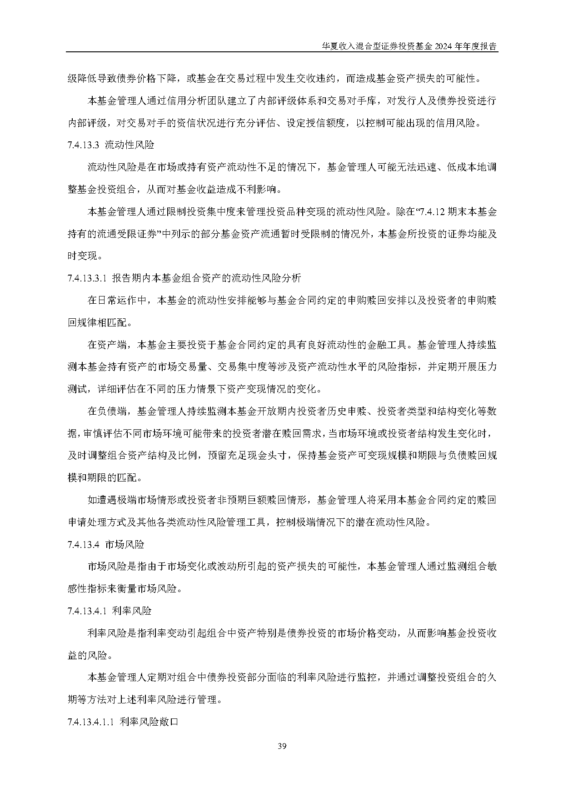

华夏收入混合型证券投资基金2024年年度报告
单位：人民币元
本期末
1年以内 1-5年 5年以上 合计
2024年12月31日
货币资金 146,009,467.36 - - 146,009,467.36
结算备付金 1,708,609.31 - - 1,708,609.31
结算保证金 245,326.48 - - 245,326.48
债券投资 81,288,568.31 - - 81,288,568.31
资产支持证券 - - - -
买入返售金融资产 - - - -
应收直销申购款 - - - -
卖出回购金融资产
- - - -
款
注：本表所示为本基金生息资产及负债的公允价值，并按照合约规定的利率重新定价日或到期
日孰早者予以分类。
7.4.13.4.1.2 利率风险的敏感性分析
假设 除市场利率以外的其他市场变量保持不变
对资产负债表日基金资产净值的
影响金额（单位：人民币元）
相关风险变量的变动
本期末 上年度末
分析
2024年12月31日 2023年12月31日
利率下降25个基点 31,694.57 -
利率上升25个基点 -31,669.87 -
7.4.13.4.2 外汇风险
外汇风险是指金融工具的公允价值或未来现金流量因外汇汇率变动而发生波动的风险。本基金
持有的金融工具以人民币计价，因此无重大外汇风险。
7.4.13.4.3 其他价格风险
其他价格风险为除市场利率和外汇汇率以外的市场因素（单个证券发行主体自身经营情况或证
券市场整体波动）发生变动时导致基金资产发生损失的风险。
本基金通过投资组合的分散化降低市场价格风险。此外，本基金管理人对本基金所持有的证券
价格实施监控，定期运用多种定量方法进行风险度量和分析，以对风险进行跟踪和控制。
7.4.13.4.3.1 其他价格风险敞口
金额单位：人民币元
本期末 上年度末
2024年12月31日 2023年12月31日
项目 占基金 占基金
公允价值 资产净 公允价值 资产净
值比例 值比例
40

| 本期末
2024年12月31日 | 1年以内 | 1-5年 | 5年以上 | 合计 |
| --- | --- | --- | --- | --- |
| 货币资金 | 146,009,467.36 | - | - | 146,009,467.36 |
| 结算备付金 | 1,708,609.31 | - | - | 1,708,609.31 |
| 结算保证金 | 245,326.48 | - | - | 245,326.48 |
| 债券投资 | 81,288,568.31 | - | - | 81,288,568.31 |
| 资产支持证券 | - | - | - | - |
| 买入返售金融资产 | - | - | - | - |
| 应收直销申购款 | - | - | - | - |
| 卖出回购金融资产
款 | - | - | - | - |

| 假设 | 除市场利率以外的其他市场变量保持不变 |  |  |
| --- | --- | --- | --- |
| 分析 | 相关风险变量的变动 | 对资产负债表日基金资产净值的
影响金额（单位：人民币元） |  |
|  |  | 本期末
2024年12月31日 | 上年度末
2023年12月31日 |
|  | 利率下降25个基点 | 31,694.57 | - |
|  | 利率上升25个基点 | -31,669.87 | - |

| 项目 | 本期末
2024年12月31日 |  | 上年度末
2023年12月31日 |  |
| --- | --- | --- | --- | --- |
|  | 公允价值 | 占基金
资产净
值比例 | 公允价值 | 占基金
资产净
值比例 |

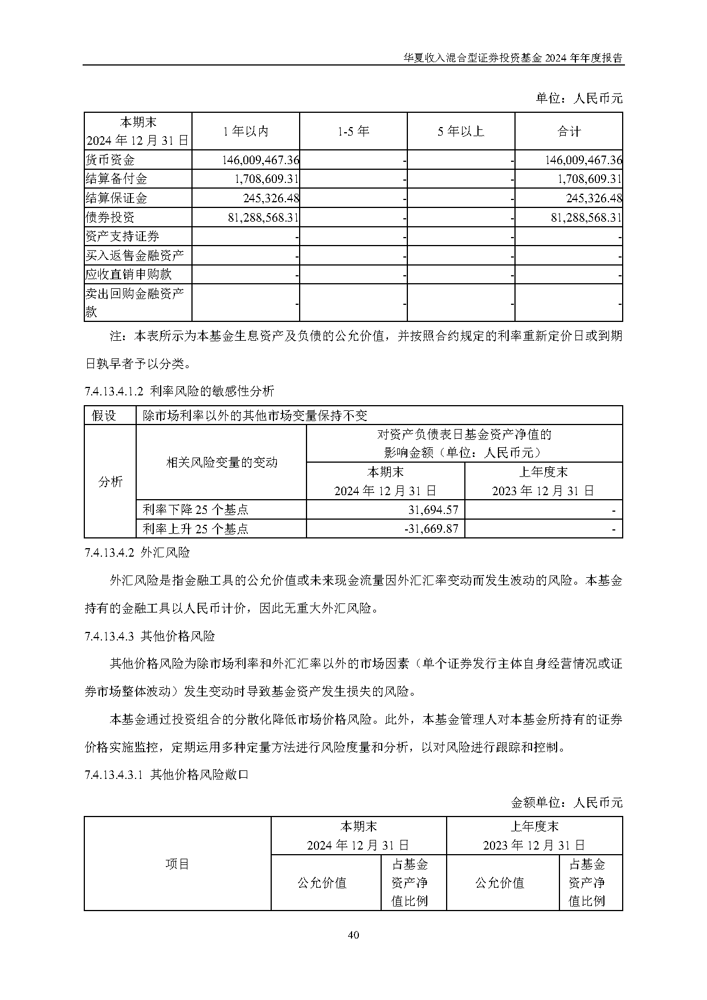

华夏收入混合型证券投资基金2024年年度报告
（%） （%）
|  |  | （%） |  | （%） |
| --- | --- | --- | --- | --- |
| 交易性金融资产－股票投资 | 1,419,423,335.17 | 86.40 | 1,558,454,794.25 | 90.13 |
| 交易性金融资产—基金投资 | - | - | - | - |
| 交易性金融资产－贵金属投资 | - | - | - | - |
| 衍生金融资产－权证投资 | - | - | - | - |
| 其他 | - | - | - | - |
| 合计 | 1,419,423,335.17 | 86.40 | 1,558,454,794.25 | 90.13 |

注：①本表中交易性金融资产-债券投资科目仅包含可转换公司债券和可交换公司债券等。
②由于四舍五入的原因，分项之和与合计项之间可能存在尾差。
7.4.13.4.3.2 其他价格风险的敏感性分析
假设 除沪深300指数以外的其他市场变量保持不变
对资产负债表日基金资产净值的
影响金额（单位：人民币元）
相关风险变量的变动
本期末 上年度末
分析
2024年12月31日 2023年12月31日
-5% -78,338,223.69 -80,419,089.74
+5% 78,338,223.69 80,419,089.74
7.4.14 公允价值
7.4.14.1 金融工具公允价值计量的方法
公允价值计量结果所属的层次，由对公允价值计量整体而言具有重要意义的输入值所属的最低
层次决定：
第一层次：相同资产或负债在活跃市场上未经调整的报价；
第二层次：除第一层次输入值外相关资产或负债直接或间接可观察的输入值；
第三层次：相关资产或负债的不可观察输入值。
7.4.14.2 持续的以公允价值计量的金融工具
7.4.14.2.1 各层次金融工具的公允价值
单位：人民币元
上年度末
本期末
公允价值计量结果所属的层次
2024年12月31日 2023年12月31日
第一层次 1,419,020,860.36 1,499,879,277.81
第二层次 81,316,304.81 898,742.02
第三层次 374,738.31 57,676,774.42
合计 1,500,711,903.48 1,558,454,794.25
7.4.14.2.2 公允价值所属层次间的重大变动
对于公开市场交易的证券等投资，若出现交易不活跃（包括重大事项停牌、境内证券涨跌停等
导致的交易不活跃）和非公开发行等情况，本基金不会于交易不活跃期间及限售期间将相关投资的
41

| 假设 | 除沪深300指数以外的其他市场变量保持不变 |  |  |
| --- | --- | --- | --- |
| 分析 | 相关风险变量的变动 | 对资产负债表日基金资产净值的
影响金额（单位：人民币元） |  |
|  |  | 本期末
2024年12月31日 | 上年度末
2023年12月31日 |
|  | -5% | -78,338,223.69 | -80,419,089.74 |
|  | +5% | 78,338,223.69 | 80,419,089.74 |

| 公允价值计量结果所属的层次 | 本期末
2024年12月31日 | 上年度末
2023年12月31日 |
| --- | --- | --- |
| 第一层次 | 1,419,020,860.36 | 1,499,879,277.81 |
| 第二层次 | 81,316,304.81 | 898,742.02 |
| 第三层次 | 374,738.31 | 57,676,774.42 |
| 合计 | 1,500,711,903.48 | 1,558,454,794.25 |

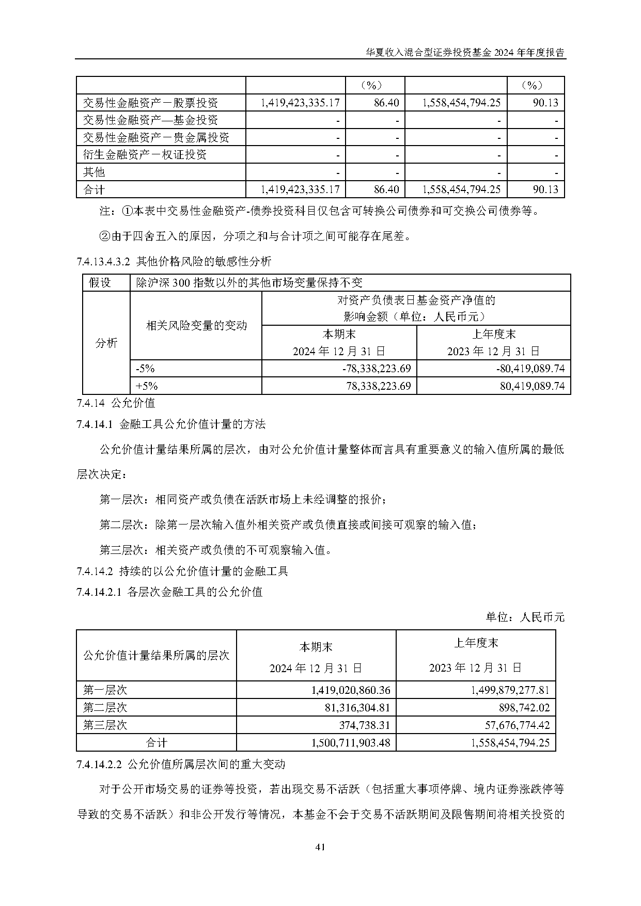

华夏收入混合型证券投资基金2024年年度报告
公允价值列入第一层次，并根据估值调整中采用的对公允价值计量整体而言具有重要意义的输入值
所属的最低层次，确定相关投资的公允价值应属第二层次或第三层次。本基金政策以导致各层次之
间转换的事项发生日作为确定金融工具公允价值层次之间转换的时点。
7.4.14.2.3 第三层次公允价值余额及变动情况
7.4.14.2.3.1 第三层次公允价值余额及变动情况
单位：人民币元
本期
2024年1月1日至2024年12月31日
项目
交易性金融资产
合计
债券投资 股票投资
期初余额 - 57,676,774.42 57,676,774.42
当期购买 - 8,999,992.72 8,999,992.72
当期出售/结算 - - -
转入第三层次 - 984,481.43 984,481.43
转出第三层次 - 58,287,069.97 58,287,069.97
当期利得或损失总额 - -8,999,440.29 -8,999,440.29
其中：计入损益的利
- -8,999,440.29 -8,999,440.29
得或损失
计入其他综合
收益的利得或损失 - - -
（若有）
期末余额 - 374,738.31 374,738.31
期末仍持有的第三层
次金融资产计入本期
损益的未实现利得或 - 214,833.68 214,833.68
损失的变动——公允
价值变动损益
上年度可比期间
2023年1月1日至2023年12月31日
项目
交易性金融资产
合计
债券投资 股票投资
期初余额 - 93,954,372.77 93,954,372.77
当期购买 - 70,000,005.39 70,000,005.39
当期出售/结算 - - -
转入第三层次 - 2,756,227.09 2,756,227.09
转出第三层次 - 115,299,047.02 115,299,047.02
当期利得或损失总额 - 6,265,216.19 6,265,216.19
其中：计入损益的利
- 6,265,216.19 6,265,216.19
得或损失
计入其他综合
- - -
收益的利得或损失
42

| 项目 | 本期
2024年1月1日至2024年12月31日 |  |  |
| --- | --- | --- | --- |
|  | 交易性金融资产 |  | 合计 |
|  | 债券投资 | 股票投资 |  |
| 期初余额 | - | 57,676,774.42 | 57,676,774.42 |
| 当期购买 | - | 8,999,992.72 | 8,999,992.72 |
| 当期出售/结算 | - | - | - |
| 转入第三层次 | - | 984,481.43 | 984,481.43 |
| 转出第三层次 | - | 58,287,069.97 | 58,287,069.97 |
| 当期利得或损失总额 | - | -8,999,440.29 | -8,999,440.29 |
| 其中：计入损益的利
得或损失 | - | -8,999,440.29 | -8,999,440.29 |
| 计入其他综合
收益的利得或损失
（若有） | - | - | - |
| 期末余额 | - | 374,738.31 | 374,738.31 |
| 期末仍持有的第三层
次金融资产计入本期
损益的未实现利得或
损失的变动——公允
价值变动损益 | - | 214,833.68 | 214,833.68 |
| 项目 | 上年度可比期间
2023年1月1日至2023年12月31日 |  |  |
|  | 交易性金融资产 |  | 合计 |
|  | 债券投资 | 股票投资 |  |
| 期初余额 | - | 93,954,372.77 | 93,954,372.77 |
| 当期购买 | - | 70,000,005.39 | 70,000,005.39 |
| 当期出售/结算 | - | - | - |
| 转入第三层次 | - | 2,756,227.09 | 2,756,227.09 |
| 转出第三层次 | - | 115,299,047.02 | 115,299,047.02 |
| 当期利得或损失总额 | - | 6,265,216.19 | 6,265,216.19 |
| 其中：计入损益的利
得或损失 | - | 6,265,216.19 | 6,265,216.19 |
| 计入其他综合
收益的利得或损失 | - | - | - |

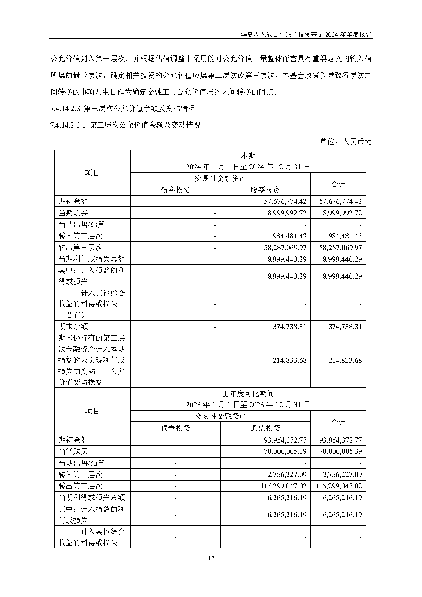

华夏收入混合型证券投资基金2024年年度报告
（若有）
期末余额 - 57,676,774.42 57,676,774.42
期末仍持有的第三层
次金融资产计入本期
损益的未实现利得或 - -5,119,266.64 -5,119,266.64
损失的变动——公允
价值变动损益
7.4.14.2.3.2 使用重要不可观察输入值的第三层次公允价值计量的情况
单位：人民币元
不可观察输入值
本期末公允价 采用的估值技
项目 范围/加权平 与公允价值之
值 术 名称
均值 间的关系
平均价格亚式 预期年化波动
限售股票 374,738.31 0.3423-5.7444 负相关
期权模型 率
不可观察输入值
上年度末公允 采用的估值技
项目 范围/加权平 与公允价值之
价值 术 名称
均值 间的关系
平均价格亚式 预期年化波动
限售股票 57,676,774.42 0.1462-2.1988 负相关
期权模型 率
7.4.14.3 非持续的以公允价值计量的金融工具的说明
截至2024年12月31日止，本基金未持有非持续的以公允价值计量的金融资产。
7.4.14.4 不以公允价值计量的金融工具的相关说明
本基金持有的不以公允价值计量的金融工具为以摊余成本计量的金融资产和金融负债，这些金
融工具因其剩余期限较短，其账面价值与公允价值差异很小。
7.4.15 有助于理解和分析会计报表需要说明的其他事项
截至资产负债表日本基金无需要说明的其他重要事项。
§8 投资组合报告
8.1 期末基金资产组合情况
金额单位：人民币元
占基金总资产的比例
序号 项目 金额
（%）
1 权益投资 1,419,423,335.17 86.09
其中：股票 1,419,423,335.17 86.09
2 基金投资 - -
43

| （若有） |  |  |  |
| --- | --- | --- | --- |
| 期末余额 | - | 57,676,774.42 | 57,676,774.42 |
| 期末仍持有的第三层
次金融资产计入本期
损益的未实现利得或
损失的变动——公允
价值变动损益 | - | -5,119,266.64 | -5,119,266.64 |

| 项目 | 本期末公允价
值 | 采用的估值技
术 |  | 不可观察输入值 |  |  |  |
| --- | --- | --- | --- | --- | --- | --- | --- |
|  |  |  | 名称 |  | 范围/加权平
均值 | 与公允价值之
间的关系 |  |
| 限售股票 | 374,738.31 | 平均价格亚式
期权模型 | 预期年化波动
率 |  | 0.3423-5.7444 | 负相关 |  |
| 项目 | 上年度末公允
价值 | 采用的估值技
术 |  | 不可观察输入值 |  |  |  |
|  |  |  | 名称 |  | 范围/加权平
均值 | 与公允价值之
间的关系 |  |
| 限售股票 | 57,676,774.42 | 平均价格亚式
期权模型 | 预期年化波动
率 |  | 0.1462-2.1988 | 负相关 |  |

| 本期末公允价 |
| --- |
| 值 |

| 采用的估值技 |
| --- |
| 术 |

| 范围/加权平 |
| --- |
| 均值 |

| 与公允价值之 |
| --- |
| 间的关系 |

| 上年度末公允 |
| --- |
| 价值 |

| 采用的估值技 |
| --- |
| 术 |

| 范围/加权平 |
| --- |
| 均值 |

| 与公允价值之 |
| --- |
| 间的关系 |

| 序号 | 项目 | 金额 | 占基金总资产的比例
（%） |
| --- | --- | --- | --- |
| 1 | 权益投资 | 1,419,423,335.17 | 86.09 |
|  | 其中：股票 | 1,419,423,335.17 | 86.09 |
| 2 | 基金投资 | - | - |

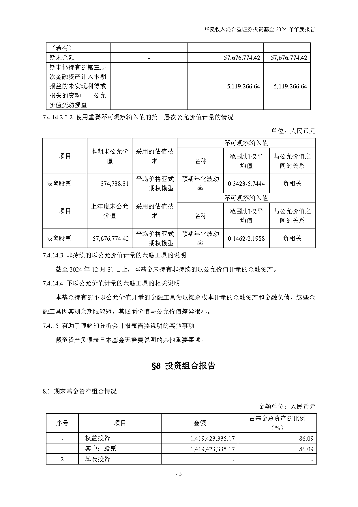

华夏收入混合型证券投资基金2024年年度报告
3 固定收益投资 81,288,568.31 4.93
其中：债券 81,288,568.31 4.93
资产支持证券 - -
4 贵金属投资 - -
5 金融衍生品投资 - -
6 买入返售金融资产 - -
其中：买断式回购的买入返
- -
售金融资产
银行存款和结算备付金合
7 147,718,076.67 8.96
计
8 其他各项资产 404,051.07 0.02
9 合计 1,648,834,031.22 100.00
8.2 报告期末按行业分类的股票投资组合
8.2.1 报告期末按行业分类的境内股票投资组合
占基金资产净值比例
代码 行业类别 公允价值（元）
（％）
A 农、林、牧、渔业 - -
B 采矿业 81,853,028.00 4.98
C 制造业 989,367,643.83 60.22
D 电力、热力、燃气及水生产和供应业 - -
E 建筑业 12,000,000.00 0.73
F 批发和零售业 11,798,600.00 0.72
G 交通运输、仓储和邮政业 28,155,178.80 1.71
H 住宿和餐饮业 - -
I 信息传输、软件和信息技术服务业 155,639.73 0.01
J 金融业 216,223,455.63 13.16
K 房地产业 - -
L 租赁和商务服务业 68,837,372.76 4.19
M 科学研究和技术服务业 11,019,148.56 0.67
N 水利、环境和公共设施管理业 13,267.86 0.00
O 居民服务、修理和其他服务业 - -
P 教育 - -
Q 卫生和社会工作 - -
R 文化、体育和娱乐业 - -
S 综合 - -
合计 1,419,423,335.17 86.40
8.3 期末按公允价值占基金资产净值比例大小排序的所有股票投资明细
金额单位：人民币元
占基金资产净
序号 股票代码 股票名称 数量(股) 公允价值
值比例(％)
1 002371 北方华创 163,978 64,115,398.00 3.90
44

| 3 | 固定收益投资 | 81,288,568.31 | 4.93 |
| --- | --- | --- | --- |
|  | 其中：债券 | 81,288,568.31 | 4.93 |
|  | 资产支持证券 | - | - |
| 4 | 贵金属投资 | - | - |
| 5 | 金融衍生品投资 | - | - |
| 6 | 买入返售金融资产 | - | - |
|  | 其中：买断式回购的买入返
售金融资产 | - | - |
| 7 | 银行存款和结算备付金合
计 | 147,718,076.67 | 8.96 |
| 8 | 其他各项资产 | 404,051.07 | 0.02 |
| 9 | 合计 | 1,648,834,031.22 | 100.00 |

| 代码 | 行业类别 | 公允价值（元） | 占基金资产净值比例
（％） |
| --- | --- | --- | --- |
| A | 农、林、牧、渔业 | - | - |
| B | 采矿业 | 81,853,028.00 | 4.98 |
| C | 制造业 | 989,367,643.83 | 60.22 |
| D | 电力、热力、燃气及水生产和供应业 | - | - |
| E | 建筑业 | 12,000,000.00 | 0.73 |
| F | 批发和零售业 | 11,798,600.00 | 0.72 |
| G | 交通运输、仓储和邮政业 | 28,155,178.80 | 1.71 |
| H | 住宿和餐饮业 | - | - |
| I | 信息传输、软件和信息技术服务业 | 155,639.73 | 0.01 |
| J | 金融业 | 216,223,455.63 | 13.16 |
| K | 房地产业 | - | - |
| L | 租赁和商务服务业 | 68,837,372.76 | 4.19 |
| M | 科学研究和技术服务业 | 11,019,148.56 | 0.67 |
| N | 水利、环境和公共设施管理业 | 13,267.86 | 0.00 |
| O | 居民服务、修理和其他服务业 | - | - |
| P | 教育 | - | - |
| Q | 卫生和社会工作 | - | - |
| R | 文化、体育和娱乐业 | - | - |
| S | 综合 | - | - |
|  | 合计 | 1,419,423,335.17 | 86.40 |

| 序号 | 股票代码 | 股票名称 | 数量(股) | 公允价值 | 占基金资产净
值比例(％) |
| --- | --- | --- | --- | --- | --- |
| 1 | 002371 | 北方华创 | 163,978 | 64,115,398.00 | 3.90 |

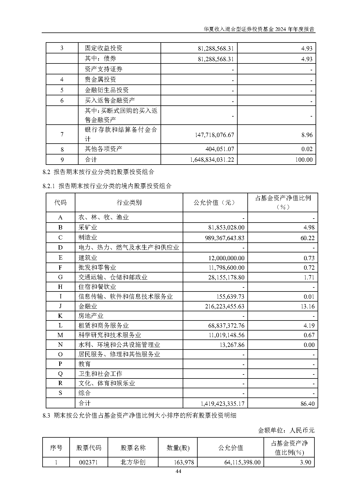

华夏收入混合型证券投资基金2024年年度报告
| 2 | 600153 | 建发股份 | 5,156,388 | 54,245,201.76 | 3.30 |
| --- | --- | --- | --- | --- | --- |
| 3 | 000933 | 神火股份 | 3,074,200 | 51,953,980.00 | 3.16 |
| 4 | 600036 | 招商银行 | 1,213,368 | 47,685,362.40 | 2.90 |
| 5 | 002050 | 三花智控 | 1,941,800 | 45,651,718.00 | 2.78 |
| 6 | 000651 | 格力电器 | 964,500 | 43,836,525.00 | 2.67 |
| 7 | 601838 | 成都银行 | 2,538,363 | 43,431,390.93 | 2.64 |
| 8 | 601225 | 陕西煤业 | 1,842,000 | 42,844,920.00 | 2.61 |
| 9 | 601318 | 中国平安 | 770,700 | 40,577,355.00 | 2.47 |
| 10 | 002271 | 东方雨虹 | 3,081,300 | 39,995,274.00 | 2.43 |
| 11 | 002475 | 立讯精密 | 964,588 | 39,316,606.88 | 2.39 |
| 12 | 002920 | 德赛西威 | 338,311 | 37,251,424.21 | 2.27 |
| 13 | 600079 | 人福医药 | 1,545,800 | 36,140,804.00 | 2.20 |
| 14 | 300750 | 宁德时代 | 127,402 | 33,888,932.00 | 2.06 |
| 15 | 300395 | 菲利华 | 821,300 | 30,889,093.00 | 1.88 |
| 16 | 688596 | 正帆科技 | 843,139 | 29,973,591.45 | 1.82 |
| 17 | 601689 | 拓普集团 | 604,758 | 29,633,142.00 | 1.80 |
| 18 | 300274 | 阳光电源 | 391,260 | 28,886,725.80 | 1.76 |
| 19 | 601717 | 郑煤机 | 2,187,010 | 28,387,389.80 | 1.73 |
| 20 | 002832 | 比音勒芬 | 1,325,207 | 28,372,681.87 | 1.73 |
| 21 | 601601 | 中国太保 | 793,000 | 27,025,440.00 | 1.65 |
| 22 | 300476 | 胜宏科技 | 635,597 | 26,752,277.73 | 1.63 |
| 23 | 600256 | 广汇能源 | 3,959,600 | 26,648,108.00 | 1.62 |
| 24 | 002472 | 双环传动 | 852,900 | 26,115,798.00 | 1.59 |
| 25 | 688389 | 普门科技 | 1,733,261 | 25,808,256.29 | 1.57 |
| 26 | 600438 | 通威股份 | 1,166,400 | 25,789,104.00 | 1.57 |
| 27 | 002080 | 中材科技 | 1,947,650 | 25,475,262.00 | 1.55 |
| 28 | 000807 | 云铝股份 | 1,757,500 | 23,778,975.00 | 1.45 |
| 29 | 600862 | 中航高科 | 800,000 | 20,208,000.00 | 1.23 |
| 30 | 002180 | 纳思达 | 717,224 | 20,204,200.08 | 1.23 |
| 31 | 600066 | 宇通客车 | 700,000 | 18,466,000.00 | 1.12 |
| 32 | 603507 | 振江股份 | 759,490 | 18,258,139.60 | 1.11 |
| 33 | 600522 | 中天科技 | 1,266,913 | 18,142,194.16 | 1.10 |
| 34 | 002241 | 歌尔股份 | 700,000 | 18,067,000.00 | 1.10 |
| 35 | 300181 | 佐力药业 | 1,173,087 | 18,018,616.32 | 1.10 |
| 36 | 000528 | 柳工 | 1,485,300 | 17,912,718.00 | 1.09 |
| 37 | 601138 | 工业富联 | 802,500 | 17,253,750.00 | 1.05 |
| 38 | 601881 | 中国银河 | 1,084,100 | 16,510,843.00 | 1.00 |
| 39 | 600584 | 长电科技 | 400,000 | 16,344,000.00 | 0.99 |
| 40 | 000776 | 广发证券 | 1,000,000 | 16,210,000.00 | 0.99 |
| 41 | 000680 | 山推股份 | 1,627,200 | 15,783,840.00 | 0.96 |
| 42 | 000001 | 平安银行 | 1,344,279 | 15,728,064.30 | 0.96 |
| 43 | 002422 | 科伦药业 | 500,000 | 14,965,000.00 | 0.91 |
| 44 | 002756 | 永兴材料 | 390,760 | 14,739,467.20 | 0.90 |
| 45 | 002027 | 分众传媒 | 2,075,700 | 14,592,171.00 | 0.89 |

45

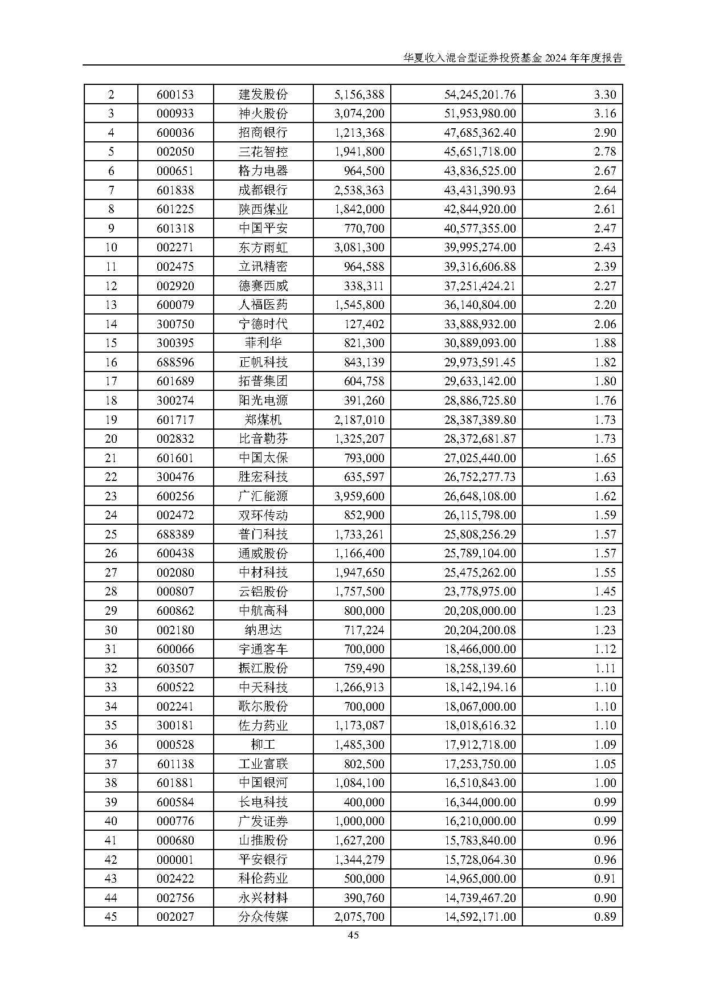

华夏收入混合型证券投资基金2024年年度报告
| 46 | 002025 | 航天电器 | 299,960 | 14,566,057.60 | 0.89 |
| --- | --- | --- | --- | --- | --- |
| 47 | 000983 | 山西焦煤 | 1,500,000 | 12,360,000.00 | 0.75 |
| 48 | 601668 | 中国建筑 | 2,000,000 | 12,000,000.00 | 0.73 |
| 49 | 000963 | 华东医药 | 341,000 | 11,798,600.00 | 0.72 |
| 50 | 603565 | 中谷物流 | 1,199,901 | 11,759,029.80 | 0.72 |
| 51 | 603259 | 药明康德 | 200,000 | 11,008,000.00 | 0.67 |
| 52 | 601006 | 大秦铁路 | 1,500,000 | 10,170,000.00 | 0.62 |
| 53 | 601788 | 光大证券 | 500,000 | 9,055,000.00 | 0.55 |
| 54 | 000408 | 藏格矿业 | 318,600 | 8,834,778.00 | 0.54 |
| 55 | 603816 | 顾家家居 | 300,000 | 8,274,000.00 | 0.50 |
| 56 | 301004 | 嘉益股份 | 60,000 | 6,939,000.00 | 0.42 |
| 57 | 601000 | 唐山港 | 1,321,900 | 6,226,149.00 | 0.38 |
| 58 | 688692 | 达梦数据 | 175 | 63,777.00 | 0.00 |
| 59 | 301626 | 苏州天脉 | 957 | 62,951.46 | 0.00 |
| 60 | 688615 | 合合信息 | 289 | 47,910.42 | 0.00 |
| 61 | 688726 | 拉普拉斯 | 979 | 32,365.74 | 0.00 |
| 62 | 301551 | 无线传媒 | 652 | 28,185.96 | 0.00 |
| 63 | 603072 | 天和磁材 | 2,255 | 27,736.50 | 0.00 |
| 64 | 301303 | 真兰仪表 | 1,481 | 22,688.92 | 0.00 |
| 65 | 001311 | 多利科技 | 844 | 21,766.76 | 0.00 |
| 66 | 301522 | 上大股份 | 816 | 20,269.44 | 0.00 |
| 67 | 301556 | 托普云农 | 267 | 15,766.35 | 0.00 |
| 68 | 301631 | 壹连科技 | 153 | 15,599.88 | 0.00 |
| 69 | 301606 | 绿联科技 | 396 | 14,450.04 | 0.00 |
| 70 | 301571 | 国科天成 | 350 | 14,290.50 | 0.00 |
| 71 | 603341 | 龙旗科技 | 298 | 13,931.50 | 0.00 |
| 72 | 301622 | 英思特 | 306 | 13,745.52 | 0.00 |
| 73 | 301305 | 朗坤环境 | 753 | 13,267.86 | 0.00 |
| 74 | 301608 | 博实结 | 184 | 12,029.92 | 0.00 |
| 75 | 301586 | 佳力奇 | 215 | 11,425.10 | 0.00 |
| 76 | 688710 | 益诺思 | 332 | 11,148.56 | 0.00 |
| 77 | 301617 | 博苑股份 | 253 | 10,066.87 | 0.00 |
| 78 | 301603 | 乔锋智能 | 233 | 9,781.34 | 0.00 |
| 79 | 301607 | 富特科技 | 257 | 9,287.98 | 0.00 |
| 80 | 603194 | 中力股份 | 291 | 8,185.83 | 0.00 |
| 81 | 301552 | 科力装备 | 143 | 8,132.41 | 0.00 |
| 82 | 301429 | 森泰股份 | 499 | 7,754.46 | 0.00 |
| 83 | 001279 | 强邦新材 | 265 | 7,396.15 | 0.00 |
| 84 | 688530 | 欧莱新材 | 344 | 6,370.88 | 0.00 |
| 85 | 301502 | 华阳智能 | 138 | 5,947.80 | 0.00 |
| 86 | 603395 | 红四方 | 154 | 5,508.58 | 0.00 |
| 87 | 603207 | 小方制药 | 185 | 4,930.25 | 0.00 |
| 88 | 603310 | 巍华新材 | 254 | 4,559.30 | 0.00 |
| 89 | 603350 | 安乃达 | 106 | 3,834.02 | 0.00 |

46

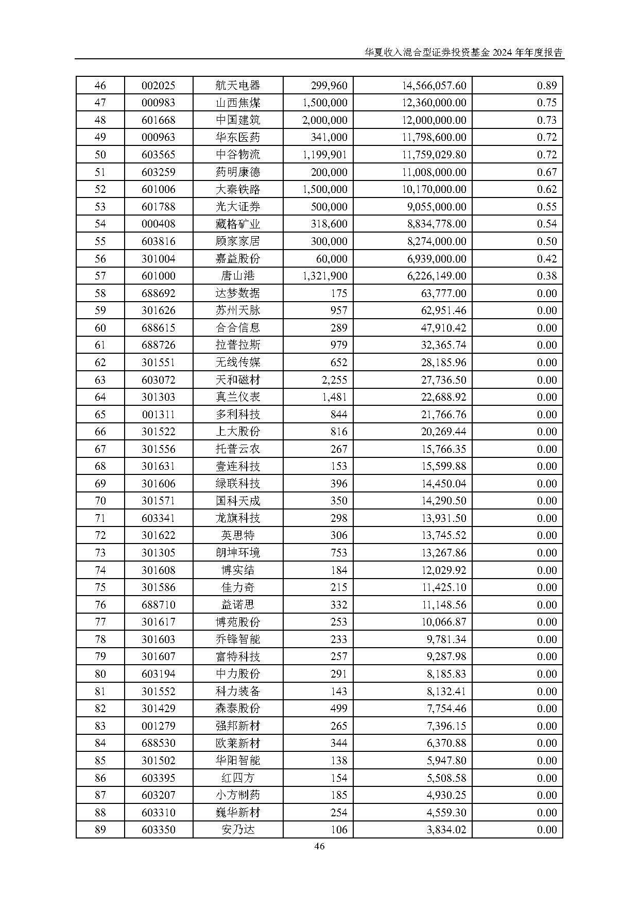

华夏收入混合型证券投资基金2024年年度报告
| 90 | 603285 | 键邦股份 | 129 | 2,916.69 | 0.00 |
| --- | --- | --- | --- | --- | --- |

8.4 报告期内股票投资组合的重大变动
8.4.1 累计买入金额超出期初基金资产净值2%或前20名的股票明细
金额单位：人民币元
占期初基金资
序号 股票代码 股票名称 本期累计买入金额 产净值比例
（％）
1 000651 格力电器 55,144,413.00 3.19
2 000933 神火股份 51,629,229.00 2.99
3 600036 招商银行 46,495,081.28 2.69
4 002432 九安医疗 45,677,317.59 2.64
5 601225 陕西煤业 45,204,069.00 2.61
6 601318 中国平安 41,633,737.00 2.41
7 601838 成都银行 41,404,136.35 2.39
8 000983 山西焦煤 41,024,035.88 2.37
9 600256 广汇能源 40,030,063.72 2.31
10 300476 胜宏科技 38,928,847.66 2.25
11 002271 东方雨虹 38,088,642.00 2.20
12 002920 德赛西威 36,716,749.00 2.12
13 688596 正帆科技 35,645,356.13 2.06
14 002436 兴森科技 34,181,461.00 1.98
15 002050 三花智控 34,017,592.28 1.97
16 600276 恒瑞医药 33,469,296.39 1.94
17 601717 郑煤机 31,928,361.00 1.85
18 600580 卧龙电驱 30,605,768.00 1.77
19 603063 禾望电气 30,152,035.00 1.74
20 002472 双环传动 30,014,795.00 1.74
注：“买入金额”按买入成交金额（成交单价乘以成交数量）填列，不考虑相关交易费用。
8.4.2 累计卖出金额超出期初基金资产净值2%或前20名的股票明细
金额单位：人民币元
占期初基金资
序号 股票代码 股票名称 本期累计卖出金额 产净值比例
（％）
1 300750 宁德时代 75,973,513.00 4.39
2 603799 华友钴业 64,989,151.25 3.76
3 603659 璞泰来 59,252,670.30 3.43
4 002432 九安医疗 53,389,309.78 3.09
5 002156 通富微电 45,012,535.29 2.60
6 603063 禾望电气 44,138,812.00 2.55
7 000933 神火股份 41,069,301.15 2.38
8 002920 德赛西威 40,703,339.00 2.35
47

| 序号 | 股票代码 | 股票名称 | 本期累计买入金额 | 占期初基金资
产净值比例
（％） |
| --- | --- | --- | --- | --- |
| 1 | 000651 | 格力电器 | 55,144,413.00 | 3.19 |
| 2 | 000933 | 神火股份 | 51,629,229.00 | 2.99 |
| 3 | 600036 | 招商银行 | 46,495,081.28 | 2.69 |
| 4 | 002432 | 九安医疗 | 45,677,317.59 | 2.64 |
| 5 | 601225 | 陕西煤业 | 45,204,069.00 | 2.61 |
| 6 | 601318 | 中国平安 | 41,633,737.00 | 2.41 |
| 7 | 601838 | 成都银行 | 41,404,136.35 | 2.39 |
| 8 | 000983 | 山西焦煤 | 41,024,035.88 | 2.37 |
| 9 | 600256 | 广汇能源 | 40,030,063.72 | 2.31 |
| 10 | 300476 | 胜宏科技 | 38,928,847.66 | 2.25 |
| 11 | 002271 | 东方雨虹 | 38,088,642.00 | 2.20 |
| 12 | 002920 | 德赛西威 | 36,716,749.00 | 2.12 |
| 13 | 688596 | 正帆科技 | 35,645,356.13 | 2.06 |
| 14 | 002436 | 兴森科技 | 34,181,461.00 | 1.98 |
| 15 | 002050 | 三花智控 | 34,017,592.28 | 1.97 |
| 16 | 600276 | 恒瑞医药 | 33,469,296.39 | 1.94 |
| 17 | 601717 | 郑煤机 | 31,928,361.00 | 1.85 |
| 18 | 600580 | 卧龙电驱 | 30,605,768.00 | 1.77 |
| 19 | 603063 | 禾望电气 | 30,152,035.00 | 1.74 |
| 20 | 002472 | 双环传动 | 30,014,795.00 | 1.74 |

| 序号 | 股票代码 | 股票名称 | 本期累计卖出金额 | 占期初基金资
产净值比例
（％） |
| --- | --- | --- | --- | --- |
| 1 | 300750 | 宁德时代 | 75,973,513.00 | 4.39 |
| 2 | 603799 | 华友钴业 | 64,989,151.25 | 3.76 |
| 3 | 603659 | 璞泰来 | 59,252,670.30 | 3.43 |
| 4 | 002432 | 九安医疗 | 53,389,309.78 | 3.09 |
| 5 | 002156 | 通富微电 | 45,012,535.29 | 2.60 |
| 6 | 603063 | 禾望电气 | 44,138,812.00 | 2.55 |
| 7 | 000933 | 神火股份 | 41,069,301.15 | 2.38 |
| 8 | 002920 | 德赛西威 | 40,703,339.00 | 2.35 |

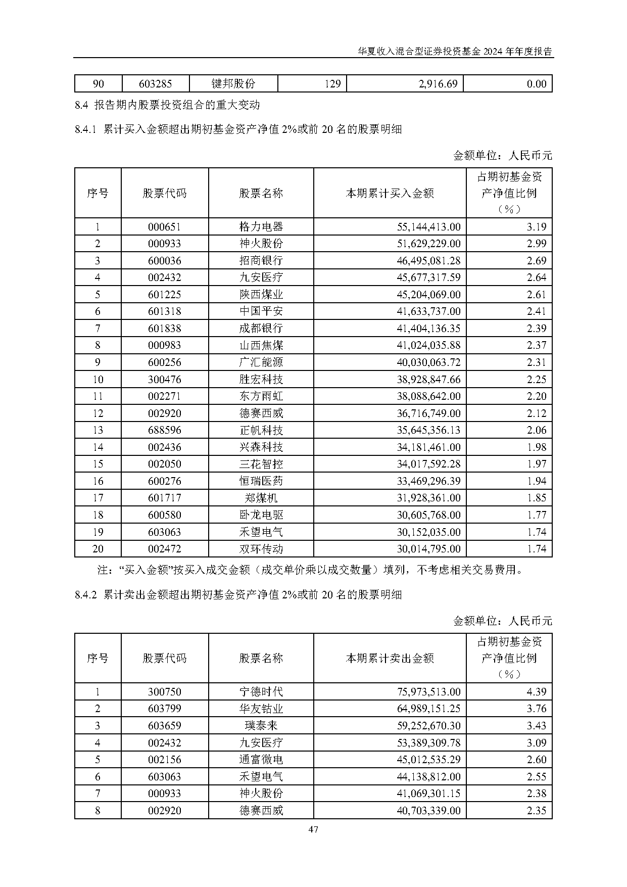

华夏收入混合型证券投资基金2024年年度报告
| 9 | 002384 | 东山精密 | 40,617,151.00 | 2.35 |
| --- | --- | --- | --- | --- |
| 10 | 300724 | 捷佳伟创 | 40,353,891.31 | 2.33 |
| 11 | 002230 | 科大讯飞 | 40,066,897.93 | 2.32 |
| 12 | 603993 | 洛阳钼业 | 38,174,373.00 | 2.21 |
| 13 | 002436 | 兴森科技 | 35,991,819.18 | 2.08 |
| 14 | 600580 | 卧龙电驱 | 35,103,474.00 | 2.03 |
| 15 | 000538 | 云南白药 | 34,962,573.20 | 2.02 |
| 16 | 300580 | 贝斯特 | 34,225,314.44 | 1.98 |
| 17 | 002865 | 钧达股份 | 34,194,453.08 | 1.98 |
| 18 | 688120 | 华海清科 | 34,188,341.73 | 1.98 |
| 19 | 600276 | 恒瑞医药 | 33,233,778.80 | 1.92 |
| 20 | 000935 | 四川双马 | 31,407,145.69 | 1.82 |

注：“卖出金额”按卖出成交金额（成交单价乘以成交数量）填列，不考虑相关交易费用。
8.4.3 买入股票的成本总额及卖出股票的收入总额
单位：人民币元
| 买入股票成本（成交）总额 | 2,796,918,910.26 |
| --- | --- |
| 卖出股票收入（成交）总额 | 2,962,717,472.37 |

注：“买入股票成本”、“卖出股票收入”均按买卖成交金额（成交单价乘以成交数量）填列，不
考虑相关交易费用。
8.5 期末按债券品种分类的债券投资组合
金额单位：人民币元
占基金资产净
序号 债券品种 公允价值
值比例(％)
1 国家债券 - -
2 央行票据 - -
3 金融债券 81,288,568.31 4.95
其中：政策性金融债 81,288,568.31 4.95
4 企业债券 - -
5 企业短期融资券 - -
6 中期票据 - -
7 可转债（可交换债） - -
8 同业存单 - -
9 其他 - -
10 合计 81,288,568.31 4.95
8.6 期末按公允价值占基金资产净值比例大小排序的前五名债券投资明细
金额单位：人民币元
占基金资产净值比例
序号 债券代码 债券名称 数量(张) 公允价值
(％)
48

| 序号 | 债券品种 | 公允价值 | 占基金资产净
值比例(％) |
| --- | --- | --- | --- |
| 1 | 国家债券 | - | - |
| 2 | 央行票据 | - | - |
| 3 | 金融债券 | 81,288,568.31 | 4.95 |
|  | 其中：政策性金融债 | 81,288,568.31 | 4.95 |
| 4 | 企业债券 | - | - |
| 5 | 企业短期融资券 | - | - |
| 6 | 中期票据 | - | - |
| 7 | 可转债（可交换债） | - | - |
| 8 | 同业存单 | - | - |
| 9 | 其他 | - | - |
| 10 | 合计 | 81,288,568.31 | 4.95 |

| 序号 | 债券代码 | 债券名称 | 数量(张) | 公允价值 | 占基金资产净值比例
(％) |
| --- | --- | --- | --- | --- | --- |

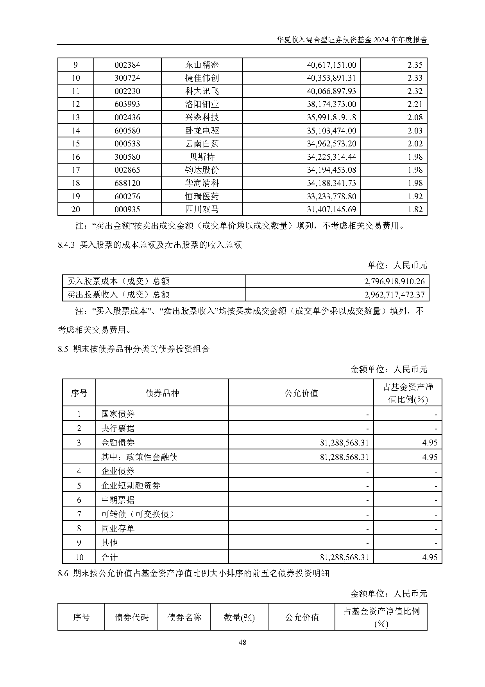

华夏收入混合型证券投资基金2024年年度报告
| 1 | 240401 | 24农发01 | 800,000 | 81,288,568.31 | 4.95 |
| --- | --- | --- | --- | --- | --- |
| 2 | - | - | - | - | - |
| 3 | - | - | - | - | - |
| 4 | - | - | - | - | - |
| 5 | - | - | - | - | - |

 - - - - -
8.7 期末按公允价值占基金资产净值比例大小排序的所有资产支持证券投资明细
本基金本报告期末未持有资产支持证券。
8.8 报告期末按公允价值占基金资产净值比例大小排序的前五名贵金属投资明细
本基金本报告期末未持有贵金属。
8.9 期末按公允价值占基金资产净值比例大小排序的前五名权证投资明细
本基金本报告期末未持有权证。
8.10 本基金投资股指期货的投资政策
本基金本报告期末无股指期货投资。
8.11 报告期末本基金投资的国债期货交易情况说明
8.11.1 本期国债期货投资政策
本基金本报告期末无国债期货投资。
8.11.2 本期国债期货投资评价
本基金本报告期末无国债期货投资。
8.12 投资组合报告附注
8.12.1 本基金投资的前十名证券的发行主体中，招商银行股份有限公司出现在报告编制日前一年内
受到监管部门公开谴责、处罚的情况。本基金对上述主体发行的相关证券的投资决策程序符合相关
法律法规及基金合同的要求。
8.12.2基金投资的前十名股票未超出基金合同规定的备选股票库。
8.12.3 期末其他各项资产构成
单位：人民币元
| 序号 | 名称 | 金额 |
| --- | --- | --- |
| 1 | 存出保证金 | 245,326.48 |
| 2 | 应收清算款 | - |
| 3 | 应收股利 | - |
| 4 | 应收利息 | - |
| 5 | 应收申购款 | 158,724.59 |
| 6 | 其他应收款 | - |
| 7 | 待摊费用 | - |
| 8 | 其他 | - |

 -
49

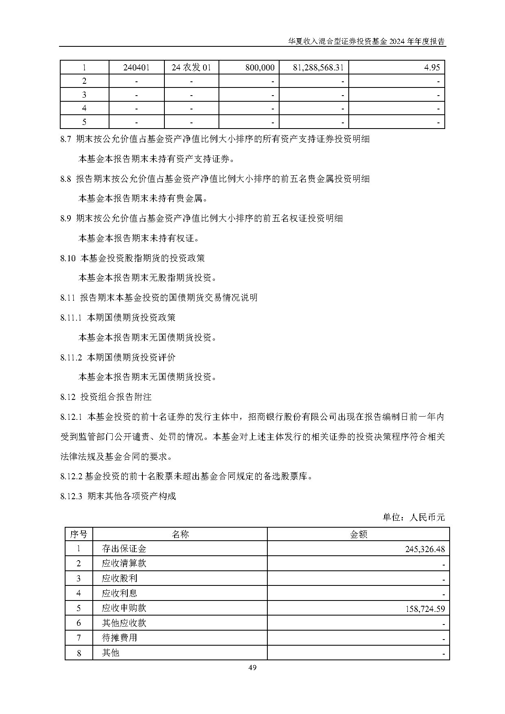

华夏收入混合型证券投资基金2024年年度报告
9 合计 404,051.07
8.12.4 期末持有的处于转股期的可转换债券明细
本基金本报告期末未持有处于转股期的可转换债券。
8.12.5 期末前十名股票中存在流通受限情况的说明
本基金本报告期末前十名股票中不存在流通受限情况。
8.12.6 投资组合报告附注的其他文字描述部分
由于四舍五入的原因，分项之和与合计项之间可能存在尾差。
§9 基金份额持有人信息
9.1 期末基金份额持有人户数及持有人结构
份额单位：份
持有人结构
持有人户数 户均持有的
机构投资者 个人投资者
(户) 基金份额
持有份额 占总份额比例 持有份额 占总份额比例
74,158 3,832.90 2,417,892.87 0.85% 281,822,331.96 99.15%
9.2 期末基金管理人的从业人员持有本基金的情况
项目 持有份额总数（份） 占基金总份额比例
基金管理人所有从业人员持有
1,240,084.85 0.44%
本基金
9.3 期末基金管理人的从业人员持有本开放式基金份额总量区间的情况
项目 持有基金份额总量的数量区间（万份）
本公司高级管理人员、基金投资和研究部门负责
>100
人持有本开放式基金
本基金基金经理持有本开放式基金 >100
9.4 期末兼任私募资产管理计划投资经理的基金经理本人及其直系亲属持有本人管理的产品情况
持有本人管理的产品份额总量
基金经理姓名 产品类型
的数量区间（万份）
公募基金 >100
郑煜 私募资产管理计划 0
合计 >100
§10 开放式基金份额变动
50

| 9 | 合计 | 404,051.07 |
| --- | --- | --- |

| 持有人户数
(户) | 户均持有的
基金份额 | 持有人结构 |  |  |  |
| --- | --- | --- | --- | --- | --- |
|  |  | 机构投资者 |  | 个人投资者 |  |
|  |  | 持有份额 | 占总份额比例 | 持有份额 | 占总份额比例 |
| 74,158 | 3,832.90 | 2,417,892.87 | 0.85% | 281,822,331.96 | 99.15% |

| 项目 | 持有份额总数（份） | 占基金总份额比例 |
| --- | --- | --- |
| 基金管理人所有从业人员持有
本基金 | 1,240,084.85 | 0.44% |

| 项目 | 持有基金份额总量的数量区间（万份） |
| --- | --- |
| 本公司高级管理人员、基金投资和研究部门负责
人持有本开放式基金 | >100 |
| 本基金基金经理持有本开放式基金 | >100 |

| 基金经理姓名 | 产品类型 | 持有本人管理的产品份额总量
的数量区间（万份） |
| --- | --- | --- |
| 郑煜 | 公募基金 | >100 |
|  | 私募资产管理计划 | 0 |
|  | 合计 | >100 |

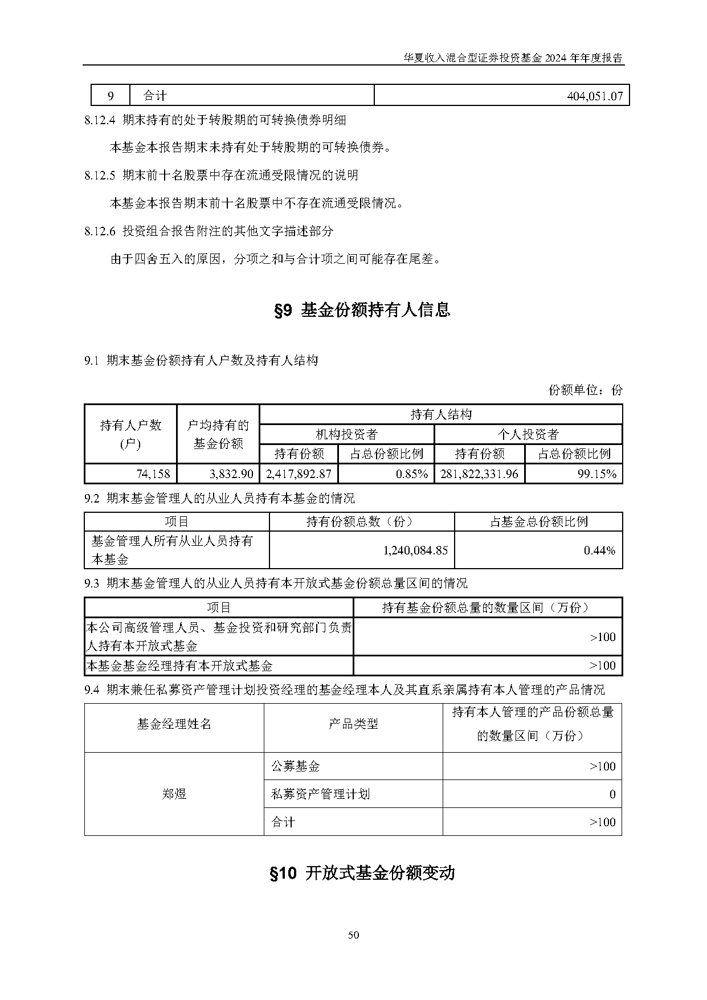

华夏收入混合型证券投资基金2024年年度报告
单位：份
| 基金合同生效日（2005年11月17日）基金份额总额 | 543,579,037.46 |
| --- | --- |
| 本报告期期初基金份额总额 | 309,023,533.02 |
| 本报告期基金总申购份额 | 29,846,760.84 |
| 减：本报告期基金总赎回份额 | 54,630,069.03 |
| 本报告期基金拆分变动份额 | - |
| 本报告期期末基金份额总额 | 284,240,224.83 |

§11 重大事件揭示
11.1 基金份额持有人大会决议
本报告期内，本基金无基金份额持有人大会决议。
11.2 基金管理人、基金托管人的专门基金托管部门的重大人事变动
本报告期内，本基金管理人未发生重大人事变动。
经中国建设银行股份有限公司（以下简称“中国建设银行”）研究决定，蔡亚蓉女士不再担任中国
建设银行资产托管业务部总经理职务。
11.3 涉及基金管理人、基金财产、基金托管业务的诉讼
本报告期未发生影响基金管理人经营或基金运营业务的诉讼。
本报告期无涉及基金财产、基金托管业务的诉讼事项。
11.4 基金投资策略的改变
本基金本报告期投资策略未发生改变。
11.5 为基金进行审计的会计师事务所情况
本基金本报告期应支付给安永华明会计师事务所（特殊普通合伙）的报酬为55,000.00元人民币。
截至本报告期末，该事务所已向本基金提供19年的审计服务。
11.6 管理人、托管人及其高级管理人员受稽查或处罚等情况
措施1 内容
受到稽查或处罚等措施的主体 管理人
受到稽查或处罚等措施的时间 2024-07-05
采取稽查或处罚等措施的机构 中国证监会北京监管局
受到的具体措施类型 责令改正并暂停办理相关业务行政监管措施
受到稽查或处罚等措施的原因 部分制度不健全或执行不到位，部分业务管控不严
管理人采取整改措施的情况（如提出整 基金管理人高度重视，已按要求完成了整改，并已将整
改意见） 改落实情况报送监管机构
其他 无
措施2 内容
51

| 措施1 | 内容 |
| --- | --- |
| 受到稽查或处罚等措施的主体 | 管理人 |
| 受到稽查或处罚等措施的时间 | 2024-07-05 |
| 采取稽查或处罚等措施的机构 | 中国证监会北京监管局 |
| 受到的具体措施类型 | 责令改正并暂停办理相关业务行政监管措施 |
| 受到稽查或处罚等措施的原因 | 部分制度不健全或执行不到位，部分业务管控不严 |
| 管理人采取整改措施的情况（如提出整
改意见） | 基金管理人高度重视，已按要求完成了整改，并已将整
改落实情况报送监管机构 |
| 其他 | 无 |
| 措施2 | 内容 |

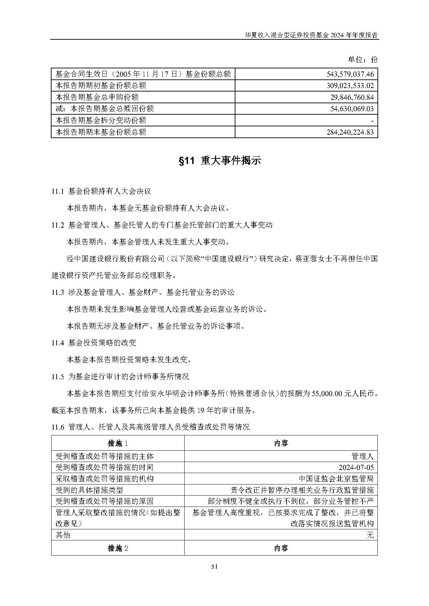

华夏收入混合型证券投资基金2024年年度报告
受到稽查或处罚等措施的主体 高级管理人员
受到稽查或处罚等措施的时间 2024-08-16
采取稽查或处罚等措施的机构 中国证监会北京监管局
受到的具体措施类型 警示函
受到稽查或处罚等措施的原因 部分制度不健全或执行不到位，部分业务管控不严
管理人采取整改措施的情况（如提出整
不适用
改意见）
其他 无
11.6.1 托管人及其高级管理人员受稽查或处罚等情况
本报告期内，基金托管人及其高级管理人员未受监管部门稽查或处罚。
11.7 基金租用证券公司交易单元的有关情况
11.7.1 基金租用证券公司交易单元进行股票投资及佣金支付情况
金额单位：人民币元
股票交易 应支付该券商的佣金
交易
占当期股 占当期佣
券商名称 单元 备注
成交金额 票成交总 佣金 金总量的
数量
额的比例 比例
中金公司 3 2,562,454,413.23 44.58% 1,282,830.78 38.62% -
光大证券 2 688,822,904.30 11.98% 486,480.04 14.65% -
大同证券 1 660,505,047.28 11.49% 492,672.33 14.83% -
长江证券 1 515,329,698.44 8.97% 230,074.37 6.93% -
西部证券 1 459,743,800.68 8.00% 224,040.40 6.75% -
南京证券 1 249,772,091.27 4.35% 186,308.74 5.61% -
中信建投证券 - 216,624,525.51 3.77% 132,006.43 3.97% -
东海证券 1 209,980,507.89 3.65% 156,626.14 4.72% -
华安证券 - 111,856,083.20 1.95% 83,434.23 2.51% -
宏信证券 1 60,886,310.11 1.06% 37,934.45 1.14% -
国投证券 - 11,921,359.38 0.21% 8,892.09 0.27% -
注：①为了贯彻中国证监会的有关规定，我公司制定了选择研究服务证券公司的标准，即：
i投研部门根据证券公司的总体资质情况、财务状况、研究服务能力、经营行为及风控合规能力
等情况，选择证券公司进入交易合作库，并进行跟踪评估，对合作库证券公司进行调整。
ii 投研部门牵头制定证券公司研究服务评价制度，建立健全对证券公司研究服务的定期评价机
制。评价指标包括但不限于：业绩贡献、反馈速度、观点或数据质量等。
②为了贯彻中国证监会的有关规定，我公司制定了选择交易服务证券公司的标准，即：
i投资部门根据证券公司的总体资质、财务状况、经营行为和合规风控能力、交易服务能力等情
况，选择证券公司进入交易合作库，并进行跟踪监控，对合作库证券公司进行调整。
ii 投资部门牵头制定证券公司交易服务评价制度，建立健全对证券公司交易服务的定期评价机
52

| 受到稽查或处罚等措施的主体 | 高级管理人员 |
| --- | --- |
| 受到稽查或处罚等措施的时间 | 2024-08-16 |
| 采取稽查或处罚等措施的机构 | 中国证监会北京监管局 |
| 受到的具体措施类型 | 警示函 |
| 受到稽查或处罚等措施的原因 | 部分制度不健全或执行不到位，部分业务管控不严 |
| 管理人采取整改措施的情况（如提出整
改意见） | 不适用 |
| 其他 | 无 |

| 券商名称 | 交易
单元
数量 | 股票交易 |  | 应支付该券商的佣金 |  | 备注 |
| --- | --- | --- | --- | --- | --- | --- |
|  |  | 成交金额 | 占当期股
票成交总
额的比例 | 佣金 | 占当期佣
金总量的
比例 |  |
| 中金公司 | 3 | 2,562,454,413.23 | 44.58% | 1,282,830.78 | 38.62% | - |
| 光大证券 | 2 | 688,822,904.30 | 11.98% | 486,480.04 | 14.65% | - |
| 大同证券 | 1 | 660,505,047.28 | 11.49% | 492,672.33 | 14.83% | - |
| 长江证券 | 1 | 515,329,698.44 | 8.97% | 230,074.37 | 6.93% | - |
| 西部证券 | 1 | 459,743,800.68 | 8.00% | 224,040.40 | 6.75% | - |
| 南京证券 | 1 | 249,772,091.27 | 4.35% | 186,308.74 | 5.61% | - |
| 中信建投证券 | - | 216,624,525.51 | 3.77% | 132,006.43 | 3.97% | - |
| 东海证券 | 1 | 209,980,507.89 | 3.65% | 156,626.14 | 4.72% | - |
| 华安证券 | - | 111,856,083.20 | 1.95% | 83,434.23 | 2.51% | - |
| 宏信证券 | 1 | 60,886,310.11 | 1.06% | 37,934.45 | 1.14% | - |
| 国投证券 | - | 11,921,359.38 | 0.21% | 8,892.09 | 0.27% | - |

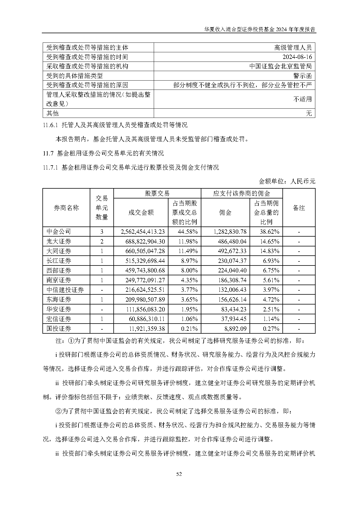

华夏收入混合型证券投资基金2024年年度报告
制。
iii 投资部门定期对证券公司的交易服务开展评价，评价指标包括但不限于：交易服务成本、交
易服务能力、交易系统稳定性、交易系统支持能力、应急交易能力等。
③证券公司专用交易单元选择程序：
i投资、研究部门牵头制定规范、合理的合作证券公司管理制度，明确证券公司准入标准、退出
程序等。合规管理部门对合作证券公司管理制度进行合规性审查。
ii投资、研究部门根据上述标准进行评估并确定选用的证券公司。
iii本基金管理人与被选择的证券公司签订交易单元租用协议/证券经纪服务协议。
④除本表列示外，本基金还选择了北京高华证券、东方证券、华菁证券、平安证券、瑞银证券、
粤开证券、中国银河证券、中信证券的交易单元作为本基金交易单元，本报告期无股票交易及应付
佣金。
⑤在上述租用的券商交易单元中，国投证券、华安证券、中信建投证券的交易单元为本基金本
期剔除的交易单元，本期没有新增的券商交易单元。
⑥本部分的数据统计时间区间与本报告的报告期一致；本公司网站披露的《华夏基金管理有限
公司旗下公募基金通过证券公司证券交易及佣金支付情况（2024年度）》的报告期为2024年7月1
日至2024年12月31日。敬请投资者关注上述报告统计时间区间的口径差异。
11.7.2 基金租用证券公司交易单元进行其他证券投资的情况
金额单位：人民币元
债券交易 债券回购交易 权证交易 基金交易
占当
占当 占当
期债
占当期 期权 期基
券回
券商名称 债券成 成交金 证成 成交金 金成
成交金额 购成 成交金额
交总额 额 交总 额 交总
交总
的比例 额的 额的
额的
比例 比例
比例
中金公司 34,716,079.91 100.00% - - - - - -
光大证券 - - - - - - - -
大同证券 - - - - - - - -
长江证券 - - - - - - - -
西部证券 - - - - - - - -
南京证券 - - - - - - - -
中信建投证
- - - - - - - -
券
东海证券 - - - - - - - -
华安证券 - - - - - - - -
53

| 券商名称 | 债券交易 |  | 债券回购交易 |  | 权证交易 |  | 基金交易 |  |
| --- | --- | --- | --- | --- | --- | --- | --- | --- |
|  | 成交金额 | 占当期
债券成
交总额
的比例 | 成交金
额 | 占当
期债
券回
购成
交总
额的
比例 | 成交金额 | 占当
期权
证成
交总
额的
比例 | 成交金
额 | 占当
期基
金成
交总
额的
比例 |
| 中金公司 | 34,716,079.91 | 100.00% | - | - | - | - | - | - |
| 光大证券 | - | - | - | - | - | - | - | - |
| 大同证券 | - | - | - | - | - | - | - | - |
| 长江证券 | - | - | - | - | - | - | - | - |
| 西部证券 | - | - | - | - | - | - | - | - |
| 南京证券 | - | - | - | - | - | - | - | - |
| 中信建投证
券 | - | - | - | - | - | - | - | - |
| 东海证券 | - | - | - | - | - | - | - | - |
| 华安证券 | - | - | - | - | - | - | - | - |

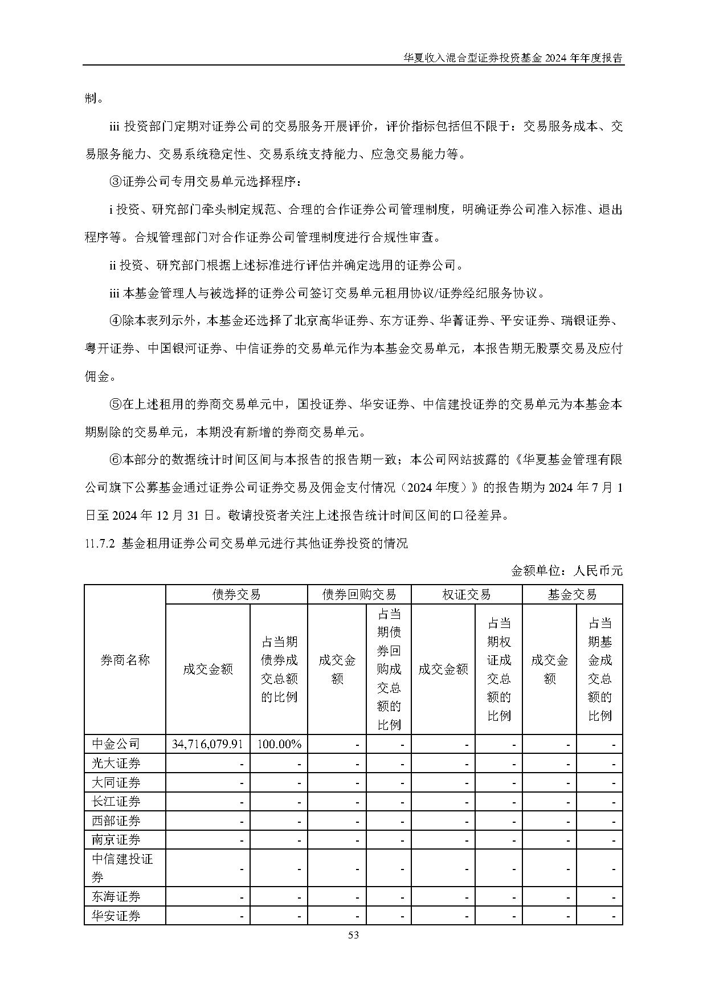

华夏收入混合型证券投资基金2024年年度报告
宏信证券 - - - - - - - -
国投证券 - - - - - - - -
11.8 其他重大事件
本基金本报告期内无需要披露的主要事项。
§12 影响投资者决策的其他重要信息
12.1 报告期内单一投资者持有基金份额比例达到或超过20%的情况
本基金本报告期内未出现单一投资者持有基金份额比例达到或超过20%的情况。
§13 备查文件目录
13.1 备查文件目录
1、中国证监会核准基金募集的文件；
2、基金合同；
3、托管协议；
4、法律意见书；
5、基金管理人业务资格批件、营业执照；
6、基金托管人业务资格批件、营业执照。
13.2 存放地点
备查文件存放于基金管理人和/或基金托管人的住所。
13.3 查阅方式
投资者可到基金管理人和/或基金托管人的住所免费查阅备查文件。在支付工本费后，投资者可
在合理时间内取得备查文件的复制件或复印件。
华夏基金管理有限公司
二〇二五年三月三十一日
54

| 宏信证券 | - | - | - | - | - | - | - | - |
| --- | --- | --- | --- | --- | --- | --- | --- | --- |
| 国投证券 | - | - | - | - | - | - | - | - |

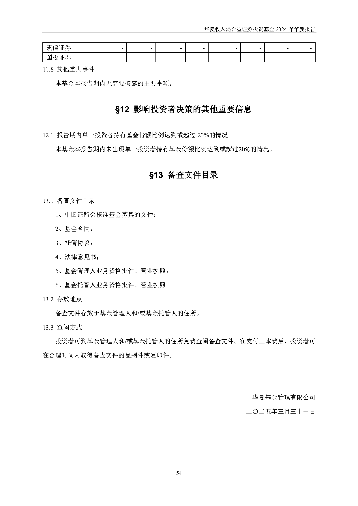

