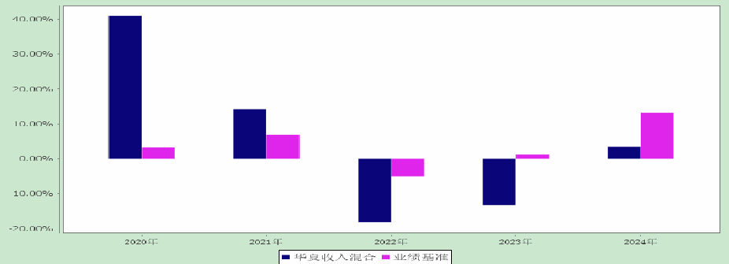
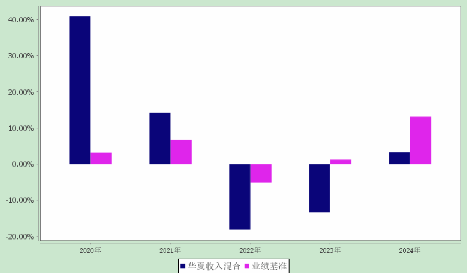

请问是不是很可爱

么动物
请问以下是一只什

10
4.3.2
公平交易制度的执行情况
息披露来保证公平交易过程和结果的监督。
并通过工作制度、流程和技术手段保证公平交易原则的实现。同时，通过监察稽核、事后分析和信
管理有限公司公平交易制度》。公司通过科学、制衡的投资决策体系，加强交易分配环节的内部控制，
本基金管理人根据《证券投资基金管理公司公平交易制度指导意见》等法规制定了《华夏基金

4.2
管理人对报告期内本基金运作遵规守信情况的说明
资产管理计划浮动管理费或产品业绩表现不直接挂钩。
考核结果作为确定其薪酬激励的重要参考因素之一。因此，基金经理个人薪酬激励与其管理的私募
本基金管理人旗下基金经理兼任私募资产管理计划投资经理的，公司对其进行年度综合考核，
4.1.4
基金经理薪酬机制
2024741
注：报告期内，郑煜于年月日离任其原管理的只公募基金。

| 姓名 | 产品类型 | 产品数量（只） | 资产净值(元) | 任职时间 |
| --- | --- | --- | --- | --- |
| 郑煜 | 公募基金 | 4 | 4,034,724,736.36 | 2009-02-04 |
|  | 私募资产管
理计划 | 1 | 10,989,018,835.55 | 2023-08-23 |
|  | 其他组合 | - | - | - |
|  | 合计 | 5 | 15,023,743,571.91 | - |

4.1.3
期末兼任私募资产管理计划投资经理的基金经理同时管理的产品情况
督管理办法》的相关规定。
②证券从业的含义遵从行业协会《证券基金经营机构董事、监事、高级管理人员及从业人员监
“”
的，其任职日期为基金合同生效日。
“”“”
注：①上述任职日期和离任日期为根据公司决定确定的聘任日期和解聘日期。首任基金经理

| 周飞 | 本基金的基
金经理助理 | 2024-06-25 | - | 14年 | 硕士。2010年7月加入
华夏基金管理有限公
司。历任交易管理部交
易员、现金管理部基金
经理助理。 |
| --- | --- | --- | --- | --- | --- |

2024
华夏收入混合型证券投资基金年年度报告

6
的基金管理公司之一。
RQFII
体目标和路径的公募基金公司，香港子公司是首批基金管理人。华夏基金是业务领域最广泛
REITs“”
人以及特定客户资产管理人、保险资金投资管理人、公募管理人，境内首家承诺碳中和具
MOMETF
理人、首批公募基金管理人、首批纳入互联互通基金管理人、首批北交所主题基金管理
ETFETF
理人、首批个人养老金基金管理人、境内首批中日互通基金管理人、首批商品期货基金管
FOF
入联合国责任投资原则组织的公募基金公司、首批公募基金管理人、首批公募养老目标基金管
金管理人、首批内地与香港基金互认基金管理人、首批基本养老保险基金投资管理人资格、首家加
QDIIETFETF
年金基金管理人、境内首批基金管理人、境内首只基金管理人、境内首只沪港通基
阳设有分公司，在香港、深圳、上海、北京设有子公司。公司是首批全国社保基金管理人、首批企业
理公司之一。公司总部设在北京，在北京、上海、深圳、成都、南京、杭州、广州、青岛、武汉及沈
199849
华夏基金管理有限公司成立于年月日，是经中国证监会批准成立的首批全国性基金管
4.1.1
基金管理人及其管理基金的经验
4.1
基金管理人及基金经理情况
§4
管理人报告
本基金过去三年无利润分配事项。
3.3
过去三年基金的利润分配情况

过去五年基金净值增长率与业绩比较基准收益率的对比图
2024
华夏收入混合型证券投资基金年年度报告

